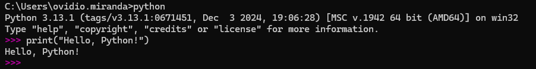
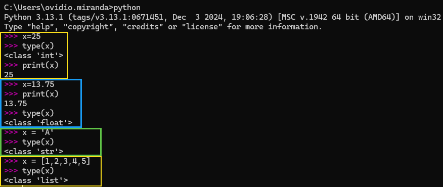
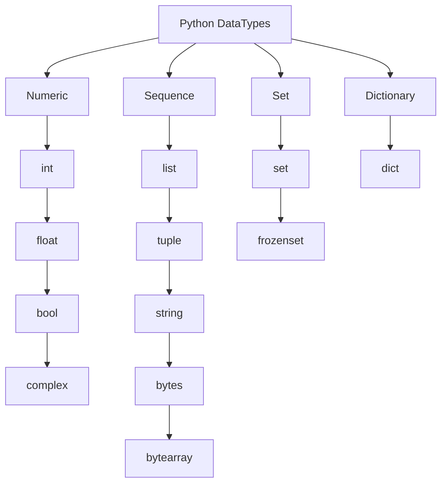

<h1>Table of contents</h1>

- [Section 1: Introduction to Python](#section-1-introduction-to-python)
  - [How a Python Program Runs?](#how-a-python-program-runs)
- [Section 2: Python Installation and Setup](#section-2-python-installation-and-setup)
  - [Installing Python](#installing-python)
  - [Installing Pycharm](#installing-pycharm)
- [Section 3: Python Datatypes](#section-3-python-datatypes)
  - [Python Dynamically Typed](#python-dynamically-typed)
    - [Example of a Type Error Due to Dynamic Typing](#example-of-a-type-error-due-to-dynamic-typing)
  - [Rules for Declaring Variable Names in Python](#rules-for-declaring-variable-names-in-python)
  - [Python DataTypes](#python-datatypes)
    - [1. Numeric](#1-numeric)
    - [2. Sequence](#2-sequence)
    - [3. Set](#3-set)
    - [4. Dictionary](#4-dictionary)
  - [Type Conversion in Python](#type-conversion-in-python)
    - [1. Implicit Type Conversion (Automatic)](#1-implicit-type-conversion-automatic)
    - [2. Explicit Type Conversion (Type Casting)](#2-explicit-type-conversion-type-casting)
    - [3. Special Cases in Type Conversion](#3-special-cases-in-type-conversion)
    - [4. Summary](#4-summary)
- [Section 4: Operators and Expression](#section-4-operators-and-expression)
  - [Arithmetic Operators](#arithmetic-operators)
  - [Challenge : Area of triangle](#challenge--area-of-triangle)
    - [1. Triangle Area](#1-triangle-area)
    - [2. Rhombus Area (Using Trapezoidal Formula)](#2-rhombus-area-using-trapezoidal-formula)
    - [3. Displacement (Using Kinematic Equation)](#3-displacement-using-kinematic-equation)
  - [Challenge : Kms to Miles](#challenge--kms-to-miles)
    - [1. Converting km to miles](#1-converting-km-to-miles)
    - [2. Area of a Circle](#2-area-of-a-circle)
  - [Challenge : Surface area of Cuboid](#challenge--surface-area-of-cuboid)
  - [Challenge : Quadratic Equations](#challenge--quadratic-equations)
  - [Arithmetic Assignment Operators](#arithmetic-assignment-operators)
- [Section 5: Conditional Statements](#section-5-conditional-statements)
  - [Conditional Statements- if ...else](#conditional-statements--if-else)
  - [Logical Operator](#logical-operator)
  - [Challenge : Eligibility for Casting a Vote](#challenge--eligibility-for-casting-a-vote)
  - [Challenge : Marks within Range](#challenge--marks-within-range)
  - [Challenge : Admin Access](#challenge--admin-access)
  - [Nested `if` and `elif` Statements](#nested-if-and-elif-statements)
  - [Challenge : Discount Amount](#challenge--discount-amount)
  - [Challenge : Displaying Name of a Day](#challenge--displaying-name-of-a-day)
  - [Challenge : Leap Year or Not](#challenge--leap-year-or-not)
  - [Detail Logical Operator](#detail-logical-operator)
  - [Bitwise Operators](#bitwise-operators)
    - [AND Operator (\&)](#and-operator-)
    - [OR Operator (|)](#or-operator-)
    - [XOR Operator (^)](#xor-operator-)
    - [NOT Operator (~)](#not-operator-)
    - [Left Shift Operator (\<\<)](#left-shift-operator-)
    - [Right Shift Operator (\>\>)](#right-shift-operator-)
- [Section 6: Loops - Control Flow](#section-6-loops---control-flow)
  - [Introduction to Loops](#introduction-to-loops)
  - [Challenge : Multiplication Table](#challenge--multiplication-table)
  - [Challenge : Counting the number of digits in a number](#challenge--counting-the-number-of-digits-in-a-number)
  - [Challenge : Find sum of digits in a number](#challenge--find-sum-of-digits-in-a-number)
  - [Challenge : Reversing a number](#challenge--reversing-a-number)
  - [Challenge : Check if a number is a Palindrome](#challenge--check-if-a-number-is-a-palindrome)
  - [Challenges](#challenges)
    - [1. Find sum of given numbers as input](#1-find-sum-of-given-numbers-as-input)
    - [2. Find sum of positive and negative numbers](#2-find-sum-of-positive-and-negative-numbers)
    - [3. Find maximum numbers from the given numbers](#3-find-maximum-numbers-from-the-given-numbers)
    - [4. Convert a Decimal number to a Binary number](#4-convert-a-decimal-number-to-a-binary-number)
  - [Challenge: Guess a number between 1 - 10](#challenge-guess-a-number-between-1---10)
  - [Infinite Loop - break - continue - pass](#infinite-loop---break---continue---pass)
  - [else suite : else with while loop](#else-suite--else-with-while-loop)
  - [What is for Loop ?](#what-is-for-loop-)
  - [Challenge : Factorial of Given Number](#challenge--factorial-of-given-number)
  - [Challenge : Fibonacci Series](#challenge--fibonacci-series)
  - [Challenges](#challenges-1)
    - [1. Find the Factors of a Number](#1-find-the-factors-of-a-number)
    - [2. Check if a number is prime or not](#2-check-if-a-number-is-prime-or-not)
  - [Match Case](#match-case)
- [Section 7: String and its Methods](#section-7-string-and-its-methods)
  - [Operators on String](#operators-on-string)

## Section 1: Introduction to Python
### How a Python Program Runs?
**1. Python Interpreter Reads the Code (.py file)**

- The Python `interpreter` starts by **reading the source code**.

**2. Compiling to Bytecode (.pyc file in __pycache__)**

- The `interpreter` **compiles** the code into **bytecode**, an intermediate representation for efficiency.

**3. Executing in the Python Virtual Machine (PVM)**
- The `interpreter` **runs the bytecode** using the Python Virtual Machine (**PVM**), which processes instructions line by line.

**4. Interacting with the Operating System**
- The `interpreter` communicates with the OS to manage files, databases, networking, and I/O operations.

<div align="right">
  <strong>
    <a href="#table-of-contents" style="text-decoration: none;">↥ Back to top</a>
  </strong>
</div>

## Section 2: Python Installation and Setup
### Installing Python
Steps to Install Python on Windows  

**1. Download Python**
- Go to the official Python website: https://www.python.org/downloads/
- Click **Download Python [latest version]** (it will detect your OS automatically).  

**2. Run the Installer**  
- Open the downloaded `.exe` file (e.g., `python-3.x.x.exe`).
- **Important**: Check the box **"Add python.exe to PATH"** (this allows running Python from the command line).
- Click **"Install Now"** and wait for the installation to finish.

**3. Verify the Installation**  
- Open **Command Prompt (CMD)** or PowerShell.
**Type:**
```sh
python --version
```
- If installed correctly, it will display the Python version
```sh
Python 3.xx.x
```  
**4. Test Python**  
- In CMD, type **python** and press **Enter**.
- You should see the Python interactive shell (>>> prompt).
- Try running a simple command:
```sh
print("Hello, Python!")
```
If it prints `Hello, Python!`, Python is installed correctly.



<div align="right">
  <strong>
    <a href="#table-of-contents" style="text-decoration: none;">↥ Back to top</a>
  </strong>
</div>

### Installing Pycharm
**Steps to Install PyCharm Community Edition on Windows**

**1. Download PyCharm**
- Visit the official JetBrains website:  
  🔗 [https://www.jetbrains.com/pycharm/download/](https://www.jetbrains.com/pycharm/download/)  
- Under **Community Edition**, click **Download** (this version is **free**).  

**2. Run the Installer**  
- Open the downloaded `.exe` file (e.g., `pycharm-community-*.*.*.exe`).  
- Click **Next** to proceed.  

 **3. Choose Installation Location**  
- Leave the **default path** or select a custom folder.  
- Click **Next**.  

 **4. Configure Installation Options(Recommended)**   
  ✅ **Create Desktop Shortcut** → Adds a shortcut to easily launch PyCharm.  
  ✅ **Update PATH Variable** → Adds the `bin` folder to the system PATH (allows running PyCharm from the terminal).  

  *(Note: Enabling the PATH option requires a system restart for changes to take effect.)*  

- Click **Next**.  

 **5. Install PyCharm**  
- Click **Install** and wait for the process to complete.  

 **6. Launch PyCharm**  
- After installing and opening PyCharm for the first time, you will see the window from the image.
- In this window, you can choose to import settings from:
 - IntelliJ IDEA Community 2024.3 (If you have used IntelliJ IDEA and want to import its settings).
 - Visual Studio Code (If you want to import settings from VS Code).
 - Skip Import (If you prefer to start with default settings).  

**7. Create a New Python Project**
1. Click **New Project** → Select a location.  
2. Choose **Python Interpreter**:  
   - Select an existing Python installation (`python.exe` from Python installation).  
   - Or let PyCharm create a **virtual environment**.  
3. Click **Create** to start coding!  

**Switch back to the Classic UI in PyCharm using the Classic UI plugin**  
Follow these steps:

**1. Open the Plugin Settings**
 - Go to File > Settings (Ctrl + Alt + S).
 - In the left menu, select **Plugins**.  

**2. Search for the "Classic UI" Plugin**
 - In the **Marketplace** tab, type **Classic UI** in the search bar.
 - Find the plugin named **Classic UI** (from JetBrains or the community).
 - Click **Install**.  

**3. Restart PyCharm**
- After installing the plugin, click **Restart** IDE.
- Once PyCharm restarts, it should switch to the **Classic UI**. which PyCharm version you're using. 

<div align="right">
  <strong>
    <a href="#table-of-contents" style="text-decoration: none;">↥ Back to top</a>
  </strong>
</div>

## Section 3: Python Datatypes
### Python Dynamically Typed
Python is **a dynamically typed language**, which means that **you don’t need to declare** the **data type** of a variable explicitly. Instead, **Python automatically determines the type** based on the value assigned to the variable at runtime.
```python
x = 10      # 'x' is an integer (int)
x = "Hello" # Now 'x' is a string (str)
x = 3.14    # Now 'x' is a float (float)
```


#### Example of a Type Error Due to Dynamic Typing
```python
num = 10     # Integer
num = num + "5"  # TypeError: unsupported operand type(s) for +: 'int' and 'str'
```
Here, Python raises an error because it tries to add an integer (10) to a string ("5"), which is not allowed.

<div align="right">
  <strong>
    <a href="#table-of-contents" style="text-decoration: none;">↥ Back to top</a>
  </strong>
</div>

### Rules for Declaring Variable Names in Python  

**1. Name can contain alpha-numeric characters and underscores** (`A-Z, a-z, 0-9, _`)  

✔ **Valid examples:**  
```python
name = "Alice"       # Only letters
age_23 = 23          # Letters + numbers
user_name = "John"   # Letters + underscore
```

✖ **Invalid examples:**  
```python
user-name = "John"   # Hyphen (-) is not allowed
2nd_place = "Silver" # Cannot start with a number
```

---

**2. Name should start with a letter or an underscore**(`A-Z, a-z, _`)  

✔ **Valid examples:**  
```python
_name = "Hidden"   # Starts with underscore
a123 = "Valid"     # Starts with a letter
```

✖ **Invalid examples:**  
```python
123name = "Error"  # Cannot start with a number
!var = 10          # Special characters not allowed
```

---

**3. Keywords should not be used as variable names**

Python has **reserved words (keywords)** that cannot be used as variable names.  

✖ **Invalid examples:**  
```python
if = 10          # 'if' is a keyword
class = "Test"   # 'class' is a keyword
return = 5       # 'return' is a keyword
```

✔ **Corrected versions:**  
```python
if_value = 10    
class_name = "Test"  
return_value = 5   
```

---

**4. Variables are case-sensitive (`name` ≠ `Name` ≠ `NAME`)**  

Python distinguishes between uppercase and lowercase letters in variable names.  

✔ **Valid examples:**  
```python
name = "Alice"
Name = "Bob"
NAME = "Charlie"

print(name)  # Output: Alice
print(Name)  # Output: Bob
print(NAME)  # Output: Charlie
```

Each **variable** holds **a different value** because **Python treats them as separate variables**.

---

**Summary**

| Rule | ✔ Valid Example | ✖ Invalid Example |
|------|----------------|-------------------|
| **Alpha-numeric & underscore** | `user_1`, `myVar` | `user-name`, `my var` |
| **Start with letter or underscore** | `_hidden`, `a123` | `123name`, `!var` |
| **No keywords** | `my_class`, `return_value` | `if`, `class`, `return` |
| **Case-sensitive** | `name`, `Name`, `NAME` | - |

<div align="right">
  <strong>
    <a href="#table-of-contents" style="text-decoration: none;">↥ Back to top</a>
  </strong>
</div>

### Python DataTypes

Python has several **built-in data types** that can be categorized into different **groups**:


#### 1. Numeric
These data types represent numerical values.

- `int` → Integer numbers (**example**: `10`, `-5`)
- `float` → Floating-point numbers (**example**: `3.14`, `-2.5`)
- `bool` → Boolean values (`True` or `False`)
- `complex` → Complex numbers (**example**: `3+4j`)

**Example**
```python
# Numeric
a = 10         # int
b = 3.14       # float
c = True       # bool
d = 3 + 4j     # complex

print(type(a), type(b), type(c), type(d))
```
**Output:**
```python
<class 'int'> <class 'float'> <class 'bool'> <class 'complex'>
```

<div align="right">
  <strong>
    <a href="#table-of-contents" style="text-decoration: none;">↥ Back to top</a>
  </strong>
</div>

#### 2. Sequence
These data types store multiple values in order.

- `list` → **Mutable** list (**example**: `[1, 2, 3]`)
- `tuple` → **Immutable** tuple (**example**: `(1, 2, 3)`)
- `str` → String of text (**example**: `"Hello, World!"`)
- `bytes` → **Immutable** sequence of bytes (**example**: `b'hello'`)
- `bytearray` → **Mutable** sequence of bytes (**example**: `bytearray(b'hello')`)

**Example**
```python
# Sequence
my_list = [1, 2, 3]
my_tuple = (1, 2, 3)
my_str = "Hello, Python"
my_bytes = b"hello"
my_bytearray = bytearray(b"hello")

print(type(my_list), type(my_tuple), type(my_str), type(my_bytes), type(my_bytearray))
```
**Output:**
```python
<class 'list'> <class 'tuple'> <class 'str'> <class 'bytes'> <class 'bytearray'>
```

<div align="right">
  <strong>
    <a href="#table-of-contents" style="text-decoration: none;">↥ Back to top</a>
  </strong>
</div>

#### 3. Set
They represent collections of unique elements.

- `set` → Mutable set (**example**: `{1, 2, 3}`)
- `frozenset` → Immutable set (**example**: `frozenset({1, 2, 3})`)

**Example**
```python
# Set
my_set = {1, 2, 3}
my_frozenset = frozenset({1, 2, 3})

print(type(my_set), type(my_frozenset))
```
**Output:**
```python
<class 'set'> <class 'frozenset'>
```

<div align="right">
  <strong>
    <a href="#table-of-contents" style="text-decoration: none;">↥ Back to top</a>
  </strong>
</div>

#### 4. Dictionary
They store data in key-value pairs.

- `dict` → Mutable dictionary (**example**: `{"name": "Alice", "age": 25}`)

**Example**
```python
# Dictionary
my_dict = {"name": "Alice", "age": 25}

print(type(my_dict))
```
**Output:**
```python
<class 'dict'>
```

<div align="right">
  <strong>
    <a href="#table-of-contents" style="text-decoration: none;">↥ Back to top</a>
  </strong>
</div>

### Type Conversion in Python

#### 1. Implicit Type Conversion (Automatic)
Python **automatically** converts one data type into another **without user intervention**.

**✅ Example of Implicit Type Conversion**
```python
num_int = 10     # Integer
num_float = 2.5  # Float

result = num_int + num_float  # int + float → float

print(result)      # Output: 12.5
print(type(result))  # Output: <class 'float'>
```
🔹 Python converts `int` to `float` because `float` has a higher precision than `int`.

**Rules for Implicit Conversion**
- `int` → `float`
- `int` → `complex`
- `int` → `bool`
- `float` → `complex`

```python
num = 5  # int
comp = num + 2j  # int → complex
print(type(comp))  # Output: <class 'complex'>
```
<div align="right">
  <strong>
    <a href="#table-of-contents" style="text-decoration: none;">↥ Back to top</a>
  </strong>
</div>

---

#### 2. Explicit Type Conversion (Type Casting)
Explicit conversion is when we **manually** convert one data type into another **using built-in functions**.

**Common Type Casting Functions**
| Function | Converts to |
|----------|------------|
| `int(x)` | Integer |
| `float(x)` | Floating point number |
| `str(x)` | String |
| `list(x)` | List |
| `tuple(x)` | Tuple |
| `set(x)` | Set |
| `dict(x)` | Dictionary |
| `bool(x)` | Boolean |

**✅ Examples of Explicit Conversion**
```python
# Convert string to 'integer'
num_str = "100"
num_int = int(num_str)
print(num_int, type(num_int))  # Output: 100 <class 'int'>

# Convert float to 'integer'
num_float = 9.7
num_int = int(num_float)  # Removes decimal part (not rounding!)
print(num_int)  # Output: 9

# Convert list to 'tuple'
my_list = [1, 2, 3]
my_tuple = tuple(my_list)
print(my_tuple)  # Output: (1, 2, 3)

# Convert integer to 'string'
num = 50
num_str = str(num)
print(num_str, type(num_str))  # Output: "50" <class 'str'>
```

<div align="right">
  <strong>
    <a href="#table-of-contents" style="text-decoration: none;">↥ Back to top</a>
  </strong>
</div>

---

#### 3. Special Cases in Type Conversion
**Converting String to Integer or Float**
```python
num = "123a"
print(int(num))  # ❌ ERROR: ValueError
```
🔹 Only strings containing **numeric values** can be converted to `int` or `float`.

**⚠️ Boolean Conversion**
- **Zero or an empty object → `False`**
- **Any number that is not zero or any object that is not empty → `True`**

```python
print(bool(0))   # False (zero is always False)
print(bool(5))   # True (any non-zero number is True)
print(bool(-3))  # True (negative numbers are also True)

# Boolean Conversion for Strings
print(bool(""))         # False (empty string)
print(bool("Hello"))    # True (non-empty string)
print(bool(" "))        # True (even a space is a character)
print(bool("0"))        # True (it's a non-empty string, not the number 0)
```
<div align="right">
  <strong>
    <a href="#table-of-contents" style="text-decoration: none;">↥ Back to top</a>
  </strong>
</div>

---

#### 4. Summary
| Type Conversion | Description |
|----------------|-------------|
| **Implicit** | Automatic conversion (e.g., `int` to `float`) |
| **Explicit** | Manual conversion using functions like `int()`, `float()`, `str()`, etc. |
| **Boolean Rules** | Non-empty values → `True`, empty values → `False` |

<div align="right">
  <strong>
    <a href="#table-of-contents" style="text-decoration: none;">↥ Back to top</a>
  </strong>
</div>

## Section 4: Operators and Expression
### Arithmetic Operators

Python provides several **arithmetic operators** to perform mathematical calculations.

**1. List of Arithmetic Operators**
| Operator | Symbol | Description | Example |
|----------|--------|-------------|---------|
| Addition | `+` | **Adds** two numbers | `5 + 3 = 8` |
| Subtraction | `-` | **Subtracts** one number from another | `10 - 4 = 6` |
| Multiplication | `*` | **Multiplies** two numbers | `6 * 2 = 12` |
| Division | `/` | **Divides** one number by another **(float result)** | `9 / 2 = 4.5` |
| Floor Division | `//` | **Divides** and rounds down to the nearest whole number **(integer result)** | `9 // 2 = 4` |
| Modulus | `%` | Returns the **remainder of division** | `9 % 2 = 1` |
| Exponentiation | `**` | Raises a number to the power of another | `2 ** 3 = 8` |

---

**2. Examples of Arithmetic Operators**
```python
# Addition
x = 10 + 5
print(x)  # Output: 15

# Subtraction
y = 20 - 3
print(y)  # Output: 17

# Multiplication
z = 4 * 6
print(z)  # Output: 24

# Division (float result)
a = 9 / 2
print(a)  # Output: 4.50

# Floor Division (integer result)
b = 9 // 2
print(b)  # Output: 4

# Modulus (remainder)
c = 9 % 2
print(c)  # Output: 1

# Exponentiation
d = 2 ** 3
print(d)  # Output: 8
```

---

**3. Special Cases**  
**Division by Zero**
```python
print(10 / 0)  # ❌ ERROR: ZeroDivisionError
```
**Solution:** Always check if the divisor is zero before performing division.

**Floor Division with Negative Numbers(integer result)**
```python
print(-7 // 2)  # Output: -4 (rounds down, not towards zero)
```

**Modulus with Negative Numbers**
```python
print(-10 % 3)  # Output: 2 (because -10 = (-4 * 3) + 2)
```

<div align="right">
  <strong>
    <a href="#table-of-contents" style="text-decoration: none;">↥ Back to top</a>
  </strong>
</div>

---
### Challenge : Area of triangle 
#### 1. Triangle Area

```math
A = \frac{1}{2} \times \text{base} \times \text{height}
```

**Example:**  
If the $base$ is **10 cm** and the $height$ is **5 cm**, then:  

```math
\begin{aligned}
A &= \frac{1}{2} \times \text{base} \times \text{height} \newline
 &= \frac{1}{2} \times 10 \times 5 = 25 \text{ cm}^2
\end{aligned}
```

**Code**
```python
base = int(input('Enter base: '))
height = int(input('Enter height: '))
area = 1/2 * base * height
print('Area is ', area)
```
**Output**
```python
Enter base: 10
Enter height: 5
Area is 25.0
```
<div align="right">
  <strong>
    <a href="#table-of-contents" style="text-decoration: none;">↥ Back to top</a>
  </strong>
</div>

---
#### 2. Rhombus Area (Using Trapezoidal Formula)
The area of a rhombus can also be calculated using the formula:  

```math
A = \frac{1}{2} \times (a + b) \times \text{height}
``` 

**Example:**  
If ($a$ = **6**) cm, ( $b$ = **4** ) cm, and $height$ = **5** cm, then:  

```math
\begin{aligned}
A &= \frac{1}{2} \times (a + b) \times \text{height} \newline
 &= \frac{1}{2} \times (6 + 4) \times 5 \newline
 &= \frac{1}{2} \times 10 \times 5 \newline
 &= 25 \text{ cm}^2
\end{aligned}
```

**Code**  
```python
a = float(input('Enter side a: '))
b = float(input('Enter side b: '))
height = float(input('Enter height: '))
area = 1/2 * (a + b) * height
print('Area is', area)
```
**Output**
```python
Enter side a: 6
Enter side b: 4
Enter height: 5
Area is 25.0
```

<div align="right">
  <strong>
    <a href="#table-of-contents" style="text-decoration: none;">↥ Back to top</a>
  </strong>
</div>

#### 3. Displacement (Using Kinematic Equation)

The displacement (**d**) is given by the equation:  

```math
d = \frac{v^2 - u^2}{2a}
```

Where:  
- **u** is the **initial velocity**.  
- **v** is the **final velocity**.  
- **a** is the **acceleration**.  
- **d** is the **displacement**.  

**Example Calculation**  
If ($u$ = **5**) m/s, ($v$ = **15**) m/s, and ($a$ = **2**) m/s², then:  

```math
\begin{aligned}
d &= \frac{v^2 - u^2}{2a} \newline
 &= \frac{15^2 - 5^2}{2 \times 2} \newline
 &= \frac{225 - 25}{4} \newline
 &= \frac{200}{4} \newline
 &= 50
\end{aligned}
```

**Code** 
```python
u = float(input('Enter initial velocity(u): '))
v = float(input('Enter final velocity(v): '))
a = float(input('Enter acceleration(a): '))
d = (v**2 - u**2) / (2 * a)
print("Displacement is", d)
```
**Output** 
```python
Enter initial velocity(u): 5
Enter final velocity(v): 15
Enter acceleration(a): 2
Displacement is 50.0
```

<div align="right">
  <strong>
    <a href="#table-of-contents" style="text-decoration: none;">↥ Back to top</a>
  </strong>
</div>

### Challenge : Kms to Miles
#### 1. Converting km to miles

```math
\text{miles} = \text{km} \times 0.621371
```

**Example**  
In this example, if the input is **10** kilometers, the output will be approximately **6.21371** miles.
```math
\begin{aligned}
\text{miles} &= \text{km} \times 0.621371 \newline
\ &= 10 \times 0.621371 \newline
\ &= 6.21371
\end{aligned}
```
**Code**
```python
km = float(input('Enter Km: '))
miles = km * 0.621371
print('Miles =', miles)
```
**Output**
```python
Enter Km: 10
Miles = 6.21371
```

<div align="right">
  <strong>
    <a href="#table-of-contents" style="text-decoration: none;">↥ Back to top</a>
  </strong>
</div>

#### 2. Area of a Circle
The formula for the area of a circle is:
```math
\text{Area} = \pi \times r^2
```
 
This calculates the **area** of a circle based on its **radius** ($r$). 

**Example**   
In this example, if the input is a radius of **5** units, the output will be approximately **78.5398**.

```math
\begin{aligned}
\text{Area} &= \pi \times r^2 \newline
\ &= \pi \times 5^2 \newline
\ &= 3.1416 \times 25 \newline
\ &= 78.53981633974483
\end{aligned}
```
**Code**
```python
import math
radius = float(input('Enter Radius: '))
area = math.pi * radius ** 2
print('Area is:', area)
```
**Output**
```python
Enter Radius: 5
Area is: 78.53981633974483
```

<div align="right">
  <strong>
    <a href="#table-of-contents" style="text-decoration: none;">↥ Back to top</a>
  </strong>
</div>

### Challenge : Surface area of Cuboid
A cuboid is a three-dimensional geometric shape with **six rectangular faces**. The **total surface area** (TSA) of a cuboid is the sum of the areas of all its six faces. It is calculated using the formula:
```math
\text{TSA} = 2(lh + lb + bh)
```
where:
- $l$ is the length,
- $b$ is the breadth (width),
- $h$ is the height.

**Example**  
Let's consider a cuboid with:
- $l \ = 10 \ cm$
- $b \ = 6 \ cm$
- $h \ = 4 \ cm$

```math
\begin{aligned}
\text{TSA} &= 2(lh + lb + bh) \newline
\ &= 2(10 \times 4 + 10 \times 6 + 6 \times 4) \newline
\ &= 2(40 + 60 + 24) \newline
\ &= 2(124) \newline
\ &= 248 cm^2
\end{aligned}
```
**Code**
```python
length = float(input('Enter Length(l): '))
breadth = float(input('Enter Breadth(b): '))
height = float(input('Enter Height(h): '))
area = 2 * (length * breadth + length * height + breadth * height)
print('Total Surface Area is:', area)
```
**Output**
```python
Enter Length(l): 10
Enter Breadth(b): 6
Enter Height(h): 4
Total Surface Area is: 248.0
```
<div align="right">
  <strong>
    <a href="#table-of-contents" style="text-decoration: none;">↥ Back to top</a>
  </strong>
</div>

### Challenge : Quadratic Equations
**Finding Roots of Quadratic Equations**  
The general quadratic equation is:

```math
ax^2 + bx + c = 0
```
The roots of the equation are given by:

```math
\begin{aligned}
r_1 = \frac{-b + \sqrt{b^2 - 4ac}}{2a} \newline
r_2 = \frac{-b - \sqrt{b^2 - 4ac}}{2a}
\end{aligned}
```
**Example**  
Let's solve the quadratic equation:

```math
2x^2 + 5x - 3 = 0
```

Using the quadratic formula:
```math
a = 2, \quad b = 5, \quad c = -3
```
```math
\begin{aligned}
r_1 &= \frac{-b + \sqrt{b^2 - 4ac}}{2a} \newline
&= \frac{-5 + \sqrt{(5)^2 - 4(2)(-3)}}{2(2)} \newline
&= \frac{-5 + \sqrt{25 + 24}}{4} \newline
&= \frac{-5 + \sqrt{49}}{4} \newline
&= \frac{-5 + 7}{4} = \frac{2}{4} = 0.5
\end{aligned}
```
For $r_2$:
```math
a = 2, \quad b = 5, \quad c = -3
```
```math
\begin{aligned}
r_2 &= \frac{-b - \sqrt{b^2 - 4ac}}{2a} \newline
&= \frac{-5 - \sqrt{(5)^2 - 4(2)(-3)}}{2(2)} \newline
&= \frac{-5 - \sqrt{25 + 24}}{4} \newline
&= \frac{-5 - \sqrt{49}}{4} \newline
&= \frac{-5 - 7}{4} = \frac{-12}{4} = -3
\end{aligned}
```
**Final Answer:**  
The roots of the equation are:
```math
r_1 = 0.5, \quad r_2 = -3
```
**Code**
```python
import math

a = int(input('Enter a value: '))
b = int(input('Enter b value: '))
c = int(input('Enter c value: '))
root1 = (-b + math.sqrt(b**2 - 4 * a * c))/(2 * a)
root2 = (-b - math.sqrt(b**2 - 4 * a * c))/(2 * a)
print('Roots are ', root1, root2)
```

**Output**
```python
Enter a value: 2
Enter b value: 5
Enter c value: -3
Roots are  0.5 -3.0
```
<div align="right">
  <strong>
    <a href="#table-of-contents" style="text-decoration: none;">↥ Back to top</a>
  </strong>
</div>

### Arithmetic Assignment Operators
| Operator | Example | Equivalent To | Description |
|----------|---------|--------------|-------------|
| `+=` | `a += b` | `a = a + b` | Adds `b` to `a` and assigns the result to `a`. |
| `-=` | `a -= b` | `a = a - b` | Subtracts `b` from `a` and assigns the result to `a`. |
| `*=` | `a *= b` | `a = a * b` | Multiplies `a` by `b` and assigns the result to `a`. |
| `/=` | `a /= b` | `a = a / b` | Divides `a` by `b` and assigns the result to `a`. |
| `//=` | `a //= b` | `a = a // b` | Performs floor division on `a` by `b` and assigns the result to `a`. |
| `%=` | `a %= b` | `a = a % b` | Computes the remainder of `a` divided by `b` and assigns the result to `a`. |
| `**=` | `a **= b` | `a = a ** b` | Raises `a` to the power of `b` and assigns the result to `a`. |

**Example**  

```python
# Initialize a variable
a = 10

# Using arithmetic assignment operators
# Equivalent to
a += 5  # a = a + 5
a -= 2  # a = a - 2
a *= 3  # a = a * 3
a /= 4  # a = a / 4
a //= 2 # a = a // 2
a %= 3  # a = a % 3
a **= 2 # a = a ** 2

# Print final result
print("Final value of a:", a)
```
<div align="right">
  <strong>
    <a href="#table-of-contents" style="text-decoration: none;">↥ Back to top</a>
  </strong>
</div>

## Section 5: Conditional Statements
### Conditional Statements- if ...else
Conditional statements allow executing different code blocks based on conditions.

**`if` Statement**
```python
x = 10
if x > 5:
    print("x is greater than 5")
```
Executes the block if the condition is `True`.

**`if...else` Statement**
```python
x = 3
if x > 5:
    print("x is greater than 5")
else:
    print("x is not greater than 5")
```
Runs the `else` block if the condition is `False`.

**`if...elif...else` Structure**
```python
x = 5
if x > 5:
    print("x is greater than 5")
elif x == 5:
    print("x is equal to 5")
else:
    print("x is less than 5")
```
Allows multiple conditions.

**Ternary Operator**
```python
x = 10
message = "Greater than 5" if x > 5 else "5 or less"
print(message)
```
A compact way to write simple conditional expressions.

---

<div align="right">
  <strong>
    <a href="#table-of-contents" style="text-decoration: none;">↥ Back to top</a>
  </strong>
</div>

### Logical Operator
Logical operators are used to combine conditional statements.

**`and` Operator**
```python
x = 7
y = 10
if x > 5 and y > 8:
    print("Both conditions are true")
```
Returns `True` if both conditions are true.

**`or` Operator**
```python
x = 3
y = 10
if x > 5 or y > 8:
    print("At least one condition is true")
```
Returns `True` if **at least one condition** is true.

**`not` Operator**
```python
x = False
if not x:
    print("x is False")
```
**Reverses the boolean value** of the condition.

<div align="right">
  <strong>
    <a href="#table-of-contents" style="text-decoration: none;">↥ Back to top</a>
  </strong>
</div>

### Challenge : Eligibility for Casting a Vote
**1. Find Difference between 2 numbers**
**Code**
```python
no1 = int(input('Enter first number: '))
no2 = int(input('Enter second number: '))
if no1 - no2 >= 0:
    print(no1 - no2)
else:
    print(no2 - no1)
```
**Output**
```python
Enter first number: 8
Enter second number: 5
3
```

**2. Check if a number is Odd or Even**
**Code**
```python
number = int(input("Enter a number: "))
if number % 2 == 0:
    print("Even")
else:
    print("Odd")
```
**Output**
```python
Enter a number: 10
Even
```
**3. Check for Age Eligibility for casting a Vote** 
**Code**
```python
age = int(input("Enter your age: "))

if age >= 18:
    print("Eligible")
else:
    print("Not Eligible")
```
**Output**
```python
Enter your age: 19
Eligible
```

<div align="right">
  <strong>
    <a href="#table-of-contents" style="text-decoration: none;">↥ Back to top</a>
  </strong>
</div>

### Challenge : Marks within Range
**1. Check if marks of a subject are within range 0-100**
**Code**
```python
mark = float(input("Enter the mark: " ))
if mark >= 0 and mark <= 100:
    print("Valid")
else:
    print("Invalid")
```
**Output**
```python
Enter the mark: 99
Valid
```

**2. Check if a person is ‘Male’ or ‘Female’** 
**Code**
```python
gender = input("Enter the gender: ")
if gender == 'M' or gender == 'm':
    print("Male")
else:
    print("Female")
```
**Output**
```
Enter the gender: m
Male
```

**3. Check if a person is eligible to work**  
**Code**
```python
age = int(input("Enter your age: "))
if age >= 18 and age <= 60:
    print("Eligible")
else:
    print("Not Eligible")
```
**Output**
```
Enter your age: 17
Not Eligible
```

<div align="right">
  <strong>
    <a href="#table-of-contents" style="text-decoration: none;">↥ Back to top</a>
  </strong>
</div>

### Challenge : Admin Access
**1. Check if a student has passed or failed, by taking marks in 3 subjects**
**Code**
```python
math = float(input("Enter Maths Marks: "))
phy = float(input("Enter Physics Marks: "))
chem = float(input("Enter Chemistry Marks: "))
if math >= 45 and phy >= 45 and chem >= 45:
    print('Passed')
else:
    print('Failed')
```
**Output**
```python
Enter Maths Marks: 75
Enter Physics Marks: 46
Enter Chemistry Marks: 78
Passed
```
**2.Check if a person is authorized for admin access**
**Code**
```python
username = input('Enter Username: ')

if username == 'john' or username == 'smith':
  print('Authorized')
else:
  print('Not Authorized')
```
**Output**
```python
Enter Username: john
Authorized
```
**3. Check if a given lower case character is a vowel or consonant**
**Code**
```python
ch = input('Enter a lower case letter: ')

if ch == 'a' or ch == 'e' or ch == 'i' or ch == 'o'or ch == 'u' or ch == 'A':
  print('Vowel')
else:
  print('Consonant')
```
**Output**
```python
Enter a lower case letter: a
Vowel
```
<div align="right">
  <strong>
    <a href="#table-of-contents" style="text-decoration: none;">↥ Back to top</a>
  </strong>
</div>

### Nested `if` and `elif` Statements

Nested `if` and `elif` statements allow multiple levels of condition checking.

**Nested `if` Statement**
```python
x = 10
y = 20
if x > 5:
    if y > 15:
        print("x is greater than 5 and y is greater than 15")
```
An `if` statement inside another `if` statement for more granular conditions.

**Nested `if...elif` Structure**
```python
x = 10
y = 5
if x > 5:
    if y > 10:
        print("x is greater than 5 and y is greater than 10")
    elif y > 2:
        print("x is greater than 5 and y is greater than 2 but not greater than 10")
    else:
        print("x is greater than 5 but y is 2 or less")
```
This structure allows multiple conditions to be checked within a nested block.

---
Nested `if` and `elif` statements are **useful** for **handling complex decision-making** scenarios.

<div align="right">
  <strong>
    <a href="#table-of-contents" style="text-decoration: none;">↥ Back to top</a>
  </strong>
</div>

### Challenge : Discount Amount
The discount percentage is determined based on the amount:
```math
\begin{aligned}
\text{amount} \leq 1000 & \quad 10\% \newline
1000 < \text{amount} \leq 5000 & \quad  20\% \newline
5000 < \text{amount} \leq 10000 & \quad 30\% \newline
10000 < \text{amount} & \quad 50\%
\end{aligned}
```
**Code**
```python
amount = float(input('Enter Bill Amount: '))

if amount <= 1000:
  discount = amount * 10 / 100
elif amount > 1000 and amount <= 5000:
  discount = amount * 20 / 100
elif amount > 5000 and amount <= 10000:
  discount = amount * 30 / 100
else:
  discount = amount * 50 / 100
disc_amount = amount - discount

print('Pay', disc_amount)
```
**Output**
```python
Enter Bill Amount: 2000
Pay 1600.0
```
<div align="right">
  <strong>
    <a href="#table-of-contents" style="text-decoration: none;">↥ Back to top</a>
  </strong>
</div>

### Challenge : Displaying Name of a Day
Take a day number and display day name
**Code**
```python
day = int(input('Enter Day Number: '))

if day == 1:
    print('Sunday')
elif day == 2:
    print('Monday')
elif day == 3:
    print('Tuesday')
elif day == 4:
    print('Wednesday')
elif day == 5:
    print('Thursday')
elif day == 6:
    print('Friday')
elif day == 7:
    print('Saturday')
else:
    print('Invalid Day Number')
```
**Output**
```python
Enter Day Number: 5
Thursday
```

<div align="right">
  <strong>
    <a href="#table-of-contents" style="text-decoration: none;">↥ Back to top</a>
  </strong>
</div>

### Challenge : Leap Year or Not
Check whether a year is a leap year or not.  
**Code**
```python
year = int(input('Enter year: '))

if year % 100 == 0:
    if year % 400 == 0:
        print('Leap Year')
    else:
        print('Not a Leap Year')
elif year % 4 == 0:
    print('Leap Year')
else:
    print('Not a Leap Year')
```
**Output**
```python
Enter year: 2024
Leap Year
```

<div align="right">
  <strong>
    <a href="#table-of-contents" style="text-decoration: none;">↥ Back to top</a>
  </strong>
</div>

### Detail Logical Operator
**1. Non-Boolean Types**  
Python allows logical operators (`and`, `or`, `not`) to work with **non-boolean types** by evaluating their **truthy** or **falsy** nature.  

**Truthy and Falsy Values**
- **`Falsy` values**: `0`, `None`, `''`, `[]`, `{}`, `False`
- **`Truthy` values**: Any **`non-falsy`** value

**Behavior of Logical Operators**
```python
print(5 and 10)   # Output: '10' (returns the 'last truthy' value)
print(0 or "Hi") # Output: 'Hi' (returns the 'first truthy' value)
print(not [])     # Output: 'True' ([] is falsy)
```
**And**
- `and` returns the **first falsy** value it encounters.
-  If **all values are truthy**, it returns the **last truthy** value.value

**Or**
- `or` returns the **first truthy** value it encounters.
- If **all values are falsy**, it returns the **last falsy** value.

**Not**
- `not` **negates** the **truthy or falsy** nature of a value.
- **Truthy** values **become False**, and **falsy** values **become True**.

**2. Short Circuiting**  
Short-circuiting means Python **stops evaluating expressions** as soon as the final result is determined.

**`and` Operator (`Stops` at First `Falsy` Value)**
- If it finds a **falsy** value, it **stops** and **returns it immediately**.
```python
print(False and 5)  # Output: 'False' (Stops at False, 5 is not evaluated)
print(0 and 10)     # Output: '0' (Stops at 0, since it's falsy)
```

**`or` Operator (`Stops` at First `Truthy` Value)**
- or **stops** as soon as it **finds** a **truthy** value and **returns it**.
```python
print(True or 5)  # Output: 'True' (Stops at True, 5 is not evaluated)
print(0 or "Hi")  # Output: 'Hi' (0 is falsy, so evaluates and returns "Hi")
```

**Example with Functions**
```python
def check():
    print("Function executed")
    return True

print(False and check())  # Output: 'False' (check() is never executed)
print(True or check())    # Output: 'True' (check() is never executed)
```

**📌 Common Use Cases**

**1. Assign Default Values (`or`)**  
If a value is empty or `None`, `or` assigns an alternative value.
```python
name = input("Enter your name: ") or "Guest"
print(name)  # If empty, prints "Guest"
```

**2. Conditional Execution (`and`)**  
`and` executes an action only if **all conditions are true.**
```python
age = 20
age >= 18 and print("You can vote")
```

**3. Avoid `None` Errors (`or`)**  
Instead of checking `None` with `if`, use `or`.

```python
data = None
result = data or "No data available"
print(result)  # Prints "No data available"
```

**4. Optimization with Short-Circuiting (`and`, `or`)**  
Python **stops evaluation** if the result is already determined.
```python
def operation():
    print("Executing...")
    return True

False and operation()  # Does NOT execute the function
True or operation()    # Does NOT execute the function
```

<div align="right">
  <strong>
    <a href="#table-of-contents" style="text-decoration: none;">↥ Back to top</a>
  </strong>
</div>

### Bitwise Operators

Bitwise operators perform operations on the **binary representation** of numbers. They manipulate **bits directly**, making them useful **in low-level programming**, encryption, and performance optimizations.

#### AND Operator (&) 
Given
```math
a = 5, \quad b = 3
```
Applying the AND (`&`) operator:

Sets `bits` to `1` only if `both` corresponding bits are `1`
```math
\begin{aligned}
a &= 5 = 0101 \newline
b &= 3 = 0011 \newline
a \& b &= 0101\&0011 \newline \newline
a \& b &= 010\textbf{1} \newline
       &= 001\textbf{1} \newline
       &= 000\textbf{1} = 1
\end{aligned}
```
<div align="right">
  <strong>
    <a href="#table-of-contents" style="text-decoration: none;">↥ Back to top</a>
  </strong>
</div>

---

#### OR Operator (|)
Given:
```math
a = 5, \quad b = 3
```
**Applying the OR ($|$) operator:**  
Sets bits to `1` if at **least one** of the corresponding bits is `1`.
```math
\begin{aligned}
a &= 5 = 0101 \newline
b &= 3 = 0011 \newline
a | b &= 0101 | 0011 \newline \newline
a | b &= 0\textbf{1}0\textbf{1} \newline
       &= 00\textbf{1}1 \newline
       &= 0\textbf{111} = 7
\end{aligned}
```
<div align="right">
  <strong>
    <a href="#table-of-contents" style="text-decoration: none;">↥ Back to top</a>
  </strong>
</div>

---

#### XOR Operator (^)

```math
a = 5, \quad b = 3
```
**Applying the XOR (^) operator:**  
Sets bits to `1` if the corresponding **bits are different**, otherwise it is `0`.
```math
\begin{aligned}
a &= 5 = 0101 \newline
b &= 3 = 0011 \newline
a \wedge b &= 0101 \wedge 0011 \newline \newline

a \wedge b &= 0\textbf{1}\textbf{0}1 \newline
           &= 0\textbf{0}\textbf{1}1 \newline
           &= 0\textbf{11}0 = 6
\end{aligned}
```

<div align="right">
  <strong>
    <a href="#table-of-contents" style="text-decoration: none;">↥ Back to top</a>
  </strong>
</div>

---

#### NOT Operator (~)
The NOT (~) operator **inverts the bits** and **changes the sign** of the number.
```math 
\sim a = - (a + 1)
```
**Understanding Two’s Complement**  
Two’s complement is a method for representing signed integers in binary. The steps to compute the two’s complement of a number are:

1. Write **the number** in **binary**.
2. **Invert all bits** (change `0` to `1` and `1` to `0`).
3. **Add 1** to the result.  

Given:
```math
a = 5 = 0101
```
**Binary** representation (**8-bit** format):
```math
a = 0000\ 0101 = 5
```
**Applying the NOT (~) operator:**

```math
a = 5 = 0000\ 0101
```
1. Invert all bits:

```math
\sim a = 1111\ 1010 \quad (\text{Two's complement})
```
2. Add `1`:  
In the binary system, we add **bit** by **bit** from **right to left**, just like in the decimal system, applying these rules:

```math
\begin{aligned}
0 + 0 &= 0 \\
0 + 1 &= 1 \\
1 + 0 &= 1 \\
1 + 1 &= 10 \quad \text{(0 and carry 1)}
\end{aligned}
```
| Carry       | 0 | 0 | 0 | 0 | 0 | 0 | 0 | 1 |
|------------|---|---|---|---|---|---|---|---|
| Number A   | 1 | 1 | 1 | 1 | 1 | 0 | 1 | 0 |
| Number B   | 0 | 0 | 0 | 0 | 0 | 0 | 0 | 1 |
| **Result** | 1 | 1 | 1 | 1 | 1 | 0 | 1 | 1 |

Bitwise sum from right to left
```math
1111\ 1010 + 1 = 1111\ 1011
```

This is the two’s complement representation of `-6` in binary.
```math
\begin{aligned}
\sim a &= -(a + 1) \newline
       &= -(5+1) \newline
       &= -6
\end{aligned}
```
<div align="right">
  <strong>
    <a href="#table-of-contents" style="text-decoration: none;">↥ Back to top</a>
  </strong>
</div>

---

#### Left Shift Operator (<<)
**General Rule:**

```math
a << n = 2^n \times a
```
where `n` is the number of bit shifts to the left.

Given an integer:

```math
a = 10
```

Applying the left shift (`<<`) operator:

```math
\begin{aligned}
a << n &= 2^n \times a \newline
a << 1 &= 2^1 \times a = 2 \times 10 = 20 \newline
a << 2 &= 2^2 \times a = 4 \times 10 = 40 \newline
a << 5 &= 2^5 \times a = 32 \times 10 = 320
\end{aligned}
```
**Left Shift Representation <<**

Binary representation and left shift operation:

```math
\begin{aligned}
a &= 10 \quad (Decimal) \newline 
a &= 1010 \quad (Binary) \newline \newline
a << n &= \newline
a << 1 &= 20\newline
1010\textbf{0} &= 20 \newline \newline

a << 2 &= 40\newline
1010\textbf{00} &= 40 \newline \newline

a << 5 &= 320\newline
1010\textbf{00000} &= 320 \newline
\end{aligned}
```
<div align="right">
  <strong>
    <a href="#table-of-contents" style="text-decoration: none;">↥ Back to top</a>
  </strong>
</div>

---

#### Right Shift Operator (>>)

General Rule:
```math
a >> n = \frac{a}{2^n}
```

where `n` is the number of bit shifts to the right.

Given an integer:
```math
a = 160
```
Applying the right shift (`>>`) operator:
```math
\begin{aligned}
a >> n &= \frac{a}{2^n} \newline
a >> 1 &= \frac{160}{2^1} = \frac{160}{2} = 80 \newline
a >> 2 &= \frac{160}{2^2} = \frac{160}{4} = 40 \newline
a >> 5 &= \frac{160}{2^5} = \frac{160}{32} = 5
\end{aligned}
```
**Right Shift Representation (>>)**
Binary representation and right shift operation:

```math
\begin{aligned}
a &= 160 \quad (Decimal) \newline
a &= 10100000 \quad (Binary) \newline \newline
a >> n &= \newline
a >> 1 &= 80 \newline
\textbf{0}1010000 &= 80 \newline \newline

a >> 2 &= 40 \newline
\textbf{00}101000 &= 40 \newline \newline

a >> 5 &= 5 \newline
\textbf{00000}101 &= 5 \newline
\end{aligned}
```
<div align="right">
  <strong>
    <a href="#table-of-contents" style="text-decoration: none;">↥ Back to top</a>
  </strong>
</div>

## Section 6: Loops - Control Flow
### Introduction to Loops
**Code**
```python
n = int(input('Enter a number: '))

while n > 0:
 r = n % 10
 n = n // 10
 print(r)
```
**Output**
```python
Enter a number: 1000
0
0
0
1
```

<div align="right">
  <strong>
    <a href="#table-of-contents" style="text-decoration: none;">↥ Back to top</a>
  </strong>
</div>

### Challenge : Multiplication Table
**Display Multiplication table for a given number.**
**Code**
```python
n = int(input('Enter a number for Multiplication table: '))

count = 1
while count <= 10:
  print(n, 'X', count, '=' , n * count)
  count+=1
```
**Output**
```python
Enter a number for Multiplication table: 5
5 X 1 = 5
5 X 2 = 10
5 X 3 = 15
5 X 4 = 20
5 X 5 = 25
5 X 6 = 30
5 X 7 = 35
5 X 8 = 40
5 X 9 = 45
5 X 10 = 50
```

<div align="right">
  <strong>
    <a href="#table-of-contents" style="text-decoration: none;">↥ Back to top</a>
  </strong>
</div>

---

### Challenge : Counting the number of digits in a number
**Code**
```python
number = int(input("Enter a number: "))

count = 0
while number > 0:
    number = number // 10
    count += 1

print('Number of Digits are', count)

```
**Output**
```python
Enter a number: 9856
Number of Digits are 4
```

<div align="right">
  <strong>
    <a href="#table-of-contents" style="text-decoration: none;">↥ Back to top</a>
  </strong>
</div>

---

### Challenge : Find sum of digits in a number
**Code**
```python
number = int(input("Enter a number: "))

sum = 0
while number > 0:
    r = number % 10
    number = number // 10
    sum += r

print('Sum of digits is', sum)
```
**Output**
```python
Enter a number: 589
Sum of digits is 22
```
<div align="right">
  <strong>
    <a href="#table-of-contents" style="text-decoration: none;">↥ Back to top</a>
  </strong>
</div>

---
### Challenge : Reversing a number
**Code**
```python
number = int(input("Enter a number: "))
rev = 0

while number > 0:
    r = number % 10
    number = number // 10
    rev = rev * 10 + r

print('Reverse number is', rev)
```
**Output**
```python
Enter a number: 189
Reverse number is 981
```

<div align="right">
  <strong>
    <a href="#table-of-contents" style="text-decoration: none;">↥ Back to top</a>
  </strong>
</div>

---
### Challenge : Check if a number is a Palindrome
**Code**
```python
number = int(input("Enter a number: "))
rev = 0
aux = number
while number > 0:
    r = number % 10
    number = number // 10
    rev = rev * 10 + r

if aux == rev:
    print('Number is a Palindrome')
else:
    print("Number is not a palindrome")
```
**Output**
```python
Enter a number: 14741
Number is a Palindrome
```

<div align="right">
  <strong>
    <a href="#table-of-contents" style="text-decoration: none;">↥ Back to top</a>
  </strong>
</div>

---
### Challenges
#### 1. Find sum of given numbers as input
**Code**
```python
n = int(input("Enter the number of number: "))
count= 0
total = 0
while count < n:
    number = int(input("Enter a number: "))
    total += number
    count += 1

print(total)
```
**Output**
```python
Enter the number of number: 5
Enter a number: 3
Enter a number: 4
Enter a number: 6
Enter a number: 2
Enter a number: 5
20
```

<div align="right">
  <strong>
    <a href="#table-of-contents" style="text-decoration: none;">↥ Back to top</a>
  </strong>
</div>

---
#### 2. Find sum of positive and negative numbers
**Code**
```python
n = int(input("Enter the number of numbers:  "))
count= 0
sum_negative_number = 0
sum_positive_number = 0
while count < n:
    number = int(input("Enter a number: "))
    if number >= 0:
        sum_positive_number += number
    else:
        sum_negative_number += number
    count += 1

print(sum_positive_number)
print(sum_negative_number)

```
**Output**
```python
Enter the number of numbers:  5
Enter a number: -15
Enter a number: 5
Enter a number: 9
Enter a number: -3
Enter a number: -2
14
-20
```

<div align="right">
  <strong>
    <a href="#table-of-contents" style="text-decoration: none;">↥ Back to top</a>
  </strong>
</div>

---
#### 3. Find maximum numbers from the given numbers
**Code**
```python
n = int(input("Enter the number of numbers:  "))
count = 0
aux = 0
while count < n:
    number = int(input("Enter a number: "))
    if number > aux:
        aux = number
    count += 1

print("The maximum number is:", aux)
```
**Output**
```python
Enter the number of numbers:  5
Enter a number: 155
Enter a number: 145
Enter a number: 189
Enter a number: 200
Enter a number: 1
The maximum number is: 200
```

<div align="right">
  <strong>
    <a href="#table-of-contents" style="text-decoration: none;">↥ Back to top</a>
  </strong>
</div>

---
#### 4. Convert a Decimal number to a Binary number
**Code**
```python
number = int(input('Enter a number: '))
# Convert the number to binary and remove the '0b' prefix
binary = bin(number)[2:]
print(binary)
```
**Output**
```python
Enter a number: 10
1010
```

<div align="right">
  <strong>
    <a href="#table-of-contents" style="text-decoration: none;">↥ Back to top</a>
  </strong>
</div>

---
### Challenge: Guess a number between 1 - 10
**Code**
```python
import random

number = random.randint(1,10)
guess = 0
while guess != number:
    guess = int(input("Enter a number: "))
    if guess < number:
        print("It is smaller.")
    elif guess > number:
        print("It is larger.")
    else:
        print('Correct Guess')
```
**Output**
```python
Enter a number: 5
It is larger.
Enter a number: 3
It is larger.
Enter a number: 2
Correct Guess
```

<div align="right">
  <strong>
    <a href="#table-of-contents" style="text-decoration: none;">↥ Back to top</a>
  </strong>
</div>

---
### Infinite Loop - break - continue - pass

**1. Infinite Loop (`while True`)**  
Runs **forever** unless manually stopped or interrupted.  
```python
while True:
    print("Hello!")  # Runs indefinitely (Ctrl + C to stop)
```

**2. `break` - Exit Loop**  
Stops the loop immediately.  
```python
while True:
    num = int(input("Enter a number: "))
    if num == 0:
        break  # Exit loop when 0 is entered
```

**3. `continue` - Skip Iteration**  
Skips the rest of the current iteration and moves to the next one.  
```python
for num in range(1, 6):
    if num == 3:
        continue  # Skip 3
    print(num)
```
**Output:**  
```
1  
2  
4  
5  
```

**4. `pass` - Do Nothing**  
A placeholder for future code.  
```python
for i in range(5):
    pass  # Placeholder, avoids syntax error
```

<div align="right">
  <strong>
    <a href="#table-of-contents" style="text-decoration: none;">↥ Back to top</a>
  </strong>
</div>

---

### else suite : else with while loop
The `else` block executes **only if the loop completes normally (without `break`)**.  
**Syntax:**
```python
while condition:
    # Loop body
else:
    # Executes if the loop ends normally
```
**Code**
```python
count = 0
while count < 3:
    num = int(input("Enter a number: "))
    if num == 0:
        break  # Exit loop early
    count += 1
else:
    print("Loop completed without break")
```
**Output**
```python
Enter a number: 1
Enter a number: 2
Enter a number: 3
Loop completed without break
```
<div align="right">
  <strong>
    <a href="#table-of-contents" style="text-decoration: none;">↥ Back to top</a>
  </strong>
</div>

### What is for Loop ?

**1. `for` Loop**  
The `for` loop is used to **iterate over a sequence** (such as a list, tuple, or string).

**Syntax:**
```python
for item in iterable:
    # Loop body
```

**Example:**
```python
for num in range(1, 6):
    print(num)
```
**Output:**
```
1
2
3
4
5
```

<div align="right">
  <strong>
    <a href="#table-of-contents" style="text-decoration: none;">↥ Back to top</a>
  </strong>
</div>

### Challenge : Factorial of Given Number

**Code**
```python
number = int(input('Enter a Number: '))
fact = 1

for x in range(1, number + 1):
    fact = fact * x

print('Factorial of', number, 'is', fact)
```
**Output**
```python
Enter a Number: 4
Factorial of 4 is 24
```
<div align="right">
  <strong>
    <a href="#table-of-contents" style="text-decoration: none;">↥ Back to top</a>
  </strong>
</div>

### Challenge : Fibonacci Series
**Code**
```python
n = int(input('Enter Number of Terms: '))
a = 0
b = 1

for i in range(n):
    print(a)
    c = a + b
    a = b
    b = c
```

**Output**
```python
Enter Number of Terms: 6
0
1
1
2
3
5
```
<div align="right">
  <strong>
    <a href="#table-of-contents" style="text-decoration: none;">↥ Back to top</a>
  </strong>
</div>

### Challenges
#### 1. Find the Factors of a Number

**Code**
```python
n = int(input('Enter a Number: '))
for i in range(1, n+1):
    if n % i == 0:
        print(i)
```
**Output**
```python
Enter a Number: 8
1
2
4
8
```
<div align="right">
  <strong>
    <a href="#table-of-contents" style="text-decoration: none;">↥ Back to top</a>
  </strong>
</div>

#### 2. Check if a number is prime or not

**Code**
```python
n = int(input('Enter a Number: '))

count = 0

for i in range(1, n+1):
    if n % i == 0:
        count += 1

if count == 2:
    print('Its a Prime')
else:
    print('Its Not a Prime')
```
**Output**
```python
Enter a Number: 5
Its a Prime
```
<div align="right">
  <strong>
    <a href="#table-of-contents" style="text-decoration: none;">↥ Back to top</a>
  </strong>
</div>

### Match Case

**Code**
```python
match value:
    case 1:
        print("One")
    case 2:
        print("Two")
    case _:
        print("Other")
```
<div align="right">
  <strong>
    <a href="#table-of-contents" style="text-decoration: none;">↥ Back to top</a>
  </strong>
</div>

## Section 7: String and its Methods
### Operators on String
Python provides **several operators** to manipulate strings efficiently. Here are some commonly used string operators with examples:  

**1. Concatenation (+)**
```python
str1 = "Hello"
str2 = " World"
result = str1 + str2
print(result)  # Output: Hello World
```
**2. Repetition (*)**

Repetition allows a string to be repeated multiple times.

```python
str1 = "Hello "
result = str1 * 3
print(result)  # Output: Hello Hello Hello 
```
**3. Indexing**

Indexing helps in accessing a specific character from a string.
```python
str1 = "Python"
print(str1[0])  # Output: P
print(str1[-1]) # Output: n (last character)
```

**4. Slicing**

Slicing extracts a portion of a string using a start and end index.

```python
str1 = "Hello World"
print(str1[0:5])  # Output: Hello
print(str1[:5])   # Output: Hello (implicit start at 0)
print(str1[6:])   # Output: World (implicit end at last index)
print(str1[::2])  # Output: HloWrd (step of 2)
```

**Slicing with Step**

Slicing can also include a step value, which defines the stride while extracting characters.

```python
S = "abcdefghij"
print(S[1:7:2])   # Output: bdf (starts at index 1, ends at 6, step of 2)
print(S[::-1])    # Output: jihgfedcba (reverses the string)
print(S[::3])     # Output: adgj (every 3rd character)
```

**5. Membership (in)**

Checks if a substring is present in a string

```python
str1 = "Hello World"
print("Hello" in str1)  # Output: True
print("Python" in str1) # Output: False
```

**6. Non-Membership (not in)**
Checks if a substring is not present in a string.

```python
str1 = "Hello World"
print("Python" not in str1) # Output: True
print("World" not in str1)  # Output: False
```

<div align="right">
  <strong>
    <a href="#table-of-contents" style="text-decoration: none;">↥ Back to top</a>
  </strong>
</div>