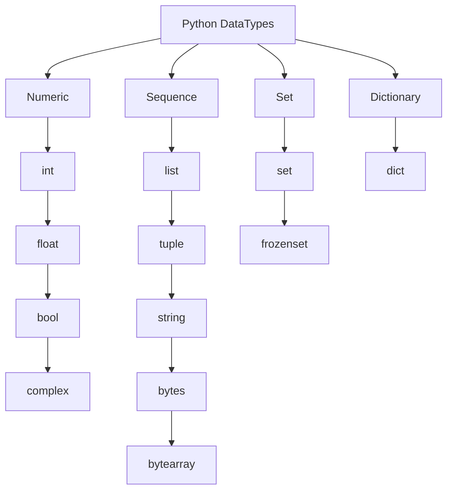

# Table of contents
  - [Section 1: Introduction to Python](#section-1-introduction-to-python)
    - [How a Python Program Runs?](#how-a-python-program-runs)
  - [Section 2: Python Installation and Setup](#section-2-python-installation-and-setup)
    - [Installing Python](#installing-python)
    - [Installing Pycharm](#installing-pycharm)
  - [Section 3: Python Datatypes](#section-3-python-datatypes)
    - [Python Dynamically Typed](#python-dynamically-typed)
      - [Example of a Type Error Due to Dynamic Typing](#example-of-a-type-error-due-to-dynamic-typing)
    - [Rules for Declaring Variable Names in Python](#rules-for-declaring-variable-names-in-python)
    - [Python DataTypes](#python-datatypes)
      - [1. Numeric](#1-numeric)
      - [2. Sequence](#2-sequence)
      - [3. Set](#3-set)
      - [4. Dictionary](#4-dictionary)

## Section 1: Introduction to Python
### How a Python Program Runs?
**1. Python Interpreter Reads the Code (.py file)**

- The Python `interpreter` starts by **reading the source code**.

**2. Compiling to Bytecode (.pyc file in __pycache__)**

- The `interpreter` **compiles** the code into **bytecode**, an intermediate representation for efficiency.

**3. Executing in the Python Virtual Machine (PVM)**
- The `interpreter` **runs the bytecode** using the Python Virtual Machine (**PVM**), which processes instructions line by line.

**4. Interacting with the Operating System**
- The `interpreter` communicates with the OS to manage files, databases, networking, and I/O operations.

<div align="right">
  <strong>
    <a href="#table-of-contents" style="text-decoration: none;">↥ Back to top</a>
  </strong>
</div>

## Section 2: Python Installation and Setup
### Installing Python
Steps to Install Python on Windows  

**1. Download Python**
- Go to the official Python website: https://www.python.org/downloads/
- Click **Download Python [latest version]** (it will detect your OS automatically).  

**2. Run the Installer**  
- Open the downloaded `.exe` file (e.g., `python-3.x.x.exe`).
- **Important**: Check the box **"Add python.exe to PATH"** (this allows running Python from the command line).
- Click **"Install Now"** and wait for the installation to finish.

**3. Verify the Installation**  
- Open **Command Prompt (CMD)** or PowerShell.
**Type:**
```sh
python --version
```
- If installed correctly, it will display the Python version
```sh
Python 3.xx.x
```  
**4. Test Python**  
- In CMD, type **python** and press **Enter**.
- You should see the Python interactive shell (>>> prompt).
- Try running a simple command:
```sh
print("Hello, Python!")
```
If it prints `Hello, Python!`, Python is installed correctly.


<div align="right">
  <strong>
    <a href="#table-of-contents" style="text-decoration: none;">↥ Back to top</a>
  </strong>
</div>

### Installing Pycharm
**Steps to Install PyCharm Community Edition on Windows**

**1. Download PyCharm**
- Visit the official JetBrains website:  
  🔗 [https://www.jetbrains.com/pycharm/download/](https://www.jetbrains.com/pycharm/download/)  
- Under **Community Edition**, click **Download** (this version is **free**).  

**2. Run the Installer**  
- Open the downloaded `.exe` file (e.g., `pycharm-community-*.*.*.exe`).  
- Click **Next** to proceed.  

 **3. Choose Installation Location**  
- Leave the **default path** or select a custom folder.  
- Click **Next**.  

 **4. Configure Installation Options(Recommended)**   
  ✅ **Create Desktop Shortcut** → Adds a shortcut to easily launch PyCharm.  
  ✅ **Update PATH Variable** → Adds the `bin` folder to the system PATH (allows running PyCharm from the terminal).  

  *(Note: Enabling the PATH option requires a system restart for changes to take effect.)*  

- Click **Next**.  

 **5. Install PyCharm**  
- Click **Install** and wait for the process to complete.  

 **6. Launch PyCharm**  
- After installing and opening PyCharm for the first time, you will see the window from the image.
- In this window, you can choose to import settings from:
 - IntelliJ IDEA Community 2024.3 (If you have used IntelliJ IDEA and want to import its settings).
 - Visual Studio Code (If you want to import settings from VS Code).
 - Skip Import (If you prefer to start with default settings).  

**7. Create a New Python Project**
1. Click **New Project** → Select a location.  
2. Choose **Python Interpreter**:  
   - Select an existing Python installation (`python.exe` from Python installation).  
   - Or let PyCharm create a **virtual environment**.  
3. Click **Create** to start coding!  

**Switch back to the Classic UI in PyCharm using the Classic UI plugin**  
Follow these steps:

**1. Open the Plugin Settings**
 - Go to File > Settings (Ctrl + Alt + S).
 - In the left menu, select **Plugins**.  

**2. Search for the "Classic UI" Plugin**
 - In the **Marketplace** tab, type **Classic UI** in the search bar.
 - Find the plugin named **Classic UI** (from JetBrains or the community).
 - Click **Install**.  

**3. Restart PyCharm**
- After installing the plugin, click **Restart** IDE.
- Once PyCharm restarts, it should switch to the **Classic UI**. which PyCharm version you're using. 

<div align="right">
  <strong>
    <a href="#table-of-contents" style="text-decoration: none;">↥ Back to top</a>
  </strong>
</div>

## Section 3: Python Datatypes
### Python Dynamically Typed
Python is **a dynamically typed language**, which means that **you don’t need to declare** the **data type** of a variable explicitly. Instead, **Python automatically determines the type** based on the value assigned to the variable at runtime.
```python
x = 10      # 'x' is an integer (int)
x = "Hello" # Now 'x' is a string (str)
x = 3.14    # Now 'x' is a float (float)
```


#### Example of a Type Error Due to Dynamic Typing
```python
num = 10     # Integer
num = num + "5"  # TypeError: unsupported operand type(s) for +: 'int' and 'str'
```
Here, Python raises an error because it tries to add an integer (10) to a string ("5"), which is not allowed.

<div align="right">
  <strong>
    <a href="#table-of-contents" style="text-decoration: none;">↥ Back to top</a>
  </strong>
</div>

### Rules for Declaring Variable Names in Python  

**1. Name can contain alpha-numeric characters and underscores** (`A-Z, a-z, 0-9, _`)  

✔ **Valid examples:**  
```python
name = "Alice"       # Only letters
age_23 = 23          # Letters + numbers
user_name = "John"   # Letters + underscore
```

✖ **Invalid examples:**  
```python
user-name = "John"   # Hyphen (-) is not allowed
2nd_place = "Silver" # Cannot start with a number
```

---

**2. Name should start with a letter or an underscore**(`A-Z, a-z, _`)  

✔ **Valid examples:**  
```python
_name = "Hidden"   # Starts with underscore
a123 = "Valid"     # Starts with a letter
```

✖ **Invalid examples:**  
```python
123name = "Error"  # Cannot start with a number
!var = 10          # Special characters not allowed
```

---

**3. Keywords should not be used as variable names**

Python has **reserved words (keywords)** that cannot be used as variable names.  

✖ **Invalid examples:**  
```python
if = 10          # 'if' is a keyword
class = "Test"   # 'class' is a keyword
return = 5       # 'return' is a keyword
```

✔ **Corrected versions:**  
```python
if_value = 10    
class_name = "Test"  
return_value = 5   
```

---

**4. Variables are case-sensitive (`name` ≠ `Name` ≠ `NAME`)**  

Python distinguishes between uppercase and lowercase letters in variable names.  

✔ **Valid examples:**  
```python
name = "Alice"
Name = "Bob"
NAME = "Charlie"

print(name)  # Output: Alice
print(Name)  # Output: Bob
print(NAME)  # Output: Charlie
```

Each **variable** holds **a different value** because **Python treats them as separate variables**.

---

**Summary**

| Rule | ✔ Valid Example | ✖ Invalid Example |
|------|----------------|-------------------|
| **Alpha-numeric & underscore** | `user_1`, `myVar` | `user-name`, `my var` |
| **Start with letter or underscore** | `_hidden`, `a123` | `123name`, `!var` |
| **No keywords** | `my_class`, `return_value` | `if`, `class`, `return` |
| **Case-sensitive** | `name`, `Name`, `NAME` | - |

<div align="right">
  <strong>
    <a href="#table-of-contents" style="text-decoration: none;">↥ Back to top</a>
  </strong>
</div>

### Python DataTypes

Python has several **built-in data types** that can be categorized into different **groups**:


#### 1. Numeric
These data types represent numerical values.

- `int` → Integer numbers (**example**: `10`, `-5`)
- `float` → Floating-point numbers (**example**: `3.14`, `-2.5`)
- `bool` → Boolean values (`True` or `False`)
- `complex` → Complex numbers (**example**: `3+4j`)

**Example**
```python
# Numeric
a = 10         # int
b = 3.14       # float
c = True       # bool
d = 3 + 4j     # complex

print(type(a), type(b), type(c), type(d))
```
**Output:**
```python
<class 'int'> <class 'float'> <class 'bool'> <class 'complex'>
```

<div align="right">
  <strong>
    <a href="#table-of-contents" style="text-decoration: none;">↥ Back to top</a>
  </strong>
</div>

#### 2. Sequence
These data types store multiple values in order.

- `list` → Mutable list (**example**: `[1, 2, 3]`)
- `tuple` → Immutable tuple (**example**: `(1, 2, 3)`)
- `str` → String of text (**example**: `"Hello, World!"`)
- `bytes` → Immutable sequence of bytes (**example**: `b'hello'`)
- `bytearray` → Mutable sequence of bytes (**example**: `bytearray(b'hello')`)

**Example**
```python
# Sequence
my_list = [1, 2, 3]
my_tuple = (1, 2, 3)
my_str = "Hello, Python"
my_bytes = b"hello"
my_bytearray = bytearray(b"hello")

print(type(my_list), type(my_tuple), type(my_str), type(my_bytes), type(my_bytearray))
```
**Output:**
```python
<class 'list'> <class 'tuple'> <class 'str'> <class 'bytes'> <class 'bytearray'>
```

<div align="right">
  <strong>
    <a href="#table-of-contents" style="text-decoration: none;">↥ Back to top</a>
  </strong>
</div>

#### 3. Set
They represent collections of unique elements.

- `set` → Mutable set (**example**: `{1, 2, 3}`)
- `frozenset` → Immutable set (**example**: `frozenset({1, 2, 3})`)

**Example**
```python
# Set
my_set = {1, 2, 3}
my_frozenset = frozenset({1, 2, 3})

print(type(my_set), type(my_frozenset))
```
**Output:**
```python
<class 'set'> <class 'frozenset'>
```

<div align="right">
  <strong>
    <a href="#table-of-contents" style="text-decoration: none;">↥ Back to top</a>
  </strong>
</div>

#### 4. Dictionary
They store data in key-value pairs.

- `dict` → Mutable dictionary (**example**: `{"name": "Alice", "age": 25}`)

**Example**
```python
# Dictionary
my_dict = {"name": "Alice", "age": 25}

print(type(my_dict))
```
**Output:**
```python
<class 'dict'>
```

<div align="right">
  <strong>
    <a href="#table-of-contents" style="text-decoration: none;">↥ Back to top</a>
  </strong>
</div>
