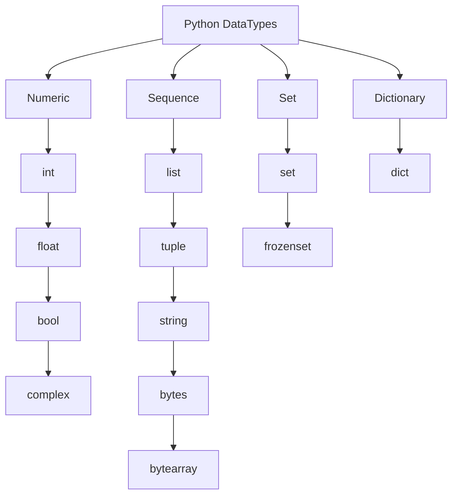

# Table of contents
  - [Section 1: Introduction to Python](#section-1-introduction-to-python)
    - [How a Python Program Runs?](#how-a-python-program-runs)
  - [Section 2: Python Installation and Setup](#section-2-python-installation-and-setup)
    - [Installing Python](#installing-python)
    - [Installing Pycharm](#installing-pycharm)
  - [Section 3: Python Datatypes](#section-3-python-datatypes)
    - [Python Dynamically Typed](#python-dynamically-typed)
      - [Example of a Type Error Due to Dynamic Typing](#example-of-a-type-error-due-to-dynamic-typing)
    - [Rules for Declaring Variable Names in Python](#rules-for-declaring-variable-names-in-python)
    - [Python DataTypes](#python-datatypes)
      - [1. Numeric](#1-numeric)
      - [2. Sequence](#2-sequence)
      - [3. Set](#3-set)
      - [4. Dictionary](#4-dictionary)
    - [Type Conversion in Python](#type-conversion-in-python)
      - [1. Implicit Type Conversion (Automatic)](#1-implicit-type-conversion-automatic)
      - [2. Explicit Type Conversion (Type Casting)](#2-explicit-type-conversion-type-casting)
      - [3. Special Cases in Type Conversion](#3-special-cases-in-type-conversion)
      - [4. Summary](#4-summary)
  - [Section 4: Operators and Expression](#section-4-operators-and-expression)
    - [Arithmetic Operators](#arithmetic-operators)
    - [Challenge : Area of triangle](#challenge--area-of-triangle)
      - [1. Triangle Area](#1-triangle-area)
      - [2. Rhombus Area (Using Trapezoidal Formula)](#2-rhombus-area-using-trapezoidal-formula)
      - [3. Displacement (Using Kinematic Equation)](#3-displacement-using-kinematic-equation)
    - [Challenge : Kms to Miles](#challenge--kms-to-miles)
      - [1. Converting km to miles](#1-converting-km-to-miles)
      - [2. Area of a Circle](#2-area-of-a-circle)

## Section 1: Introduction to Python
### How a Python Program Runs?
**1. Python Interpreter Reads the Code (.py file)**

- The Python `interpreter` starts by **reading the source code**.

**2. Compiling to Bytecode (.pyc file in __pycache__)**

- The `interpreter` **compiles** the code into **bytecode**, an intermediate representation for efficiency.

**3. Executing in the Python Virtual Machine (PVM)**
- The `interpreter` **runs the bytecode** using the Python Virtual Machine (**PVM**), which processes instructions line by line.

**4. Interacting with the Operating System**
- The `interpreter` communicates with the OS to manage files, databases, networking, and I/O operations.

<div align="right">
  <strong>
    <a href="#table-of-contents" style="text-decoration: none;">↥ Back to top</a>
  </strong>
</div>

## Section 2: Python Installation and Setup
### Installing Python
Steps to Install Python on Windows  

**1. Download Python**
- Go to the official Python website: https://www.python.org/downloads/
- Click **Download Python [latest version]** (it will detect your OS automatically).  

**2. Run the Installer**  
- Open the downloaded `.exe` file (e.g., `python-3.x.x.exe`).
- **Important**: Check the box **"Add python.exe to PATH"** (this allows running Python from the command line).
- Click **"Install Now"** and wait for the installation to finish.

**3. Verify the Installation**  
- Open **Command Prompt (CMD)** or PowerShell.
**Type:**
```sh
python --version
```
- If installed correctly, it will display the Python version
```sh
Python 3.xx.x
```  
**4. Test Python**  
- In CMD, type **python** and press **Enter**.
- You should see the Python interactive shell (>>> prompt).
- Try running a simple command:
```sh
print("Hello, Python!")
```
If it prints `Hello, Python!`, Python is installed correctly.


<div align="right">
  <strong>
    <a href="#table-of-contents" style="text-decoration: none;">↥ Back to top</a>
  </strong>
</div>

### Installing Pycharm
**Steps to Install PyCharm Community Edition on Windows**

**1. Download PyCharm**
- Visit the official JetBrains website:  
  🔗 [https://www.jetbrains.com/pycharm/download/](https://www.jetbrains.com/pycharm/download/)  
- Under **Community Edition**, click **Download** (this version is **free**).  

**2. Run the Installer**  
- Open the downloaded `.exe` file (e.g., `pycharm-community-*.*.*.exe`).  
- Click **Next** to proceed.  

 **3. Choose Installation Location**  
- Leave the **default path** or select a custom folder.  
- Click **Next**.  

 **4. Configure Installation Options(Recommended)**   
  ✅ **Create Desktop Shortcut** → Adds a shortcut to easily launch PyCharm.  
  ✅ **Update PATH Variable** → Adds the `bin` folder to the system PATH (allows running PyCharm from the terminal).  

  *(Note: Enabling the PATH option requires a system restart for changes to take effect.)*  

- Click **Next**.  

 **5. Install PyCharm**  
- Click **Install** and wait for the process to complete.  

 **6. Launch PyCharm**  
- After installing and opening PyCharm for the first time, you will see the window from the image.
- In this window, you can choose to import settings from:
 - IntelliJ IDEA Community 2024.3 (If you have used IntelliJ IDEA and want to import its settings).
 - Visual Studio Code (If you want to import settings from VS Code).
 - Skip Import (If you prefer to start with default settings).  

**7. Create a New Python Project**
1. Click **New Project** → Select a location.  
2. Choose **Python Interpreter**:  
   - Select an existing Python installation (`python.exe` from Python installation).  
   - Or let PyCharm create a **virtual environment**.  
3. Click **Create** to start coding!  

**Switch back to the Classic UI in PyCharm using the Classic UI plugin**  
Follow these steps:

**1. Open the Plugin Settings**
 - Go to File > Settings (Ctrl + Alt + S).
 - In the left menu, select **Plugins**.  

**2. Search for the "Classic UI" Plugin**
 - In the **Marketplace** tab, type **Classic UI** in the search bar.
 - Find the plugin named **Classic UI** (from JetBrains or the community).
 - Click **Install**.  

**3. Restart PyCharm**
- After installing the plugin, click **Restart** IDE.
- Once PyCharm restarts, it should switch to the **Classic UI**. which PyCharm version you're using. 

<div align="right">
  <strong>
    <a href="#table-of-contents" style="text-decoration: none;">↥ Back to top</a>
  </strong>
</div>

## Section 3: Python Datatypes
### Python Dynamically Typed
Python is **a dynamically typed language**, which means that **you don’t need to declare** the **data type** of a variable explicitly. Instead, **Python automatically determines the type** based on the value assigned to the variable at runtime.
```python
x = 10      # 'x' is an integer (int)
x = "Hello" # Now 'x' is a string (str)
x = 3.14    # Now 'x' is a float (float)
```


#### Example of a Type Error Due to Dynamic Typing
```python
num = 10     # Integer
num = num + "5"  # TypeError: unsupported operand type(s) for +: 'int' and 'str'
```
Here, Python raises an error because it tries to add an integer (10) to a string ("5"), which is not allowed.

<div align="right">
  <strong>
    <a href="#table-of-contents" style="text-decoration: none;">↥ Back to top</a>
  </strong>
</div>

### Rules for Declaring Variable Names in Python  

**1. Name can contain alpha-numeric characters and underscores** (`A-Z, a-z, 0-9, _`)  

✔ **Valid examples:**  
```python
name = "Alice"       # Only letters
age_23 = 23          # Letters + numbers
user_name = "John"   # Letters + underscore
```

✖ **Invalid examples:**  
```python
user-name = "John"   # Hyphen (-) is not allowed
2nd_place = "Silver" # Cannot start with a number
```

---

**2. Name should start with a letter or an underscore**(`A-Z, a-z, _`)  

✔ **Valid examples:**  
```python
_name = "Hidden"   # Starts with underscore
a123 = "Valid"     # Starts with a letter
```

✖ **Invalid examples:**  
```python
123name = "Error"  # Cannot start with a number
!var = 10          # Special characters not allowed
```

---

**3. Keywords should not be used as variable names**

Python has **reserved words (keywords)** that cannot be used as variable names.  

✖ **Invalid examples:**  
```python
if = 10          # 'if' is a keyword
class = "Test"   # 'class' is a keyword
return = 5       # 'return' is a keyword
```

✔ **Corrected versions:**  
```python
if_value = 10    
class_name = "Test"  
return_value = 5   
```

---

**4. Variables are case-sensitive (`name` ≠ `Name` ≠ `NAME`)**  

Python distinguishes between uppercase and lowercase letters in variable names.  

✔ **Valid examples:**  
```python
name = "Alice"
Name = "Bob"
NAME = "Charlie"

print(name)  # Output: Alice
print(Name)  # Output: Bob
print(NAME)  # Output: Charlie
```

Each **variable** holds **a different value** because **Python treats them as separate variables**.

---

**Summary**

| Rule | ✔ Valid Example | ✖ Invalid Example |
|------|----------------|-------------------|
| **Alpha-numeric & underscore** | `user_1`, `myVar` | `user-name`, `my var` |
| **Start with letter or underscore** | `_hidden`, `a123` | `123name`, `!var` |
| **No keywords** | `my_class`, `return_value` | `if`, `class`, `return` |
| **Case-sensitive** | `name`, `Name`, `NAME` | - |

<div align="right">
  <strong>
    <a href="#table-of-contents" style="text-decoration: none;">↥ Back to top</a>
  </strong>
</div>

### Python DataTypes

Python has several **built-in data types** that can be categorized into different **groups**:


#### 1. Numeric
These data types represent numerical values.

- `int` → Integer numbers (**example**: `10`, `-5`)
- `float` → Floating-point numbers (**example**: `3.14`, `-2.5`)
- `bool` → Boolean values (`True` or `False`)
- `complex` → Complex numbers (**example**: `3+4j`)

**Example**
```python
# Numeric
a = 10         # int
b = 3.14       # float
c = True       # bool
d = 3 + 4j     # complex

print(type(a), type(b), type(c), type(d))
```
**Output:**
```python
<class 'int'> <class 'float'> <class 'bool'> <class 'complex'>
```

<div align="right">
  <strong>
    <a href="#table-of-contents" style="text-decoration: none;">↥ Back to top</a>
  </strong>
</div>

#### 2. Sequence
These data types store multiple values in order.

- `list` → Mutable list (**example**: `[1, 2, 3]`)
- `tuple` → Immutable tuple (**example**: `(1, 2, 3)`)
- `str` → String of text (**example**: `"Hello, World!"`)
- `bytes` → Immutable sequence of bytes (**example**: `b'hello'`)
- `bytearray` → Mutable sequence of bytes (**example**: `bytearray(b'hello')`)

**Example**
```python
# Sequence
my_list = [1, 2, 3]
my_tuple = (1, 2, 3)
my_str = "Hello, Python"
my_bytes = b"hello"
my_bytearray = bytearray(b"hello")

print(type(my_list), type(my_tuple), type(my_str), type(my_bytes), type(my_bytearray))
```
**Output:**
```python
<class 'list'> <class 'tuple'> <class 'str'> <class 'bytes'> <class 'bytearray'>
```

<div align="right">
  <strong>
    <a href="#table-of-contents" style="text-decoration: none;">↥ Back to top</a>
  </strong>
</div>

#### 3. Set
They represent collections of unique elements.

- `set` → Mutable set (**example**: `{1, 2, 3}`)
- `frozenset` → Immutable set (**example**: `frozenset({1, 2, 3})`)

**Example**
```python
# Set
my_set = {1, 2, 3}
my_frozenset = frozenset({1, 2, 3})

print(type(my_set), type(my_frozenset))
```
**Output:**
```python
<class 'set'> <class 'frozenset'>
```

<div align="right">
  <strong>
    <a href="#table-of-contents" style="text-decoration: none;">↥ Back to top</a>
  </strong>
</div>

#### 4. Dictionary
They store data in key-value pairs.

- `dict` → Mutable dictionary (**example**: `{"name": "Alice", "age": 25}`)

**Example**
```python
# Dictionary
my_dict = {"name": "Alice", "age": 25}

print(type(my_dict))
```
**Output:**
```python
<class 'dict'>
```

<div align="right">
  <strong>
    <a href="#table-of-contents" style="text-decoration: none;">↥ Back to top</a>
  </strong>
</div>

### Type Conversion in Python

#### 1. Implicit Type Conversion (Automatic)
Python **automatically** converts one data type into another **without user intervention**.

**✅ Example of Implicit Type Conversion**
```python
num_int = 10     # Integer
num_float = 2.5  # Float

result = num_int + num_float  # int + float → float

print(result)      # Output: 12.5
print(type(result))  # Output: <class 'float'>
```
🔹 Python converts `int` to `float` because `float` has a higher precision than `int`.

**Rules for Implicit Conversion**
- `int` → `float`
- `int` → `complex`
- `int` → `bool`
- `float` → `complex`

```python
num = 5  # int
comp = num + 2j  # int → complex
print(type(comp))  # Output: <class 'complex'>
```
<div align="right">
  <strong>
    <a href="#table-of-contents" style="text-decoration: none;">↥ Back to top</a>
  </strong>
</div>

---

#### 2. Explicit Type Conversion (Type Casting)
Explicit conversion is when we **manually** convert one data type into another **using built-in functions**.

**Common Type Casting Functions**
| Function | Converts to |
|----------|------------|
| `int(x)` | Integer |
| `float(x)` | Floating point number |
| `str(x)` | String |
| `list(x)` | List |
| `tuple(x)` | Tuple |
| `set(x)` | Set |
| `dict(x)` | Dictionary |
| `bool(x)` | Boolean |

**✅ Examples of Explicit Conversion**
```python
# Convert string to 'integer'
num_str = "100"
num_int = int(num_str)
print(num_int, type(num_int))  # Output: 100 <class 'int'>

# Convert float to 'integer'
num_float = 9.7
num_int = int(num_float)  # Removes decimal part (not rounding!)
print(num_int)  # Output: 9

# Convert list to 'tuple'
my_list = [1, 2, 3]
my_tuple = tuple(my_list)
print(my_tuple)  # Output: (1, 2, 3)

# Convert integer to 'string'
num = 50
num_str = str(num)
print(num_str, type(num_str))  # Output: "50" <class 'str'>
```

<div align="right">
  <strong>
    <a href="#table-of-contents" style="text-decoration: none;">↥ Back to top</a>
  </strong>
</div>

---

#### 3. Special Cases in Type Conversion
**Converting String to Integer or Float**
```python
num = "123a"
print(int(num))  # ❌ ERROR: ValueError
```
🔹 Only strings containing **numeric values** can be converted to `int` or `float`.

**⚠️ Boolean Conversion**
- **Zero or an empty object → `False`**
- **Any number that is not zero or any object that is not empty → `True`**

```python
print(bool(0))   # False (zero is always False)
print(bool(5))   # True (any non-zero number is True)
print(bool(-3))  # True (negative numbers are also True)

# Boolean Conversion for Strings
print(bool(""))         # False (empty string)
print(bool("Hello"))    # True (non-empty string)
print(bool(" "))        # True (even a space is a character)
print(bool("0"))        # True (it's a non-empty string, not the number 0)
```
<div align="right">
  <strong>
    <a href="#table-of-contents" style="text-decoration: none;">↥ Back to top</a>
  </strong>
</div>

---

#### 4. Summary
| Type Conversion | Description |
|----------------|-------------|
| **Implicit** | Automatic conversion (e.g., `int` to `float`) |
| **Explicit** | Manual conversion using functions like `int()`, `float()`, `str()`, etc. |
| **Boolean Rules** | Non-empty values → `True`, empty values → `False` |

<div align="right">
  <strong>
    <a href="#table-of-contents" style="text-decoration: none;">↥ Back to top</a>
  </strong>
</div>

## Section 4: Operators and Expression
### Arithmetic Operators

Python provides several **arithmetic operators** to perform mathematical calculations.

**1. List of Arithmetic Operators**
| Operator | Symbol | Description | Example |
|----------|--------|-------------|---------|
| Addition | `+` | **Adds** two numbers | `5 + 3 = 8` |
| Subtraction | `-` | **Subtracts** one number from another | `10 - 4 = 6` |
| Multiplication | `*` | **Multiplies** two numbers | `6 * 2 = 12` |
| Division | `/` | **Divides** one number by another **(float result)** | `9 / 2 = 4.5` |
| Floor Division | `//` | **Divides** and rounds down to the nearest whole number **(integer result)** | `9 // 2 = 4` |
| Modulus | `%` | Returns the **remainder of division** | `9 % 2 = 1` |
| Exponentiation | `**` | Raises a number to the power of another | `2 ** 3 = 8` |

---

**2. Examples of Arithmetic Operators**
```python
# Addition
x = 10 + 5
print(x)  # Output: 15

# Subtraction
y = 20 - 3
print(y)  # Output: 17

# Multiplication
z = 4 * 6
print(z)  # Output: 24

# Division (float result)
a = 9 / 2
print(a)  # Output: 4.50

# Floor Division (integer result)
b = 9 // 2
print(b)  # Output: 4

# Modulus (remainder)
c = 9 % 2
print(c)  # Output: 1

# Exponentiation
d = 2 ** 3
print(d)  # Output: 8
```

---

**3. Special Cases**  
**Division by Zero**
```python
print(10 / 0)  # ❌ ERROR: ZeroDivisionError
```
**Solution:** Always check if the divisor is zero before performing division.

**Floor Division with Negative Numbers(integer result)**
```python
print(-7 // 2)  # Output: -4 (rounds down, not towards zero)
```

**Modulus with Negative Numbers**
```python
print(-10 % 3)  # Output: 2 (because -10 = (-4 * 3) + 2)
```

<div align="right">
  <strong>
    <a href="#table-of-contents" style="text-decoration: none;">↥ Back to top</a>
  </strong>
</div>

---
### Challenge : Area of triangle 
#### 1. Triangle Area

```math
A = \frac{1}{2} \times \text{base} \times \text{height}
```

**Example:**  
If the **base** is **10 cm** and the **height** is **5 cm**, then:  

```math
\begin{aligned}
A = \frac{1}{2} \times \text{base} \times \text{height} \newline
A = \frac{1}{2} \times 10 \times 5 = 25 \text{ cm}^2
\end{aligned}
```

**Code**
```python
base = int(input('Enter base: '))
height = int(input('Enter height: '))
area = 1/2 * base * height
print('Area is ', area)
```
**Output**
```python
Enter base: 10
Enter height: 5
Area is 25.0
```
<div align="right">
  <strong>
    <a href="#table-of-contents" style="text-decoration: none;">↥ Back to top</a>
  </strong>
</div>

---
#### 2. Rhombus Area (Using Trapezoidal Formula)
The area of a rhombus can also be calculated using the formula:  

```math
A = \frac{1}{2} \times (a + b) \times \text{height}
``` 

**Example:**  
If (**a** = 6) cm, ( **b** = 4 ) cm, and **height** = 5 cm, then:  

```math
\begin{aligned}
A = \frac{1}{2} \times (a + b) \times \text{height} \newline
A = \frac{1}{2} \times (6 + 4) \times 5 \newline
A = \frac{1}{2} \times 10 \times 5 \newline
A = 25 \text{ cm}^2
\end{aligned}
```

**Code**  
```python
a = float(input('Enter side a: '))
b = float(input('Enter side b: '))
height = float(input('Enter height: '))
area = 1/2 * (a + b) * height
print('Area is', area)
```
**Output**
```python
Enter side a: 6
Enter side b: 4
Enter height: 5
Area is 25.0
```

<div align="right">
  <strong>
    <a href="#table-of-contents" style="text-decoration: none;">↥ Back to top</a>
  </strong>
</div>

#### 3. Displacement (Using Kinematic Equation)

The displacement (**d**) is given by the equation:  

```math
d = \frac{v^2 - u^2}{2a}
```

Where:  
- **u** is the **initial velocity**.  
- **v** is the **final velocity**.  
- **a** is the **acceleration**.  
- **d** is the **displacement**.  

**Example Calculation**  
If (**u** = 5) m/s, (**v** = 15) m/s, and (**a** = 2) m/s², then:  

```math
\begin{aligned}
d = \frac{v^2 - u^2}{2a} \newline
d = \frac{15^2 - 5^2}{2 \times 2} \newline
d = \frac{225 - 25}{4} \newline
d = \frac{200}{4} = 50
\end{aligned}
```

**Code** 
```python
u = float(input('Enter initial velocity(u): '))
v = float(input('Enter final velocity(v): '))
a = float(input('Enter acceleration(a): '))
d = (v**2 - u**2) / (2 * a)
print("Displacement is", d)
```
**Output** 
```python
Enter initial velocity(u): 5
Enter final velocity(v): 15
Enter acceleration(a): 2
Displacement is 50.0
```

<div align="right">
  <strong>
    <a href="#table-of-contents" style="text-decoration: none;">↥ Back to top</a>
  </strong>
</div>

### Challenge : Kms to Miles
#### 1. Converting km to miles

```math
\text{miles} = \text{km} \times 0.621371
```

**Example**  
In this example, if the input is **10** kilometers, the output will be approximately **6.21371** miles.
```math
\begin{aligned}
\text{miles} &= \text{km} \times 0.621371 \newline
\text{miles} &= 10 \times 0.621371 = 6.21371
\end{aligned}
```
**Code**
```python
km = float(input('Enter Km: '))
miles = km * 0.621371
print('Miles =', miles)
```
**Output**
```python
Enter Km: 10
Miles = 6.21371
```

<div align="right">
  <strong>
    <a href="#table-of-contents" style="text-decoration: none;">↥ Back to top</a>
  </strong>
</div>

#### 2. Area of a Circle
The formula for the area of a circle is:
```math
\text{Area} = \pi \times r^2
```
 
This calculates the **area** of a circle based on its **radius** ($r$). 

**Example**   
In this example, if the input is a radius of **5** units, the output will be approximately **78.5398**.

```math
\begin{aligned}
\text{Area} &= \pi \times r^2 \newline
\text{Area} &= \pi \times 5^2 \newline
\text{Area} &= 3.1416 \times 25 \newline
\text{Area} &= 78.53981633974483
\end{aligned}
```
**Code**
```python
import math
radius = float(input('Enter Radius: '))
area = math.pi * radius ** 2
print('Area is:', area)
```
**Output**
```python
Enter Radius: 5
Area is: 78.53981633974483
```

<div align="right">
  <strong>
    <a href="#table-of-contents" style="text-decoration: none;">↥ Back to top</a>
  </strong>
</div>

### Challenge : Surface area of Cuboid
A cuboid is a three-dimensional geometric shape with **six rectangular faces**. The **total surface area** (TSA) of a cuboid is the sum of the areas of all its six faces. It is calculated using the formula:
```math
\text{TSA} = 2(lh + lb + bh)
```
where:
- $l$ is the length,
- $b$ is the breadth (width),
- $h$ is the height.

**Example**  
Let's consider a cuboid with:
- $l \ = 10 \ cm$
- $b \ = 6 \ cm$
- $h \ = 4 \ cm$

```math
\begin{aligned}
\text{TSA} &= 2(lh + lb + bh) \newline
\ &= 2(10 \times 4 + 10 \times 6 + 6 \times 4) \newline
\ &= 2(40 + 60 + 24) \newline
\ &= 2(124) \newline
\ &= 248 cm^2
\end{aligned}
```
**Code**
```python
length = float(input('Enter Length(l): '))
breadth = float(input('Enter Breadth(b): '))
height = float(input('Enter Height(h): '))
area = 2 * (length * breadth + length * height + breadth * height)
print('Total Surface Area is:', area)
```
**Output**
```python
Enter Length(l): 10
Enter Breadth(b): 6
Enter Height(h): 4
Total Surface Area is: 248.0
```
<div align="right">
  <strong>
    <a href="#table-of-contents" style="text-decoration: none;">↥ Back to top</a>
  </strong>
</div>

### Challenge : Quadratic Equations
**Finding Roots of Quadratic Equations**  
The general quadratic equation is:

```math
ax^2 + bx + c = 0
```
The roots of the equation are given by:

```math
\begin{aligned}
r_1 = \frac{-b + \sqrt{b^2 - 4ac}}{2a} \newline
r_2 = \frac{-b - \sqrt{b^2 - 4ac}}{2a}
\end{aligned}
```
**Example**  
Let's solve the quadratic equation:

```math
2x^2 + 5x - 3 = 0
```

Using the quadratic formula:
```math
a = 2, \quad b = 5, \quad c = -3
```
```math
\begin{aligned}
r_1 &= \frac{-b + \sqrt{b^2 - 4ac}}{2a} \newline
&= \frac{-5 + \sqrt{(5)^2 - 4(2)(-3)}}{2(2)} \newline
&= \frac{-5 + \sqrt{25 + 24}}{4} \newline
&= \frac{-5 + \sqrt{49}}{4} \newline
&= \frac{-5 + 7}{4} = \frac{2}{4} = 0.5
\end{aligned}
```
For $r_2$:
```math
a = 2, \quad b = 5, \quad c = -3
```
```math
\begin{aligned}
r_2 &= \frac{-b - \sqrt{b^2 - 4ac}}{2a} \newline
&= \frac{-5 - \sqrt{(5)^2 - 4(2)(-3)}}{2(2)} \newline
&= \frac{-5 - \sqrt{25 + 24}}{4} \newline
&= \frac{-5 - \sqrt{49}}{4} \newline
&= \frac{-5 - 7}{4} = \frac{-12}{4} = -3
\end{aligned}
```
Final Answer:
The roots of the equation are:
```math
r_1 = 0.5, \quad r_2 = -3
```
**Code**
```python
import math

a = int(input('Enter a value: '))
b = int(input('Enter b value: '))
c = int(input('Enter c value: '))
root1 = (-b + math.sqrt(b**2 - 4 * a * c))/(2 * a)
root2 = (-b - math.sqrt(b**2 - 4 * a * c))/(2 * a)
print('Roots are ', root1, root2)
```

**Output**
```python
Enter a value: 2
Enter b value: 5
Enter c value: -3
Roots are  0.5 -3.0
```
<div align="right">
  <strong>
    <a href="#table-of-contents" style="text-decoration: none;">↥ Back to top</a>
  </strong>
</div>
