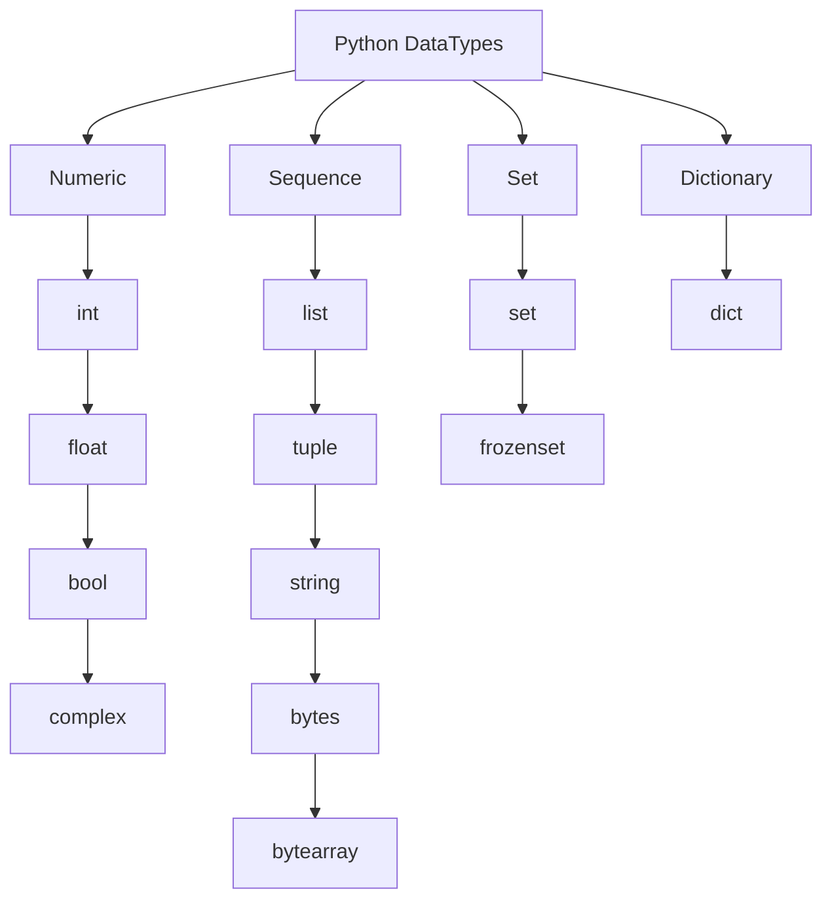

<h1>Table of contents</h1>

- [Section 1: Introduction to Python](#section-1-introduction-to-python)
  - [How a Python Program Runs?](#how-a-python-program-runs)
- [Section 2: Python Installation and Setup](#section-2-python-installation-and-setup)
  - [Installing Python](#installing-python)
  - [Installing Pycharm](#installing-pycharm)
- [Section 3: Python Datatypes](#section-3-python-datatypes)
  - [Python Dynamically Typed](#python-dynamically-typed)
    - [Example of a Type Error Due to Dynamic Typing](#example-of-a-type-error-due-to-dynamic-typing)
  - [Rules for Declaring Variable Names in Python](#rules-for-declaring-variable-names-in-python)
  - [Python DataTypes](#python-datatypes)
    - [1. Numeric](#1-numeric)
    - [2. Sequence](#2-sequence)
    - [3. Set](#3-set)
    - [4. Dictionary](#4-dictionary)
  - [Type Conversion in Python](#type-conversion-in-python)
    - [1. Implicit Type Conversion (Automatic)](#1-implicit-type-conversion-automatic)
    - [2. Explicit Type Conversion (Type Casting)](#2-explicit-type-conversion-type-casting)
    - [3. Special Cases in Type Conversion](#3-special-cases-in-type-conversion)
    - [4. Summary](#4-summary)
- [Section 4: Operators and Expression](#section-4-operators-and-expression)
  - [Arithmetic Operators](#arithmetic-operators)
  - [Challenge : Area of triangle](#challenge--area-of-triangle)
    - [1. Triangle Area](#1-triangle-area)
    - [2. Rhombus Area (Using Trapezoidal Formula)](#2-rhombus-area-using-trapezoidal-formula)
    - [3. Displacement (Using Kinematic Equation)](#3-displacement-using-kinematic-equation)
  - [Challenge : Kms to Miles](#challenge--kms-to-miles)
    - [1. Converting km to miles](#1-converting-km-to-miles)
    - [2. Area of a Circle](#2-area-of-a-circle)
  - [Challenge : Surface area of Cuboid](#challenge--surface-area-of-cuboid)
  - [Challenge : Quadratic Equations](#challenge--quadratic-equations)
  - [Arithmetic Assignment Operators](#arithmetic-assignment-operators)
- [Section 5: Conditional Statements](#section-5-conditional-statements)
  - [Conditional Statements- if ...else](#conditional-statements--if-else)
  - [Logical Operator](#logical-operator)
  - [Challenge : Eligibility for Casting a Vote](#challenge--eligibility-for-casting-a-vote)
  - [Challenge : Marks within Range](#challenge--marks-within-range)
  - [Challenge : Admin Access](#challenge--admin-access)
  - [Nested `if` and `elif` Statements](#nested-if-and-elif-statements)
  - [Challenge : Discount Amount](#challenge--discount-amount)
  - [Challenge : Displaying Name of a Day](#challenge--displaying-name-of-a-day)
  - [Challenge : Leap Year or Not](#challenge--leap-year-or-not)
  - [Detail Logical Operator](#detail-logical-operator)
  - [Bitwise Operators](#bitwise-operators)
    - [AND Operator (\&)](#and-operator-)
    - [OR Operator (|)](#or-operator-)
    - [XOR Operator (^)](#xor-operator-)
    - [NOT Operator (~)](#not-operator-)
    - [Left Shift Operator (\<\<)](#left-shift-operator-)
    - [Right Shift Operator (\>\>)](#right-shift-operator-)
- [Section 6: Loops - Control Flow](#section-6-loops---control-flow)
  - [Introduction to Loops](#introduction-to-loops)
  - [Challenge : Multiplication Table](#challenge--multiplication-table)
  - [Challenge : Counting the number of digits in a number](#challenge--counting-the-number-of-digits-in-a-number)
  - [Challenge : Find sum of digits in a number](#challenge--find-sum-of-digits-in-a-number)
  - [Challenge : Reversing a number](#challenge--reversing-a-number)
  - [Challenge : Check if a number is a Palindrome](#challenge--check-if-a-number-is-a-palindrome)
  - [Challenges](#challenges)
    - [1. Find sum of given numbers as input](#1-find-sum-of-given-numbers-as-input)
    - [2. Find sum of positive and negative numbers](#2-find-sum-of-positive-and-negative-numbers)
    - [3. Find maximum numbers from the given numbers](#3-find-maximum-numbers-from-the-given-numbers)
    - [4. Convert a Decimal number to a Binary number](#4-convert-a-decimal-number-to-a-binary-number)
  - [Challenge: Guess a number between 1 - 10](#challenge-guess-a-number-between-1---10)
  - [Infinite Loop - break - continue - pass](#infinite-loop---break---continue---pass)
  - [else suite : else with while loop](#else-suite--else-with-while-loop)
  - [What is for Loop ?](#what-is-for-loop-)
  - [Challenge : Factorial of Given Number](#challenge--factorial-of-given-number)
  - [Challenge : Fibonacci Series](#challenge--fibonacci-series)
  - [Challenges](#challenges-1)
    - [1. Find the Factors of a Number](#1-find-the-factors-of-a-number)
    - [2. Check if a number is prime or not](#2-check-if-a-number-is-prime-or-not)
  - [Match Case](#match-case)
- [Section 7: String and its Methods](#section-7-string-and-its-methods)
  - [Operators on String](#operators-on-string)
  - [String Methods](#string-methods)
  - [String Methods : Removing Spaces](#string-methods--removing-spaces)
  - [String Methods : Changing Cases](#string-methods--changing-cases)
  - [String Methods : Inquiry Methods](#string-methods--inquiry-methods)
  - [String Methods : Starts with and Ends with](#string-methods--starts-with-and-ends-with)
  - [String Methods : Joining and Splitting](#string-methods--joining-and-splitting)
  - [Challenge : Sorting Letters of a String](#challenge--sorting-letters-of-a-string)
  - [Challenge : Displaying Data](#challenge--displaying-data)
  - [Challenge : Confirming Password](#challenge--confirming-password)
  - [Challenge : Credit Card Details](#challenge--credit-card-details)
  - [Challenge : Domain Name from Email](#challenge--domain-name-from-email)
  - [Challenge : Converting String to Palindrome](#challenge--converting-string-to-palindrome)
  - [Challenge : Day, Month , Year](#challenge--day-month--year)
  - [Challenge : Anagram String](#challenge--anagram-string)
  - [Challenge : Removing Punctuations](#challenge--removing-punctuations)
- [Section 8: Formatted Printing](#section-8-formatted-printing)
- [Section 9: Regular Expression](#section-9-regular-expression)
- [Section 10: List](#section-10-list)
- [Section 11: Tuple](#section-11-tuple)
- [Section 12: Sets](#section-12-sets)
- [Section 13: Dictionary](#section-13-dictionary)
- [Section 14: Functions](#section-14-functions)
- [Section 16: Exception Handling](#section-16-exception-handling)
- [Section 17: File Handling](#section-17-file-handling)
- [Section 18: Object Oriented Programing](#section-18-object-oriented-programing)
  - [1. Challenge : Dice in Games](#1-challenge--dice-in-games)
  - [2. Challenge : Class for Circle](#2-challenge--class-for-circle)
  - [3. Challenge : Book Details](#3-challenge--book-details)
  - [4. Challenge : Details of an Employee (Instance and Class Variable)](#4-challenge--details-of-an-employee-instance-and-class-variable)
  - [5. Challenge : Simple Class for Calculator (Static Method)](#5-challenge--simple-class-for-calculator-static-method)
  - [6. Challenge : Customer Phone Number (Accessors (Getters) and Mutators (Setters))](#6-challenge--customer-phone-number-accessors-getters-and-mutators-setters)
  - [7. Challenge : Currency Converter (Accessors (Getters) and Mutators (Setters))](#7-challenge--currency-converter-accessors-getters-and-mutators-setters)
  - [8. Challenge : Bank Account (Class attribute)](#8-challenge--bank-account-class-attribute)
  - [9. Challenge : Inheriting Shapes in Classes (Inheritance)](#9-challenge--inheriting-shapes-in-classes-inheritance)
  - [10. Challenge : Academic Courses (Outer and Inner Class)](#10-challenge--academic-courses-outer-and-inner-class)
  - [11. Challenge : Details of a Computer (Inner Class)](#11-challenge--details-of-a-computer-inner-class)
  - [12. Challenge : Pet Details (Polymorphism)](#12-challenge--pet-details-polymorphism)
  - [13. Challenge : Greeting in Different Languages (Polymorphism)](#13-challenge--greeting-in-different-languages-polymorphism)
  - [14. Challenge : Measuring the Angles (Operator Overloading)](#14-challenge--measuring-the-angles-operator-overloading)
  - [15. Challenge : Police Robot (Inheritance and Method Overriding)](#15-challenge--police-robot-inheritance-and-method-overriding)
  - [16. Challenge : Different Shape Class (Inheritance and Method Overriding)](#16-challenge--different-shape-class-inheritance-and-method-overriding)
  - [17. Challenge : Rational Number (Operator Overloading(`__sub__`))](#17-challenge--rational-number-operator-overloading__sub__)
  - [18. Challenge : Shopping Cart (Overriding)](#18-challenge--shopping-cart-overriding)
- [Section 19: Multithreading](#section-19-multithreading)
- [Section 20: Date and Time](#section-20-date-and-time)
- [Section 21: Database Connectivity](#section-21-database-connectivity)

## Section 1: Introduction to Python
### How a Python Program Runs?
**1. Python Interpreter Reads the Code (.py file)**

- The Python `interpreter` starts by **reading the source code**.

**2. Compiling to Bytecode (.pyc file in __pycache__)**

- The `interpreter` **compiles** the code into **bytecode**, an intermediate representation for efficiency.

**3. Executing in the Python Virtual Machine (PVM)**
- The `interpreter` **runs the bytecode** using the Python Virtual Machine (**PVM**), which processes instructions line by line.

**4. Interacting with the Operating System**
- The `interpreter` communicates with the OS to manage files, databases, networking, and I/O operations.

<div align="right">
  <strong>
    <a href="#table-of-contents" style="text-decoration: none;">↥ Back to top</a>
  </strong>
</div>

## Section 2: Python Installation and Setup
### Installing Python
Steps to Install Python on Windows  

**1. Download Python**
- Go to the official Python website: https://www.python.org/downloads/
- Click **Download Python [latest version]** (it will detect your OS automatically).  

**2. Run the Installer**  
- Open the downloaded `.exe` file (e.g., `python-3.x.x.exe`).
- **Important**: Check the box **"Add python.exe to PATH"** (this allows running Python from the command line).
- Click **"Install Now"** and wait for the installation to finish.

**3. Verify the Installation**  
- Open **Command Prompt (CMD)** or PowerShell.
**Type:**
```sh
python --version
```
- If installed correctly, it will display the Python version
```sh
Python 3.xx.x
```  
**4. Test Python**  
- In CMD, type **python** and press **Enter**.
- You should see the Python interactive shell (>>> prompt).
- Try running a simple command:
```sh
print("Hello, Python!")
```
If it prints `Hello, Python!`, Python is installed correctly.


<div align="right">
  <strong>
    <a href="#table-of-contents" style="text-decoration: none;">↥ Back to top</a>
  </strong>
</div>

### Installing Pycharm
**Steps to Install PyCharm Community Edition on Windows**

**1. Download PyCharm**
- Visit the official JetBrains website:  
  🔗 [https://www.jetbrains.com/pycharm/download/](https://www.jetbrains.com/pycharm/download/)  
- Under **Community Edition**, click **Download** (this version is **free**).  

**2. Run the Installer**  
- Open the downloaded `.exe` file (e.g., `pycharm-community-*.*.*.exe`).  
- Click **Next** to proceed.  

 **3. Choose Installation Location**  
- Leave the **default path** or select a custom folder.  
- Click **Next**.  

 **4. Configure Installation Options(Recommended)**   
  ✅ **Create Desktop Shortcut** → Adds a shortcut to easily launch PyCharm.  
  ✅ **Update PATH Variable** → Adds the `bin` folder to the system PATH (allows running PyCharm from the terminal).  

  *(Note: Enabling the PATH option requires a system restart for changes to take effect.)*  

- Click **Next**.  

 **5. Install PyCharm**  
- Click **Install** and wait for the process to complete.  

 **6. Launch PyCharm**  
- After installing and opening PyCharm for the first time, you will see the window from the image.
- In this window, you can choose to import settings from:
 - IntelliJ IDEA Community 2024.3 (If you have used IntelliJ IDEA and want to import its settings).
 - Visual Studio Code (If you want to import settings from VS Code).
 - Skip Import (If you prefer to start with default settings).  

**7. Create a New Python Project**
1. Click **New Project** → Select a location.  
2. Choose **Python Interpreter**:  
   - Select an existing Python installation (`python.exe` from Python installation).  
   - Or let PyCharm create a **virtual environment**.  
3. Click **Create** to start coding!  

**Switch back to the Classic UI in PyCharm using the Classic UI plugin**  
Follow these steps:

**1. Open the Plugin Settings**
 - Go to File > Settings (Ctrl + Alt + S).
 - In the left menu, select **Plugins**.  

**2. Search for the "Classic UI" Plugin**
 - In the **Marketplace** tab, type **Classic UI** in the search bar.
 - Find the plugin named **Classic UI** (from JetBrains or the community).
 - Click **Install**.  

**3. Restart PyCharm**
- After installing the plugin, click **Restart** IDE.
- Once PyCharm restarts, it should switch to the **Classic UI**. which PyCharm version you're using. 

<div align="right">
  <strong>
    <a href="#table-of-contents" style="text-decoration: none;">↥ Back to top</a>
  </strong>
</div>

## Section 3: Python Datatypes
### Python Dynamically Typed
Python is **a dynamically typed language**, which means that **you don’t need to declare** the **data type** of a variable explicitly. Instead, **Python automatically determines the type** based on the value assigned to the variable at runtime.
```python
x = 10      # 'x' is an integer (int)
x = "Hello" # Now 'x' is a string (str)
x = 3.14    # Now 'x' is a float (float)
```


#### Example of a Type Error Due to Dynamic Typing
```python
num = 10     # Integer
num = num + "5"  # TypeError: unsupported operand type(s) for +: 'int' and 'str'
```
Here, Python raises an error because it tries to add an integer (10) to a string ("5"), which is not allowed.

<div align="right">
  <strong>
    <a href="#table-of-contents" style="text-decoration: none;">↥ Back to top</a>
  </strong>
</div>

### Rules for Declaring Variable Names in Python  

**1. Name can contain alpha-numeric characters and underscores** (`A-Z, a-z, 0-9, _`)  

✔ **Valid examples:**  
```python
name = "Alice"       # Only letters
age_23 = 23          # Letters + numbers
user_name = "John"   # Letters + underscore
```

✖ **Invalid examples:**  
```python
user-name = "John"   # Hyphen (-) is not allowed
2nd_place = "Silver" # Cannot start with a number
```

---

**2. Name should start with a letter or an underscore**(`A-Z, a-z, _`)  

✔ **Valid examples:**  
```python
_name = "Hidden"   # Starts with underscore
a123 = "Valid"     # Starts with a letter
```

✖ **Invalid examples:**  
```python
123name = "Error"  # Cannot start with a number
!var = 10          # Special characters not allowed
```

---

**3. Keywords should not be used as variable names**

Python has **reserved words (keywords)** that cannot be used as variable names.  

✖ **Invalid examples:**  
```python
if = 10          # 'if' is a keyword
class = "Test"   # 'class' is a keyword
return = 5       # 'return' is a keyword
```

✔ **Corrected versions:**  
```python
if_value = 10    
class_name = "Test"  
return_value = 5   
```

---

**4. Variables are case-sensitive (`name` ≠ `Name` ≠ `NAME`)**  

Python distinguishes between uppercase and lowercase letters in variable names.  

✔ **Valid examples:**  
```python
name = "Alice"
Name = "Bob"
NAME = "Charlie"

print(name)  # Output: Alice
print(Name)  # Output: Bob
print(NAME)  # Output: Charlie
```

Each **variable** holds **a different value** because **Python treats them as separate variables**.

---

**Summary**

| Rule | ✔ Valid Example | ✖ Invalid Example |
|------|----------------|-------------------|
| **Alpha-numeric & underscore** | `user_1`, `myVar` | `user-name`, `my var` |
| **Start with letter or underscore** | `_hidden`, `a123` | `123name`, `!var` |
| **No keywords** | `my_class`, `return_value` | `if`, `class`, `return` |
| **Case-sensitive** | `name`, `Name`, `NAME` | - |

<div align="right">
  <strong>
    <a href="#table-of-contents" style="text-decoration: none;">↥ Back to top</a>
  </strong>
</div>

### Python DataTypes

Python has several **built-in data types** that can be categorized into different **groups**:


#### 1. Numeric
These data types represent numerical values.

- `int` → Integer numbers (**example**: `10`, `-5`)
- `float` → Floating-point numbers (**example**: `3.14`, `-2.5`)
- `bool` → Boolean values (`True` or `False`)
- `complex` → Complex numbers (**example**: `3+4j`)

**Example**
```python
# Numeric
a = 10         # int
b = 3.14       # float
c = True       # bool
d = 3 + 4j     # complex

print(type(a), type(b), type(c), type(d))
```
**Output:**
```python
<class 'int'> <class 'float'> <class 'bool'> <class 'complex'>
```

<div align="right">
  <strong>
    <a href="#table-of-contents" style="text-decoration: none;">↥ Back to top</a>
  </strong>
</div>

#### 2. Sequence
These data types store multiple values in order.

- `list` → **Mutable** list (**example**: `[1, 2, 3]`)
- `tuple` → **Immutable** tuple (**example**: `(1, 2, 3)`)
- `str` → String of text (**example**: `"Hello, World!"`)
- `bytes` → **Immutable** sequence of bytes (**example**: `b'hello'`)
- `bytearray` → **Mutable** sequence of bytes (**example**: `bytearray(b'hello')`)

**Example**
```python
# Sequence
my_list = [1, 2, 3]
my_tuple = (1, 2, 3)
my_str = "Hello, Python"
my_bytes = b"hello"
my_bytearray = bytearray(b"hello")

print(type(my_list), type(my_tuple), type(my_str), type(my_bytes), type(my_bytearray))
```
**Output:**
```python
<class 'list'> <class 'tuple'> <class 'str'> <class 'bytes'> <class 'bytearray'>
```

<div align="right">
  <strong>
    <a href="#table-of-contents" style="text-decoration: none;">↥ Back to top</a>
  </strong>
</div>

#### 3. Set
They represent collections of unique elements.

- `set` → Mutable set (**example**: `{1, 2, 3}`)
- `frozenset` → Immutable set (**example**: `frozenset({1, 2, 3})`)

**Example**
```python
# Set
my_set = {1, 2, 3}
my_frozenset = frozenset({1, 2, 3})

print(type(my_set), type(my_frozenset))
```
**Output:**
```python
<class 'set'> <class 'frozenset'>
```

<div align="right">
  <strong>
    <a href="#table-of-contents" style="text-decoration: none;">↥ Back to top</a>
  </strong>
</div>

#### 4. Dictionary
They store data in key-value pairs.

- `dict` → Mutable dictionary (**example**: `{"name": "Alice", "age": 25}`)

**Example**
```python
# Dictionary
my_dict = {"name": "Alice", "age": 25}

print(type(my_dict))
```
**Output:**
```python
<class 'dict'>
```

<div align="right">
  <strong>
    <a href="#table-of-contents" style="text-decoration: none;">↥ Back to top</a>
  </strong>
</div>

### Type Conversion in Python

#### 1. Implicit Type Conversion (Automatic)
Python **automatically** converts one data type into another **without user intervention**.

**✅ Example of Implicit Type Conversion**
```python
num_int = 10     # Integer
num_float = 2.5  # Float

result = num_int + num_float  # int + float → float

print(result)      # Output: 12.5
print(type(result))  # Output: <class 'float'>
```
🔹 Python converts `int` to `float` because `float` has a higher precision than `int`.

**Rules for Implicit Conversion**
- `int` → `float`
- `int` → `complex`
- `int` → `bool`
- `float` → `complex`

```python
num = 5  # int
comp = num + 2j  # int → complex
print(type(comp))  # Output: <class 'complex'>
```
<div align="right">
  <strong>
    <a href="#table-of-contents" style="text-decoration: none;">↥ Back to top</a>
  </strong>
</div>

---

#### 2. Explicit Type Conversion (Type Casting)
Explicit conversion is when we **manually** convert one data type into another **using built-in functions**.

**Common Type Casting Functions**
| Function | Converts to |
|----------|------------|
| `int(x)` | Integer |
| `float(x)` | Floating point number |
| `str(x)` | String |
| `list(x)` | List |
| `tuple(x)` | Tuple |
| `set(x)` | Set |
| `dict(x)` | Dictionary |
| `bool(x)` | Boolean |

**✅ Examples of Explicit Conversion**
```python
# Convert string to 'integer'
num_str = "100"
num_int = int(num_str)
print(num_int, type(num_int))  # Output: 100 <class 'int'>

# Convert float to 'integer'
num_float = 9.7
num_int = int(num_float)  # Removes decimal part (not rounding!)
print(num_int)  # Output: 9

# Convert list to 'tuple'
my_list = [1, 2, 3]
my_tuple = tuple(my_list)
print(my_tuple)  # Output: (1, 2, 3)

# Convert integer to 'string'
num = 50
num_str = str(num)
print(num_str, type(num_str))  # Output: "50" <class 'str'>
```

<div align="right">
  <strong>
    <a href="#table-of-contents" style="text-decoration: none;">↥ Back to top</a>
  </strong>
</div>

---

#### 3. Special Cases in Type Conversion
**Converting String to Integer or Float**
```python
num = "123a"
print(int(num))  # ❌ ERROR: ValueError
```
🔹 Only strings containing **numeric values** can be converted to `int` or `float`.

**⚠️ Boolean Conversion**
- **Zero or an empty object → `False`**
- **Any number that is not zero or any object that is not empty → `True`**

```python
print(bool(0))   # False (zero is always False)
print(bool(5))   # True (any non-zero number is True)
print(bool(-3))  # True (negative numbers are also True)

# Boolean Conversion for Strings
print(bool(""))         # False (empty string)
print(bool("Hello"))    # True (non-empty string)
print(bool(" "))        # True (even a space is a character)
print(bool("0"))        # True (it's a non-empty string, not the number 0)
```
<div align="right">
  <strong>
    <a href="#table-of-contents" style="text-decoration: none;">↥ Back to top</a>
  </strong>
</div>

---

#### 4. Summary
| Type Conversion | Description |
|----------------|-------------|
| **Implicit** | Automatic conversion (e.g., `int` to `float`) |
| **Explicit** | Manual conversion using functions like `int()`, `float()`, `str()`, etc. |
| **Boolean Rules** | Non-empty values → `True`, empty values → `False` |

<div align="right">
  <strong>
    <a href="#table-of-contents" style="text-decoration: none;">↥ Back to top</a>
  </strong>
</div>

## Section 4: Operators and Expression
### Arithmetic Operators

Python provides several **arithmetic operators** to perform mathematical calculations.

**1. List of Arithmetic Operators**
| Operator | Symbol | Description | Example |
|----------|--------|-------------|---------|
| Addition | `+` | **Adds** two numbers | `5 + 3 = 8` |
| Subtraction | `-` | **Subtracts** one number from another | `10 - 4 = 6` |
| Multiplication | `*` | **Multiplies** two numbers | `6 * 2 = 12` |
| Division | `/` | **Divides** one number by another **(float result)** | `9 / 2 = 4.5` |
| Floor Division | `//` | **Divides** and rounds down to the nearest whole number **(integer result)** | `9 // 2 = 4` |
| Modulus | `%` | Returns the **remainder of division** | `9 % 2 = 1` |
| Exponentiation | `**` | Raises a number to the power of another | `2 ** 3 = 8` |

---

**2. Examples of Arithmetic Operators**
```python
# Addition
x = 10 + 5
print(x)  # Output: 15

# Subtraction
y = 20 - 3
print(y)  # Output: 17

# Multiplication
z = 4 * 6
print(z)  # Output: 24

# Division (float result)
a = 9 / 2
print(a)  # Output: 4.50

# Floor Division (integer result)
b = 9 // 2
print(b)  # Output: 4

# Modulus (remainder)
c = 9 % 2
print(c)  # Output: 1

# Exponentiation
d = 2 ** 3
print(d)  # Output: 8
```

---

**3. Special Cases**  
**Division by Zero**
```python
print(10 / 0)  # ❌ ERROR: ZeroDivisionError
```
**Solution:** Always check if the divisor is zero before performing division.

**Floor Division with Negative Numbers(integer result)**
```python
print(-7 // 2)  # Output: -4 (rounds down, not towards zero)
```

**Modulus with Negative Numbers**
```python
print(-10 % 3)  # Output: 2 (because -10 = (-4 * 3) + 2)
```

<div align="right">
  <strong>
    <a href="#table-of-contents" style="text-decoration: none;">↥ Back to top</a>
  </strong>
</div>

---
### Challenge : Area of triangle 
#### 1. Triangle Area

```math
A = \frac{1}{2} \times \text{base} \times \text{height}
```

**Example:**  
If the $base$ is **10 cm** and the $height$ is **5 cm**, then:  

```math
\begin{aligned}
A &= \frac{1}{2} \times \text{base} \times \text{height} \newline
 &= \frac{1}{2} \times 10 \times 5 = 25 \text{ cm}^2
\end{aligned}
```

**Code**
```python
base = int(input('Enter base: '))
height = int(input('Enter height: '))
area = 1/2 * base * height
print('Area is ', area)
```
**Output**
```python
Enter base: 10
Enter height: 5
Area is 25.0
```
<div align="right">
  <strong>
    <a href="#table-of-contents" style="text-decoration: none;">↥ Back to top</a>
  </strong>
</div>

---
#### 2. Rhombus Area (Using Trapezoidal Formula)
The area of a rhombus can also be calculated using the formula:  

```math
A = \frac{1}{2} \times (a + b) \times \text{height}
``` 

**Example:**  
If ($a$ = **6**) cm, ( $b$ = **4** ) cm, and $height$ = **5** cm, then:  

```math
\begin{aligned}
A &= \frac{1}{2} \times (a + b) \times \text{height} \newline
 &= \frac{1}{2} \times (6 + 4) \times 5 \newline
 &= \frac{1}{2} \times 10 \times 5 \newline
 &= 25 \text{ cm}^2
\end{aligned}
```

**Code**  
```python
a = float(input('Enter side a: '))
b = float(input('Enter side b: '))
height = float(input('Enter height: '))
area = 1/2 * (a + b) * height
print('Area is', area)
```
**Output**
```python
Enter side a: 6
Enter side b: 4
Enter height: 5
Area is 25.0
```

<div align="right">
  <strong>
    <a href="#table-of-contents" style="text-decoration: none;">↥ Back to top</a>
  </strong>
</div>

#### 3. Displacement (Using Kinematic Equation)

The displacement (**d**) is given by the equation:  

```math
d = \frac{v^2 - u^2}{2a}
```

Where:  
- **u** is the **initial velocity**.  
- **v** is the **final velocity**.  
- **a** is the **acceleration**.  
- **d** is the **displacement**.  

**Example Calculation**  
If ($u$ = **5**) m/s, ($v$ = **15**) m/s, and ($a$ = **2**) m/s², then:  

```math
\begin{aligned}
d &= \frac{v^2 - u^2}{2a} \newline
 &= \frac{15^2 - 5^2}{2 \times 2} \newline
 &= \frac{225 - 25}{4} \newline
 &= \frac{200}{4} \newline
 &= 50
\end{aligned}
```

**Code** 
```python
u = float(input('Enter initial velocity(u): '))
v = float(input('Enter final velocity(v): '))
a = float(input('Enter acceleration(a): '))
d = (v**2 - u**2) / (2 * a)
print("Displacement is", d)
```
**Output** 
```python
Enter initial velocity(u): 5
Enter final velocity(v): 15
Enter acceleration(a): 2
Displacement is 50.0
```

<div align="right">
  <strong>
    <a href="#table-of-contents" style="text-decoration: none;">↥ Back to top</a>
  </strong>
</div>

### Challenge : Kms to Miles
#### 1. Converting km to miles

```math
\text{miles} = \text{km} \times 0.621371
```

**Example**  
In this example, if the input is **10** kilometers, the output will be approximately **6.21371** miles.
```math
\begin{aligned}
\text{miles} &= \text{km} \times 0.621371 \newline
\ &= 10 \times 0.621371 \newline
\ &= 6.21371
\end{aligned}
```
**Code**
```python
km = float(input('Enter Km: '))
miles = km * 0.621371
print('Miles =', miles)
```
**Output**
```python
Enter Km: 10
Miles = 6.21371
```

<div align="right">
  <strong>
    <a href="#table-of-contents" style="text-decoration: none;">↥ Back to top</a>
  </strong>
</div>

#### 2. Area of a Circle
The formula for the area of a circle is:
```math
\text{Area} = \pi \times r^2
```
 
This calculates the **area** of a circle based on its **radius** ($r$). 

**Example**   
In this example, if the input is a radius of **5** units, the output will be approximately **78.5398**.

```math
\begin{aligned}
\text{Area} &= \pi \times r^2 \newline
\ &= \pi \times 5^2 \newline
\ &= 3.1416 \times 25 \newline
\ &= 78.53981633974483
\end{aligned}
```
**Code**
```python
import math
radius = float(input('Enter Radius: '))
area = math.pi * radius ** 2
print('Area is:', area)
```
**Output**
```python
Enter Radius: 5
Area is: 78.53981633974483
```

<div align="right">
  <strong>
    <a href="#table-of-contents" style="text-decoration: none;">↥ Back to top</a>
  </strong>
</div>

### Challenge : Surface area of Cuboid
A cuboid is a three-dimensional geometric shape with **six rectangular faces**. The **total surface area** (TSA) of a cuboid is the sum of the areas of all its six faces. It is calculated using the formula:
```math
\text{TSA} = 2(lh + lb + bh)
```
where:
- $l$ is the length,
- $b$ is the breadth (width),
- $h$ is the height.

**Example**  
Let's consider a cuboid with:
- $l \ = 10 \ cm$
- $b \ = 6 \ cm$
- $h \ = 4 \ cm$

```math
\begin{aligned}
\text{TSA} &= 2(lh + lb + bh) \newline
\ &= 2(10 \times 4 + 10 \times 6 + 6 \times 4) \newline
\ &= 2(40 + 60 + 24) \newline
\ &= 2(124) \newline
\ &= 248 cm^2
\end{aligned}
```
**Code**
```python
length = float(input('Enter Length(l): '))
breadth = float(input('Enter Breadth(b): '))
height = float(input('Enter Height(h): '))
area = 2 * (length * breadth + length * height + breadth * height)
print('Total Surface Area is:', area)
```
**Output**
```python
Enter Length(l): 10
Enter Breadth(b): 6
Enter Height(h): 4
Total Surface Area is: 248.0
```
<div align="right">
  <strong>
    <a href="#table-of-contents" style="text-decoration: none;">↥ Back to top</a>
  </strong>
</div>

### Challenge : Quadratic Equations
**Finding Roots of Quadratic Equations**  
The general quadratic equation is:

```math
ax^2 + bx + c = 0
```
The roots of the equation are given by:

```math
\begin{aligned}
r_1 = \frac{-b + \sqrt{b^2 - 4ac}}{2a} \newline
r_2 = \frac{-b - \sqrt{b^2 - 4ac}}{2a}
\end{aligned}
```
**Example**  
Let's solve the quadratic equation:

```math
2x^2 + 5x - 3 = 0
```

Using the quadratic formula:
```math
a = 2, \quad b = 5, \quad c = -3
```
```math
\begin{aligned}
r_1 &= \frac{-b + \sqrt{b^2 - 4ac}}{2a} \newline
&= \frac{-5 + \sqrt{(5)^2 - 4(2)(-3)}}{2(2)} \newline
&= \frac{-5 + \sqrt{25 + 24}}{4} \newline
&= \frac{-5 + \sqrt{49}}{4} \newline
&= \frac{-5 + 7}{4} = \frac{2}{4} = 0.5
\end{aligned}
```
For $r_2$:
```math
a = 2, \quad b = 5, \quad c = -3
```
```math
\begin{aligned}
r_2 &= \frac{-b - \sqrt{b^2 - 4ac}}{2a} \newline
&= \frac{-5 - \sqrt{(5)^2 - 4(2)(-3)}}{2(2)} \newline
&= \frac{-5 - \sqrt{25 + 24}}{4} \newline
&= \frac{-5 - \sqrt{49}}{4} \newline
&= \frac{-5 - 7}{4} = \frac{-12}{4} = -3
\end{aligned}
```
**Final Answer:**  
The roots of the equation are:
```math
r_1 = 0.5, \quad r_2 = -3
```
**Code**
```python
import math

a = int(input('Enter a value: '))
b = int(input('Enter b value: '))
c = int(input('Enter c value: '))
root1 = (-b + math.sqrt(b**2 - 4 * a * c))/(2 * a)
root2 = (-b - math.sqrt(b**2 - 4 * a * c))/(2 * a)
print('Roots are ', root1, root2)
```

**Output**
```python
Enter a value: 2
Enter b value: 5
Enter c value: -3
Roots are  0.5 -3.0
```
<div align="right">
  <strong>
    <a href="#table-of-contents" style="text-decoration: none;">↥ Back to top</a>
  </strong>
</div>

### Arithmetic Assignment Operators
| Operator | Example | Equivalent To | Description |
|----------|---------|--------------|-------------|
| `+=` | `a += b` | `a = a + b` | Adds `b` to `a` and assigns the result to `a`. |
| `-=` | `a -= b` | `a = a - b` | Subtracts `b` from `a` and assigns the result to `a`. |
| `*=` | `a *= b` | `a = a * b` | Multiplies `a` by `b` and assigns the result to `a`. |
| `/=` | `a /= b` | `a = a / b` | Divides `a` by `b` and assigns the result to `a`. |
| `//=` | `a //= b` | `a = a // b` | Performs floor division on `a` by `b` and assigns the result to `a`. |
| `%=` | `a %= b` | `a = a % b` | Computes the remainder of `a` divided by `b` and assigns the result to `a`. |
| `**=` | `a **= b` | `a = a ** b` | Raises `a` to the power of `b` and assigns the result to `a`. |

**Example**  

```python
# Initialize a variable
a = 10

# Using arithmetic assignment operators
# Equivalent to
a += 5  # a = a + 5
a -= 2  # a = a - 2
a *= 3  # a = a * 3
a /= 4  # a = a / 4
a //= 2 # a = a // 2
a %= 3  # a = a % 3
a **= 2 # a = a ** 2

# Print final result
print("Final value of a:", a)
```
<div align="right">
  <strong>
    <a href="#table-of-contents" style="text-decoration: none;">↥ Back to top</a>
  </strong>
</div>

## Section 5: Conditional Statements
### Conditional Statements- if ...else
Conditional statements allow executing different code blocks based on conditions.

**`if` Statement**
```python
x = 10
if x > 5:
    print("x is greater than 5")
```
Executes the block if the condition is `True`.

**`if...else` Statement**
```python
x = 3
if x > 5:
    print("x is greater than 5")
else:
    print("x is not greater than 5")
```
Runs the `else` block if the condition is `False`.

**`if...elif...else` Structure**
```python
x = 5
if x > 5:
    print("x is greater than 5")
elif x == 5:
    print("x is equal to 5")
else:
    print("x is less than 5")
```
Allows multiple conditions.

**Ternary Operator**
```python
x = 10
message = "Greater than 5" if x > 5 else "5 or less"
print(message)
```
A compact way to write simple conditional expressions.

---

<div align="right">
  <strong>
    <a href="#table-of-contents" style="text-decoration: none;">↥ Back to top</a>
  </strong>
</div>

### Logical Operator
Logical operators are used to combine conditional statements.

**`and` Operator**
```python
x = 7
y = 10
if x > 5 and y > 8:
    print("Both conditions are true")
```
Returns `True` if both conditions are true.

**`or` Operator**
```python
x = 3
y = 10
if x > 5 or y > 8:
    print("At least one condition is true")
```
Returns `True` if **at least one condition** is true.

**`not` Operator**
```python
x = False
if not x:
    print("x is False")
```
**Reverses the boolean value** of the condition.

<div align="right">
  <strong>
    <a href="#table-of-contents" style="text-decoration: none;">↥ Back to top</a>
  </strong>
</div>

### Challenge : Eligibility for Casting a Vote
**1. Find Difference between 2 numbers**
**Code**
```python
no1 = int(input('Enter first number: '))
no2 = int(input('Enter second number: '))
if no1 - no2 >= 0:
    print(no1 - no2)
else:
    print(no2 - no1)
```
**Output**
```python
Enter first number: 8
Enter second number: 5
3
```

**2. Check if a number is Odd or Even**
**Code**
```python
number = int(input("Enter a number: "))
if number % 2 == 0:
    print("Even")
else:
    print("Odd")
```
**Output**
```python
Enter a number: 10
Even
```
**3. Check for Age Eligibility for casting a Vote** 
**Code**
```python
age = int(input("Enter your age: "))

if age >= 18:
    print("Eligible")
else:
    print("Not Eligible")
```
**Output**
```python
Enter your age: 19
Eligible
```

<div align="right">
  <strong>
    <a href="#table-of-contents" style="text-decoration: none;">↥ Back to top</a>
  </strong>
</div>

### Challenge : Marks within Range
**1. Check if marks of a subject are within range 0-100**
**Code**
```python
mark = float(input("Enter the mark: " ))
if mark >= 0 and mark <= 100:
    print("Valid")
else:
    print("Invalid")
```
**Output**
```python
Enter the mark: 99
Valid
```

**2. Check if a person is ‘Male’ or ‘Female’** 
**Code**
```python
gender = input("Enter the gender: ")
if gender == 'M' or gender == 'm':
    print("Male")
else:
    print("Female")
```
**Output**
```
Enter the gender: m
Male
```

**3. Check if a person is eligible to work**  
**Code**
```python
age = int(input("Enter your age: "))
if age >= 18 and age <= 60:
    print("Eligible")
else:
    print("Not Eligible")
```
**Output**
```
Enter your age: 17
Not Eligible
```

<div align="right">
  <strong>
    <a href="#table-of-contents" style="text-decoration: none;">↥ Back to top</a>
  </strong>
</div>

### Challenge : Admin Access
**1. Check if a student has passed or failed, by taking marks in 3 subjects**
**Code**
```python
math = float(input("Enter Maths Marks: "))
phy = float(input("Enter Physics Marks: "))
chem = float(input("Enter Chemistry Marks: "))
if math >= 45 and phy >= 45 and chem >= 45:
    print('Passed')
else:
    print('Failed')
```
**Output**
```python
Enter Maths Marks: 75
Enter Physics Marks: 46
Enter Chemistry Marks: 78
Passed
```
**2.Check if a person is authorized for admin access**
**Code**
```python
username = input('Enter Username: ')

if username == 'john' or username == 'smith':
  print('Authorized')
else:
  print('Not Authorized')
```
**Output**
```python
Enter Username: john
Authorized
```
**3. Check if a given lower case character is a vowel or consonant**
**Code**
```python
ch = input('Enter a lower case letter: ')

if ch == 'a' or ch == 'e' or ch == 'i' or ch == 'o'or ch == 'u' or ch == 'A':
  print('Vowel')
else:
  print('Consonant')
```
**Output**
```python
Enter a lower case letter: a
Vowel
```
<div align="right">
  <strong>
    <a href="#table-of-contents" style="text-decoration: none;">↥ Back to top</a>
  </strong>
</div>

### Nested `if` and `elif` Statements

Nested `if` and `elif` statements allow multiple levels of condition checking.

**Nested `if` Statement**
```python
x = 10
y = 20
if x > 5:
    if y > 15:
        print("x is greater than 5 and y is greater than 15")
```
An `if` statement inside another `if` statement for more granular conditions.

**Nested `if...elif` Structure**
```python
x = 10
y = 5
if x > 5:
    if y > 10:
        print("x is greater than 5 and y is greater than 10")
    elif y > 2:
        print("x is greater than 5 and y is greater than 2 but not greater than 10")
    else:
        print("x is greater than 5 but y is 2 or less")
```
This structure allows multiple conditions to be checked within a nested block.

---
Nested `if` and `elif` statements are **useful** for **handling complex decision-making** scenarios.

<div align="right">
  <strong>
    <a href="#table-of-contents" style="text-decoration: none;">↥ Back to top</a>
  </strong>
</div>

### Challenge : Discount Amount
The discount percentage is determined based on the amount:
```math
\begin{aligned}
\text{amount} \leq 1000 & \quad 10\% \newline
1000 < \text{amount} \leq 5000 & \quad  20\% \newline
5000 < \text{amount} \leq 10000 & \quad 30\% \newline
10000 < \text{amount} & \quad 50\%
\end{aligned}
```
**Code**
```python
amount = float(input('Enter Bill Amount: '))

if amount <= 1000:
  discount = amount * 10 / 100
elif amount > 1000 and amount <= 5000:
  discount = amount * 20 / 100
elif amount > 5000 and amount <= 10000:
  discount = amount * 30 / 100
else:
  discount = amount * 50 / 100
disc_amount = amount - discount

print('Pay', disc_amount)
```
**Output**
```python
Enter Bill Amount: 2000
Pay 1600.0
```
<div align="right">
  <strong>
    <a href="#table-of-contents" style="text-decoration: none;">↥ Back to top</a>
  </strong>
</div>

### Challenge : Displaying Name of a Day
Take a day number and display day name
**Code**
```python
day = int(input('Enter Day Number: '))

if day == 1:
    print('Sunday')
elif day == 2:
    print('Monday')
elif day == 3:
    print('Tuesday')
elif day == 4:
    print('Wednesday')
elif day == 5:
    print('Thursday')
elif day == 6:
    print('Friday')
elif day == 7:
    print('Saturday')
else:
    print('Invalid Day Number')
```
**Output**
```python
Enter Day Number: 5
Thursday
```

<div align="right">
  <strong>
    <a href="#table-of-contents" style="text-decoration: none;">↥ Back to top</a>
  </strong>
</div>

### Challenge : Leap Year or Not
Check whether a year is a leap year or not.  
**Code**
```python
year = int(input('Enter year: '))

if year % 100 == 0:
    if year % 400 == 0:
        print('Leap Year')
    else:
        print('Not a Leap Year')
elif year % 4 == 0:
    print('Leap Year')
else:
    print('Not a Leap Year')
```
**Output**
```python
Enter year: 2024
Leap Year
```

<div align="right">
  <strong>
    <a href="#table-of-contents" style="text-decoration: none;">↥ Back to top</a>
  </strong>
</div>

### Detail Logical Operator
**1. Non-Boolean Types**  
Python allows logical operators (`and`, `or`, `not`) to work with **non-boolean types** by evaluating their **truthy** or **falsy** nature.  

**Truthy and Falsy Values**
- **`Falsy` values**: `0`, `None`, `''`, `[]`, `{}`, `False`
- **`Truthy` values**: Any **`non-falsy`** value

**Behavior of Logical Operators**
```python
print(5 and 10)   # Output: '10' (returns the 'last truthy' value)
print(0 or "Hi") # Output: 'Hi' (returns the 'first truthy' value)
print(not [])     # Output: 'True' ([] is falsy)
```
**And**
- `and` returns the **first falsy** value it encounters.
-  If **all values are truthy**, it returns the **last truthy** value.value

**Or**
- `or` returns the **first truthy** value it encounters.
- If **all values are falsy**, it returns the **last falsy** value.

**Not**
- `not` **negates** the **truthy or falsy** nature of a value.
- **Truthy** values **become False**, and **falsy** values **become True**.

**2. Short Circuiting**  
Short-circuiting means Python **stops evaluating expressions** as soon as the final result is determined.

**`and` Operator (`Stops` at First `Falsy` Value)**
- If it finds a **falsy** value, it **stops** and **returns it immediately**.
```python
print(False and 5)  # Output: 'False' (Stops at False, 5 is not evaluated)
print(0 and 10)     # Output: '0' (Stops at 0, since it's falsy)
```

**`or` Operator (`Stops` at First `Truthy` Value)**
- or **stops** as soon as it **finds** a **truthy** value and **returns it**.
```python
print(True or 5)  # Output: 'True' (Stops at True, 5 is not evaluated)
print(0 or "Hi")  # Output: 'Hi' (0 is falsy, so evaluates and returns "Hi")
```

**Example with Functions**
```python
def check():
    print("Function executed")
    return True

print(False and check())  # Output: 'False' (check() is never executed)
print(True or check())    # Output: 'True' (check() is never executed)
```

**📌 Common Use Cases**

**1. Assign Default Values (`or`)**  
If a value is empty or `None`, `or` assigns an alternative value.
```python
name = input("Enter your name: ") or "Guest"
print(name)  # If empty, prints "Guest"
```

**2. Conditional Execution (`and`)**  
`and` executes an action only if **all conditions are true.**
```python
age = 20
age >= 18 and print("You can vote")
```

**3. Avoid `None` Errors (`or`)**  
Instead of checking `None` with `if`, use `or`.

```python
data = None
result = data or "No data available"
print(result)  # Prints "No data available"
```

**4. Optimization with Short-Circuiting (`and`, `or`)**  
Python **stops evaluation** if the result is already determined.
```python
def operation():
    print("Executing...")
    return True

False and operation()  # Does NOT execute the function
True or operation()    # Does NOT execute the function
```

<div align="right">
  <strong>
    <a href="#table-of-contents" style="text-decoration: none;">↥ Back to top</a>
  </strong>
</div>

### Bitwise Operators

Bitwise operators perform operations on the **binary representation** of numbers. They manipulate **bits directly**, making them useful **in low-level programming**, encryption, and performance optimizations.

#### AND Operator (&) 
Given
```math
a = 5, \quad b = 3
```
Applying the AND (`&`) operator:

Sets `bits` to `1` only if `both` corresponding bits are `1`
```math
\begin{aligned}
a &= 5 = 0101 \newline
b &= 3 = 0011 \newline
a \& b &= 0101\&0011 \newline \newline
a \& b &= 010\textbf{1} \newline
       &= 001\textbf{1} \newline
       &= 000\textbf{1} = 1
\end{aligned}
```
<div align="right">
  <strong>
    <a href="#table-of-contents" style="text-decoration: none;">↥ Back to top</a>
  </strong>
</div>

---

#### OR Operator (|)
Given:
```math
a = 5, \quad b = 3
```
**Applying the OR ($|$) operator:**  
Sets bits to `1` if at **least one** of the corresponding bits is `1`.
```math
\begin{aligned}
a &= 5 = 0101 \newline
b &= 3 = 0011 \newline
a | b &= 0101 | 0011 \newline \newline
a | b &= 0\textbf{1}0\textbf{1} \newline
       &= 00\textbf{1}1 \newline
       &= 0\textbf{111} = 7
\end{aligned}
```
<div align="right">
  <strong>
    <a href="#table-of-contents" style="text-decoration: none;">↥ Back to top</a>
  </strong>
</div>

---

#### XOR Operator (^)

```math
a = 5, \quad b = 3
```
**Applying the XOR (^) operator:**  
Sets bits to `1` if the corresponding **bits are different**, otherwise it is `0`.
```math
\begin{aligned}
a &= 5 = 0101 \newline
b &= 3 = 0011 \newline
a \wedge b &= 0101 \wedge 0011 \newline \newline

a \wedge b &= 0\textbf{1}\textbf{0}1 \newline
           &= 0\textbf{0}\textbf{1}1 \newline
           &= 0\textbf{11}0 = 6
\end{aligned}
```

<div align="right">
  <strong>
    <a href="#table-of-contents" style="text-decoration: none;">↥ Back to top</a>
  </strong>
</div>

---

#### NOT Operator (~)
The NOT (~) operator **inverts the bits** and **changes the sign** of the number.
```math 
\sim a = - (a + 1)
```
**Understanding Two’s Complement**  
Two’s complement is a method for representing signed integers in binary. The steps to compute the two’s complement of a number are:

1. Write **the number** in **binary**.
2. **Invert all bits** (change `0` to `1` and `1` to `0`).
3. **Add 1** to the result.  

Given:
```math
a = 5 = 0101
```
**Binary** representation (**8-bit** format):
```math
a = 0000\ 0101 = 5
```
**Applying the NOT (~) operator:**

```math
a = 5 = 0000\ 0101
```
1. Invert all bits:

```math
\sim a = 1111\ 1010 \quad (\text{Two's complement})
```
2. Add `1`:  
In the binary system, we add **bit** by **bit** from **right to left**, just like in the decimal system, applying these rules:

```math
\begin{aligned}
0 + 0 &= 0 \\
0 + 1 &= 1 \\
1 + 0 &= 1 \\
1 + 1 &= 10 \quad \text{(0 and carry 1)}
\end{aligned}
```
| Carry       | 0 | 0 | 0 | 0 | 0 | 0 | 0 | 1 |
|------------|---|---|---|---|---|---|---|---|
| Number A   | 1 | 1 | 1 | 1 | 1 | 0 | 1 | 0 |
| Number B   | 0 | 0 | 0 | 0 | 0 | 0 | 0 | 1 |
| **Result** | 1 | 1 | 1 | 1 | 1 | 0 | 1 | 1 |

Bitwise sum from right to left
```math
1111\ 1010 + 1 = 1111\ 1011
```

This is the two’s complement representation of `-6` in binary.
```math
\begin{aligned}
\sim a &= -(a + 1) \newline
       &= -(5+1) \newline
       &= -6
\end{aligned}
```
<div align="right">
  <strong>
    <a href="#table-of-contents" style="text-decoration: none;">↥ Back to top</a>
  </strong>
</div>

---

#### Left Shift Operator (<<)
**General Rule:**

```math
a << n = 2^n \times a
```
where `n` is the number of bit shifts to the left.

Given an integer:

```math
a = 10
```

Applying the left shift (`<<`) operator:

```math
\begin{aligned}
a << n &= 2^n \times a \newline
a << 1 &= 2^1 \times a = 2 \times 10 = 20 \newline
a << 2 &= 2^2 \times a = 4 \times 10 = 40 \newline
a << 5 &= 2^5 \times a = 32 \times 10 = 320
\end{aligned}
```
**Left Shift Representation <<**

Binary representation and left shift operation:

```math
\begin{aligned}
a &= 10 \quad (Decimal) \newline 
a &= 1010 \quad (Binary) \newline \newline
a << n &= \newline
a << 1 &= 20\newline
1010\textbf{0} &= 20 \newline \newline

a << 2 &= 40\newline
1010\textbf{00} &= 40 \newline \newline

a << 5 &= 320\newline
1010\textbf{00000} &= 320 \newline
\end{aligned}
```
<div align="right">
  <strong>
    <a href="#table-of-contents" style="text-decoration: none;">↥ Back to top</a>
  </strong>
</div>

---

#### Right Shift Operator (>>)

General Rule:
```math
a >> n = \frac{a}{2^n}
```

where `n` is the number of bit shifts to the right.

Given an integer:
```math
a = 160
```
Applying the right shift (`>>`) operator:
```math
\begin{aligned}
a >> n &= \frac{a}{2^n} \newline
a >> 1 &= \frac{160}{2^1} = \frac{160}{2} = 80 \newline
a >> 2 &= \frac{160}{2^2} = \frac{160}{4} = 40 \newline
a >> 5 &= \frac{160}{2^5} = \frac{160}{32} = 5
\end{aligned}
```
**Right Shift Representation (>>)**
Binary representation and right shift operation:

```math
\begin{aligned}
a &= 160 \quad (Decimal) \newline
a &= 10100000 \quad (Binary) \newline \newline
a >> n &= \newline
a >> 1 &= 80 \newline
\textbf{0}1010000 &= 80 \newline \newline

a >> 2 &= 40 \newline
\textbf{00}101000 &= 40 \newline \newline

a >> 5 &= 5 \newline
\textbf{00000}101 &= 5 \newline
\end{aligned}
```
<div align="right">
  <strong>
    <a href="#table-of-contents" style="text-decoration: none;">↥ Back to top</a>
  </strong>
</div>

## Section 6: Loops - Control Flow
### Introduction to Loops
**Code**
```python
n = int(input('Enter a number: '))

while n > 0:
 r = n % 10
 n = n // 10
 print(r)
```
**Output**
```python
Enter a number: 1000
0
0
0
1
```

<div align="right">
  <strong>
    <a href="#table-of-contents" style="text-decoration: none;">↥ Back to top</a>
  </strong>
</div>

### Challenge : Multiplication Table
**Display Multiplication table for a given number.**
**Code**
```python
n = int(input('Enter a number for Multiplication table: '))

count = 1
while count <= 10:
  print(n, 'X', count, '=' , n * count)
  count+=1
```
**Output**
```python
Enter a number for Multiplication table: 5
5 X 1 = 5
5 X 2 = 10
5 X 3 = 15
5 X 4 = 20
5 X 5 = 25
5 X 6 = 30
5 X 7 = 35
5 X 8 = 40
5 X 9 = 45
5 X 10 = 50
```

<div align="right">
  <strong>
    <a href="#table-of-contents" style="text-decoration: none;">↥ Back to top</a>
  </strong>
</div>

---

### Challenge : Counting the number of digits in a number
**Code**
```python
number = int(input("Enter a number: "))

count = 0
while number > 0:
    number = number // 10
    count += 1

print('Number of Digits are', count)

```
**Output**
```python
Enter a number: 9856
Number of Digits are 4
```

<div align="right">
  <strong>
    <a href="#table-of-contents" style="text-decoration: none;">↥ Back to top</a>
  </strong>
</div>

---

### Challenge : Find sum of digits in a number
**Code**
```python
number = int(input("Enter a number: "))

sum = 0
while number > 0:
    r = number % 10
    number = number // 10
    sum += r

print('Sum of digits is', sum)
```
**Output**
```python
Enter a number: 589
Sum of digits is 22
```
<div align="right">
  <strong>
    <a href="#table-of-contents" style="text-decoration: none;">↥ Back to top</a>
  </strong>
</div>

---
### Challenge : Reversing a number
**Code**
```python
number = int(input("Enter a number: "))
rev = 0

while number > 0:
    r = number % 10
    number = number // 10
    rev = rev * 10 + r

print('Reverse number is', rev)
```
**Output**
```python
Enter a number: 189
Reverse number is 981
```

<div align="right">
  <strong>
    <a href="#table-of-contents" style="text-decoration: none;">↥ Back to top</a>
  </strong>
</div>

---
### Challenge : Check if a number is a Palindrome
**Code**
```python
number = int(input("Enter a number: "))
rev = 0
aux = number
while number > 0:
    r = number % 10
    number = number // 10
    rev = rev * 10 + r

if aux == rev:
    print('Number is a Palindrome')
else:
    print("Number is not a palindrome")
```
**Output**
```python
Enter a number: 14741
Number is a Palindrome
```

<div align="right">
  <strong>
    <a href="#table-of-contents" style="text-decoration: none;">↥ Back to top</a>
  </strong>
</div>

---
### Challenges
#### 1. Find sum of given numbers as input
**Code**
```python
n = int(input("Enter the number of number: "))
count= 0
total = 0
while count < n:
    number = int(input("Enter a number: "))
    total += number
    count += 1

print(total)
```
**Output**
```python
Enter the number of number: 5
Enter a number: 3
Enter a number: 4
Enter a number: 6
Enter a number: 2
Enter a number: 5
20
```

<div align="right">
  <strong>
    <a href="#table-of-contents" style="text-decoration: none;">↥ Back to top</a>
  </strong>
</div>

---
#### 2. Find sum of positive and negative numbers
**Code**
```python
n = int(input("Enter the number of numbers:  "))
count= 0
sum_negative_number = 0
sum_positive_number = 0
while count < n:
    number = int(input("Enter a number: "))
    if number >= 0:
        sum_positive_number += number
    else:
        sum_negative_number += number
    count += 1

print(sum_positive_number)
print(sum_negative_number)

```
**Output**
```python
Enter the number of numbers:  5
Enter a number: -15
Enter a number: 5
Enter a number: 9
Enter a number: -3
Enter a number: -2
14
-20
```

<div align="right">
  <strong>
    <a href="#table-of-contents" style="text-decoration: none;">↥ Back to top</a>
  </strong>
</div>

---
#### 3. Find maximum numbers from the given numbers
**Code**
```python
n = int(input("Enter the number of numbers:  "))
count = 0
aux = 0
while count < n:
    number = int(input("Enter a number: "))
    if number > aux:
        aux = number
    count += 1

print("The maximum number is:", aux)
```
**Output**
```python
Enter the number of numbers:  5
Enter a number: 155
Enter a number: 145
Enter a number: 189
Enter a number: 200
Enter a number: 1
The maximum number is: 200
```

<div align="right">
  <strong>
    <a href="#table-of-contents" style="text-decoration: none;">↥ Back to top</a>
  </strong>
</div>

---
#### 4. Convert a Decimal number to a Binary number
**Code**
```python
number = int(input('Enter a number: '))
# Convert the number to binary and remove the '0b' prefix
binary = bin(number)[2:]
print(binary)
```
**Output**
```python
Enter a number: 10
1010
```

<div align="right">
  <strong>
    <a href="#table-of-contents" style="text-decoration: none;">↥ Back to top</a>
  </strong>
</div>

---
### Challenge: Guess a number between 1 - 10
**Code**
```python
import random

number = random.randint(1,10)
guess = 0
while guess != number:
    guess = int(input("Enter a number: "))
    if guess < number:
        print("It is smaller.")
    elif guess > number:
        print("It is larger.")
    else:
        print('Correct Guess')
```
**Output**
```python
Enter a number: 5
It is larger.
Enter a number: 3
It is larger.
Enter a number: 2
Correct Guess
```

<div align="right">
  <strong>
    <a href="#table-of-contents" style="text-decoration: none;">↥ Back to top</a>
  </strong>
</div>

---
### Infinite Loop - break - continue - pass

**1. Infinite Loop (`while True`)**  
Runs **forever** unless manually stopped or interrupted.  
```python
while True:
    print("Hello!")  # Runs indefinitely (Ctrl + C to stop)
```

**2. `break` - Exit Loop**  
Stops the loop immediately.  
```python
while True:
    num = int(input("Enter a number: "))
    if num == 0:
        break  # Exit loop when 0 is entered
```

**3. `continue` - Skip Iteration**  
Skips the rest of the current iteration and moves to the next one.  
```python
for num in range(1, 6):
    if num == 3:
        continue  # Skip 3
    print(num)
```
**Output:**  
```
1  
2  
4  
5  
```

**4. `pass` - Do Nothing**  
A placeholder for future code.  
```python
for i in range(5):
    pass  # Placeholder, avoids syntax error
```

<div align="right">
  <strong>
    <a href="#table-of-contents" style="text-decoration: none;">↥ Back to top</a>
  </strong>
</div>

---

### else suite : else with while loop
The `else` block executes **only if the loop completes normally (without `break`)**.  
**Syntax:**
```python
while condition:
    # Loop body
else:
    # Executes if the loop ends normally
```
**Code**
```python
count = 0
while count < 3:
    num = int(input("Enter a number: "))
    if num == 0:
        break  # Exit loop early
    count += 1
else:
    print("Loop completed without break")
```
**Output**
```python
Enter a number: 1
Enter a number: 2
Enter a number: 3
Loop completed without break
```
<div align="right">
  <strong>
    <a href="#table-of-contents" style="text-decoration: none;">↥ Back to top</a>
  </strong>
</div>

### What is for Loop ?

**1. `for` Loop**  
The `for` loop is used to **iterate over a sequence** (such as a list, tuple, or string).

**Syntax:**
```python
for item in iterable:
    # Loop body
```

**Example:**
```python
for num in range(1, 6):
    print(num)
```
**Output:**
```
1
2
3
4
5
```

<div align="right">
  <strong>
    <a href="#table-of-contents" style="text-decoration: none;">↥ Back to top</a>
  </strong>
</div>

### Challenge : Factorial of Given Number

**Code**
```python
number = int(input('Enter a Number: '))
fact = 1

for x in range(1, number + 1):
    fact = fact * x

print('Factorial of', number, 'is', fact)
```
**Output**
```python
Enter a Number: 4
Factorial of 4 is 24
```
<div align="right">
  <strong>
    <a href="#table-of-contents" style="text-decoration: none;">↥ Back to top</a>
  </strong>
</div>

### Challenge : Fibonacci Series
**Code**
```python
n = int(input('Enter Number of Terms: '))
a = 0
b = 1

for i in range(n):
    print(a)
    c = a + b
    a = b
    b = c
```

**Output**
```python
Enter Number of Terms: 6
0
1
1
2
3
5
```
<div align="right">
  <strong>
    <a href="#table-of-contents" style="text-decoration: none;">↥ Back to top</a>
  </strong>
</div>

### Challenges
#### 1. Find the Factors of a Number

**Code**
```python
n = int(input('Enter a Number: '))
for i in range(1, n+1):
    if n % i == 0:
        print(i)
```
**Output**
```python
Enter a Number: 8
1
2
4
8
```
<div align="right">
  <strong>
    <a href="#table-of-contents" style="text-decoration: none;">↥ Back to top</a>
  </strong>
</div>

#### 2. Check if a number is prime or not

**Code**
```python
n = int(input('Enter a Number: '))

count = 0

for i in range(1, n+1):
    if n % i == 0:
        count += 1

if count == 2:
    print('Its a Prime')
else:
    print('Its Not a Prime')
```
**Output**
```python
Enter a Number: 5
Its a Prime
```
<div align="right">
  <strong>
    <a href="#table-of-contents" style="text-decoration: none;">↥ Back to top</a>
  </strong>
</div>

### Match Case

**Code**
```python
match value:
    case 1:
        print("One")
    case 2:
        print("Two")
    case _:
        print("Other")
```
<div align="right">
  <strong>
    <a href="#table-of-contents" style="text-decoration: none;">↥ Back to top</a>
  </strong>
</div>

## Section 7: String and its Methods
### Operators on String
Python provides **several operators** to manipulate strings efficiently. Here are some commonly used string operators with examples:  

**1. Concatenation (+)**
```python
str1 = "Hello"
str2 = " World"
result = str1 + str2
print(result)  # Output: Hello World
```
**2. Repetition (*)**

Repetition allows a string to be repeated multiple times.

```python
str1 = "Hello "
result = str1 * 3
print(result)  # Output: Hello Hello Hello 
```
**3. Indexing**

Indexing helps in accessing a specific character from a string.
```python
str1 = "Python"
print(str1[0])  # Output: P
print(str1[-1]) # Output: n (last character)
```

**4. Slicing**

Slicing extracts a portion of a string using a start and end index.

```python
str1 = "Hello World"
print(str1[0:5])  # Output: Hello
print(str1[:5])   # Output: Hello (implicit start at 0)
print(str1[6:])   # Output: World (implicit end at last index)
print(str1[::2])  # Output: HloWrd (step of 2)
```

**Slicing with Step**

Slicing can also include a step value, which defines the stride while extracting characters.

```python
S = "abcdefghij"
print(S[1:7:2])   # Output: bdf (starts at index 1, ends at 6, step of 2)
```

**4.1. Reversing a String (S[::-1])**
```python
S = "abcdefghij"
print(S[::-1])    # Output: jihgfedcba (reverses the string)
```
- The syntax **S[start:end:step]** uses **-1** as the step, meaning the string will be traversed in **reverse order**.
- Since **start** and end are not specified, the default values are used:
  - `start`: begins from the end of the string.
  - `end`: goes up to the beginning of the string.
  - `step`: -1, which means the traversal is from right to left.

**4.2. Selecting Every 3rd Character (S[::3])**
```python
S = "abcdefghij"
print(S[::3])     # Output: adgj (every 3rd character)
```
- The syntax **S[start:end:step]** uses **step=3**, meaning one character is selected **every three positions**.
- Since **start** and **end** are **not specified**, the default values are used:
  - `start`: begins from the first character (index 0).
  - `end`: goes up to the end of the string.
  - `step`: **3**, meaning a character is selected, then two are skipped before picking the next.

**5. Membership (in)**

Checks if a substring is present in a string

```python
str1 = "Hello World"
print("Hello" in str1)  # Output: True
print("Python" in str1) # Output: False
```

**6. Non-Membership (not in)**
Checks if a substring is not present in a string.

```python
str1 = "Hello World"
print("Python" not in str1) # Output: True
print("World" not in str1)  # Output: False
```

<div align="right">
  <strong>
    <a href="#table-of-contents" style="text-decoration: none;">↥ Back to top</a>
  </strong>
</div>

### String Methods
Python provides several built-in **string methods** for searching and counting substrings. Below are some commonly used string methods with examples.

**1. `find()`**

**Finds** the **first occurrence** of a substring and returns its index. If not found, returns **`-1`**.

```python
text = "Hello, world!"
result = text.find("world")
print(result)  # Output: 7
```

**2. `rfind()`**

Finds the **last occurrence** of a substring and returns its index. If not found, returns **`-1`**.

```python
text = "Hello, world! Hello again!"
result = text.rfind("Hello")
print(result)  # Output: 13
```

**3. `index()`**

The `index()` method works similar to `find()`, but raises a **`ValueError`** if the substring is not found.

```python
text = "Hello, world!"
result = text.index("world")
print(result)  # Output: 7
```

**4. `rindex()`**

The `rindex()` method works similar to `rfind()`, but raises a **`ValueError`** if the substring **is not found.**

```python
text = "Hello, world! Hello again!"
result = text.rindex("Hello")
print(result)  # Output: 13
```

**5. `count()`**

The `count()` method returns the number of occurrences of a substring in the string.

```python
text = "Hello, world! Hello again!"
result = text.count("Hello")
print(result)  # Output: 2
```

<div align="right">
  <strong>
    <a href="#table-of-contents" style="text-decoration: none;">↥ Back to top</a>
  </strong>
</div>

### String Methods : Removing Spaces

**Justification Methods**

**`s.ljust(width, fillchar=' ')`**  
Left justifies the string within the given width, filling with the specified character.

```python
s = "hello"
print(s.ljust(10, '-'))  # Output: "hello-----"
```

**`s.rjust(width, fillchar=' ')`**  
Right justifies the string within the given width, filling with the specified character.

```python
s = "hello"
print(s.rjust(10, '-'))  # Output: "-----hello"
```

**`s.center(width, fillchar=' ')`**  
Centers the string within the given width, filling with the specified character.

```python
s = "hello"
print(s.center(10, '-'))  # Output: "--hello---"
```

**Trimming Methods**

**`s.strip`**  
Removes `leading` and `trailing` characters (default is whitespace).

```python
s = "  hello  "
print(s.strip())  # Output: "hello"
```

**`s.lstrip`**  
Removes **`leading`** characters (default is whitespace).

```python
s = "  hello  "
print(s.lstrip())  # Output: "hello  "
```

**`s.rstrip`**  
Removes **`trailing`** characters (default is whitespace).

```python
s = "  hello  "
print(s.rstrip())  # Output: "  hello"
```

<div align="right">
  <strong>
    <a href="#table-of-contents" style="text-decoration: none;">↥ Back to top</a>
  </strong>
</div>

### String Methods : Changing Cases

**`s.capitalize()`**  
**Capitalizes** the `first letter` of the string and converts **the rest to lowercase**.

```python
s = "hello world"
print(s.capitalize())  # Output: "Hello world"
```

**`s.lower()`**  
Converts **all characters** in the string to **lowercase**.

```python
s = "HELLO WORLD"
print(s.lower())  # Output: "hello world"
```

**`s.upper()`**  
Converts **all characters** in the string to **uppercase**.

```python
s = "hello world"
print(s.upper())  # Output: "HELLO WORLD"
```

**`s.title()`**  
Converts **the first letter** of each word to uppercase.

```python
s = "hello world"
print(s.title())  # Output: "Hello World"
```

**`s.swapcase()`**  
**Swaps uppercase** letters to **lowercase** and `vice versa`.

```python
s = "Hello World"
print(s.swapcase())  # Output: "hELLO wORLD"
```

**`s.casefold()`**  
Converts the string to **lowercase** in a way that is more aggressive for case-insensitive comparisons.

```python
s = "HELLO WORLD"
print(s.casefold())  # Output: "hello world"
```

<div align="right">
  <strong>
    <a href="#table-of-contents" style="text-decoration: none;">↥ Back to top</a>
  </strong>
</div>

### String Methods : Inquiry Methods
**Case Check Methods**  

**`s.isupper()`**  
Returns `True` if all characters in the string are uppercase.

```python
s = "HELLO"
print(s.isupper())  # Output: True
```

**`s.islower()`**  
Returns `True` if all characters in the string are lowercase.

```python
s = "hello"
print(s.islower())  # Output: True
```

**`s.istitle()`**  
Returns `True` if the string follows title case (each word starts with an uppercase letter).

```python
s = "Hello World"
print(s.istitle())  # Output: True
```

**Character Type Check Methods**

**`s.isalnum()`**  
Returns `True` if all characters in the string are alphanumeric (letters or digits).

```python
s = "Hello123"
print(s.isalnum())  # Output: True
```

**`s.isalpha()`**  
Returns `True` if all characters in the string are alphabetic.

```python
s = "Hello"
print(s.isalpha())  # Output: True
```

**`s.isspace()`**  
Returns `True` if all characters in the string are whitespace.

```python
s = "   "
print(s.isspace())  # Output: True
```

**`s.isascii()`**  
Returns `True` if all characters in the string are ASCII.

```python
s = "Hello"
print(s.isascii())  # Output: True
```

**Identifier and Printable Check Methods**

**`s.isidentifier()`**  
Returns `True` if the string is a valid Python identifier.

```python
s = "variable_name"
print(s.isidentifier())  # Output: True
```

**`s.isprintable()`**  
Returns `True` if all characters in the string are printable.

```python
s = "Hello World!"
print(s.isprintable())  # Output: True
```

**Numeric Check Methods**

**`s.isdecimal()`**  
Returns `True` if all characters in the string are decimal characters.

```python
s = "123"
print(s.isdecimal())  # Output: True
```

**`s.isdigit()`**  
Returns `True` if all characters in the string are digits.

```python
s = "123"
print(s.isdigit())  # Output: True
```

**`s.isnumeric()`**  
Returns `True` if all characters in the string are numeric characters.

```python
s = "123"
print(s.isnumeric())  # Output: True
```

<div align="right">
  <strong>
    <a href="#table-of-contents" style="text-decoration: none;">↥ Back to top</a>
  </strong>
</div>

### String Methods : Starts with and Ends with

**1. `s.startswith(prefix)`**
- Returns `True` if the string starts with `prefix`, otherwise `False`.
```python
text = "Hello world"
print(text.startswith("Hello"))  # True
print(text.startswith("World"))  # False
```

**2. `s.endswith(suffix)`**
- Returns `True` if the string ends with `suffix`, otherwise `False`.
```python
text = "document.txt"
print(text.endswith(".txt"))  # True
print(text.endswith(".csv"))  # False
```

**3. `s.removeprefix(prefix)`**
- Removes `prefix` from the string if it starts with it; otherwise, returns the string unchanged.
```python
text = "Python_is_awesome"
print(text.removeprefix("Python_"))  # "is_awesome"
print(text.removeprefix("Java_"))  # "Python_is_awesome" (unchanged)
```

**4. `s.removesuffix(suffix)`**
- Removes `suffix` from the string if it ends with it; otherwise, returns the string unchanged.
```python
text = "report_final.docx"
print(text.removesuffix(".docx"))  # "report_final"
print(text.removesuffix(".pdf"))  # "report_final.docx" (unchanged)
```

**5. `s.partition(sep)`**
- **Splits the string** **`into a tuple`** of three elements: before `sep`, `sep`, and after `sep`.
- If `sep` is not found, returns the original string and two empty strings.
```python
text = "key=value"
print(text.partition("="))  # ('key', '=', 'value')
print(text.partition(":"))  # ('key=value', '', '') (unchanged)
```

**6. `s.rpartition(sep)`**
- Similar to `partition()`, but **searches for the last occurrence** of `sep`.
```python
text = "path/directory/file"
print(text.rpartition("/"))  # ('path/directory', '/', 'file')
print(text.rpartition(":"))  # ('', '', 'path/directory/file') (unchanged)
```

<div align="right">
  <strong>
    <a href="#table-of-contents" style="text-decoration: none;">↥ Back to top</a>
  </strong>
</div>

### String Methods : Joining and Splitting

**1. `s.replace(old, new, count)`**
- Returns a new string where occurrences of `old` are replaced with **`new`**.
- The **optional `count`** specifies the maximum number of replacements.
```python
text = "Hello world"
print(text.replace("world", "Python"))  # "Hello Python"
print(text.replace("o", "0", 1))  # "Hell0 world"
```

**2. `s.join(iterable)`**
- Joins elements of an iterable **into a string**, using **`s`** as the separator.
```python
words = ["Hello", "world"]
print(" ".join(words))  # "Hello world"
print("-".join(words))  # "Hello-world"
```

**3. `s.split(sep, maxsplit)`**
- Splits the string at each occurrence of `sep` and returns a list.
- If `maxsplit` is provided, at most `maxsplit` splits are performed.
```python
text = "apple,banana,grape"
print(text.split(","))  # ['apple', 'banana', 'grape']
print(text.split(",", 1))  # ['apple', 'banana,grape']
```

**4. `s.rsplit(sep, maxsplit)`**
- Splits the string from the right at each occurrence of `sep` and returns a list.
- If `maxsplit` is provided, at most `maxsplit` splits are performed.
```python
text = "apple,banana,grape"
print(text.rsplit(",", 1))  # ['apple,banana', 'grape']
```

**5. `s.splitlines(keepends)`**
- Splits the string **at line breaks** and returns a list of lines.
- If `keepends` is `True`, line breaks are included in the result.
```python
text = "Hello\nWorld\nPython"
print(text.splitlines())  # ['Hello', 'World', 'Python']
print(text.splitlines(True))  # ['Hello\n', 'World\n', 'Python']
```

<div align="right">
  <strong>
    <a href="#table-of-contents" style="text-decoration: none;">↥ Back to top</a>
  </strong>
</div>

### Challenge : Sorting Letters of a String
**Code**
```python
value = 'klmndgfhbpa'

value_sorted = sorted(value)
print(value_sorted)

new_string = ''.join(value_sorted)
print(new_string)
```
**Output**
```python
['a', 'b', 'd', 'f', 'g', 'h', 'k', 'l', 'm', 'n', 'p']
abdfghklmnp
```
<div align="right">
  <strong>
    <a href="#table-of-contents" style="text-decoration: none;">↥ Back to top</a>
  </strong>
</div>

### Challenge : Displaying Data
Display Data in given format (25 letters)
```python
item = input('Enter The Item: ')
price = input('Enter price: ')

total_len = len(item) + len(price)

print(total_len)

dots = '.' * (25 - total_len)

print(item+dots+price)
```
**Output**
```python
Enter The Item: Chicken pizza
Enter price: 25
15
Chicken pizza..........25
```
<div align="right">
  <strong>
    <a href="#table-of-contents" style="text-decoration: none;">↥ Back to top</a>
  </strong>
</div>

### Challenge : Confirming Password

**Code**
```python 
password1 = input("Enter the password: ")
password2 = input("Confirm password: ")

if password1 == password2:
    print("Yes, the passwords match.")
elif password1.casefold() == password2.casefold():
    print("Passwords match but have different cases.")
else:
    print("No, the passwords do not match. Try again.")
```
**Output**
```python
Enter the password: admin
Confirm password: admin
Yes, the passwords match.
```
<div align="right">
  <strong>
    <a href="#table-of-contents" style="text-decoration: none;">↥ Back to top</a>
  </strong>
</div>

### Challenge : Credit Card Details
**Code**
```python
# Display credit card number
# 4554 3663 2595 1142
# **** **** **** 1142
cardNo = input("Enter your credit card numer: ")
lastDigits = cardNo[15:]
four = '*' * 4 + ' '
display = four * 3 + lastDigits
print(display)
```
**Output**
```python 
Enter your credit card numer: 4554 3663 2595 1142
**** **** **** 1142
```

<div align="right">
  <strong>
    <a href="#table-of-contents" style="text-decoration: none;">↥ Back to top</a>
  </strong>
</div>

### Challenge : Domain Name from Email
Find user id and domain name from email address
**Option 1**
```python 
email = input('Enter your email: ')
info = email.split('@')
domain = info[0]
emailAddress = info[1]
print('User id:', domain)
print('Domain name:', emailAddress)
```
**Output 1**
```python 
Enter your email: ovidiocbba@hotmail.com
ovidiocbba
hotmail.com
```
**Option 2**
```python 
```
**Output 2**
```python 
Enter your email: ovidiocbba@hotmail.com
ovidiocbba
hotmail.com
```
**Option 2**  
✅ More efficient – It doesn't **create unnecessary lists** like split('@') does.  
✅ **Less memory usage** – Since it only **finds** the **@ index** and uses slicing, it avoids extra list storage.  
✅ Better error handling – It allows checking **if @ exists** before processing, preventing potential errors.

<div align="right">
  <strong>
    <a href="#table-of-contents" style="text-decoration: none;">↥ Back to top</a>
  </strong>
</div>

### Challenge : Converting String to Palindrome
**1. Checking a string is a palindrome**  
**Code**
```python
is_palindrome = input("Enter a word: ")

reverse = ''.join(is_palindrome[::-1])
if is_palindrome == reverse:
    print("The word is a palindrome.")
else:
    print("The word isn't a palindrome.")
```
**Output**
```python
Enter a word: oso
The word is a palindrome.
```
<div align="right">
  <strong>
    <a href="#table-of-contents" style="text-decoration: none;">↥ Back to top</a>
  </strong>
</div>

### Challenge : Day, Month , Year
 
**Code**
```python
mydate = input('Enter Date in dd/mm/yyyy format:')

l = mydate.split('/')

print('Day:',l[0])
print('Month:',l[1])
print('Year:',l[2])
```
**Output**
```python
Enter Date in dd/mm/yyyy format:02/01/1991
Day: 02
Month: 01
Year: 1991
```

<div align="right">
  <strong>
    <a href="#table-of-contents" style="text-decoration: none;">↥ Back to top</a>
  </strong>
</div>

### Challenge : Anagram String
**Checking if two strings are Anagram**

**Code**
```python
s1 = input('Enter a String: ')
s2 = input('Enter second String: ')

if len(s1) != len(s2):
    print('Not Anagram')
else:

    for x in s1:
        if x not in s2:
            print('Not Anagarm')
            break
    else:
        print('Anagram')
```
**Output**
```python
Enter Date in dd/mm/yyyy format:02/01/1991
Day: 02
Month: 01
Year: 1991
```

<div align="right">
  <strong>
    <a href="#table-of-contents" style="text-decoration: none;">↥ Back to top</a>
  </strong>
</div>

### Challenge : Removing Punctuations
**Code**
```python
punct = '''!()-[];:'<>./?@#$%^&*~'''
s1 = '[my_python@gmail.com]'
s2 = ''

for x in s1:
 if x not in punct:
   s2 = s2 + x

print(s2)
```
**Output**
```python
my_pythongmailcom
```

<div align="right">
  <strong>
    <a href="#table-of-contents" style="text-decoration: none;">↥ Back to top</a>
  </strong>
</div>

## Section 8: Formatted Printing

Formatted printing in Python allows you to control how values are displayed in the output. Here are various examples of how to use different formatting methods in Python.

**1. Using `f-strings` (Introduced in Python 3.6)**
This is the modern and preferred method to format strings in Python.

```python
name = "Juan"
age = 25
print(f"My name is {name} and I am {age} years old.")
```

**2. Using the `format()` method**
This is the previous method for formatting strings, and it works well in versions of Python prior to 3.6.

```python
name = "Ana"
age = 30
print("My name is {} and I am {} years old.".format(name, age))
```

You can also use indexes or variable names within the braces:

```python
print("My name is {0} and I am {1} years old.".format(name, age))
# Or using named placeholders
print("My name is {name} and I am {age} years old.".format(name=name, age=age))
```

**3. Using the `%` operator (Old formatting method)**
```python
name = "Carlos"
age = 40
print("My name is %s and I am %d years old." % (name, age))
```

**4. Formatting numbers**
You can control how numbers are printed with decimals, digits, etc.

```python
pi = 3.14159265358979
# Using f-strings
print(f"Pi value with 2 decimal places: {pi:.2f}")
# Using format()
print("Pi value with 3 decimal places: {:.3f}".format(pi))
```

**5. Text alignment and spacing**
You can specify the width of fields and alignment.

```python
name = "Luis"
salary = 5000

# Left, centered, or right alignment
print(f"{name:<10} | {salary:>10}")  # Name left-aligned, salary right-aligned
print(f"{name:^10} | {salary:^10}")  # Both centered
```

<div align="right">
  <strong>
    <a href="#table-of-contents" style="text-decoration: none;">↥ Back to top</a>
  </strong>
</div>

## Section 9: Regular Expression

Regular expressions (regex) are powerful tools for pattern matching and string manipulation. Python provides the `re` module to work with regex.

**Basic Syntax**
- `.` : Matches any character except newline.
- `^` : Matches the start of a string.
- `$` : Matches the end of a string.
- `*` : Matches 0 or more repetitions of the preceding character.
- `+` : Matches 1 or more repetitions of the preceding character.
- `?` : Matches 0 or 1 occurrence of the preceding character.
- `{n}` : Matches exactly `n` occurrences.
- `{n,}` : Matches `n` or more occurrences.
- `{n,m}` : Matches between `n` and `m` occurrences.
- `\d` : Matches any digit (equivalent to `[0-9]`).
- `\D` : Matches any non-digit character.
- `\s` : Matches any whitespace character.
- `\S` : Matches any non-whitespace character.
- `\w` : Matches any alphanumeric character (equivalent to `[a-zA-Z0-9_]`).
- `\W` : Matches any non-alphanumeric character.

**Using `re` Module**
```python
import re
```
**Compiling Patterns**  
For efficiency, regex patterns can be compiled.
```python
compiled_pattern = re.compile(r"\b\d{3}-\d{3}-\d{4}\b")
text = "Call me at 987-654-3210."
print(compiled_pattern.findall(text))
```
**Output:**
```
['987-654-3210']
```
**`Search` Function**  
Finds the **first occurrence** of a pattern in a string.
```python
pattern = r"\b\d{3}-\d{3}-\d{4}\b"
text = "My phone number is 555-123-4567."
search = re.search(pattern, text)
if search:
    print("Pattern found at position:", search.start())
```
**Output:**
```
Pattern found at position: 19
```

**`Match` Function**    
Checks if a string starts with a pattern.
```python
import re
pattern = r"\d{3}-\d{2}-\d{4}"
text = "123-45-6789 is a valid SSN format"
match = re.match(pattern, text)
if match:
    print("Match found!")
else:
    print("No match.")
```
**Output:**
```
Match found!
```

**`Findall` Function**  
Finds **all occurrences** of a pattern in a string.
```python
pattern = r"\d+"
text = "There are 3 cats, 4 dogs, and 5 birds."
result = re.findall(pattern, text)
print(result)
```
**Output:**
```
['3', '4', '5']
```

**`Sub` Function**  
Replaces occurrences of a pattern with a given string.
```python
pattern = r"cats"
text = "I love cats. Cats are great!"
new_text = re.sub(pattern, "dogs", text, flags=re.IGNORECASE)
print(new_text)
```
**Output:**
```
I love dogs. dogs are great!
```
<div align="right">
  <strong>
    <a href="#table-of-contents" style="text-decoration: none;">↥ Back to top</a>
  </strong>
</div>

## Section 10: List

A `list` is an ordered, **`mutable` collection** that allows duplicate elements.

```python
# Creating a list
fruits = ["apple", "banana", "cherry"]

# Accessing elements
print(fruits[0])  # apple

# Modifying elements
fruits[1] = "blueberry"
print(fruits)  # ['apple', 'blueberry', 'cherry']

# Adding elements
fruits.append("orange")
print(fruits)  # ['apple', 'blueberry', 'cherry', 'orange']

# Removing elements
fruits.remove("cherry")
print(fruits)  # ['apple', 'blueberry', 'orange']
```

<div align="right">
  <strong>
    <a href="#table-of-contents" style="text-decoration: none;">↥ Back to top</a>
  </strong>
</div>

## Section 11: Tuple
A `tuple` is an ordered, **`immutable` collection** that allows duplicate elements.

```python
# Creating a tuple
coordinates = (10, 20, 30)

# Accessing elements
print(coordinates[1])  # 20

# Unpacking a tuple
x, y, z = coordinates
print(x, y, z)  # 10 20 30
```

<div align="right">
  <strong>
    <a href="#table-of-contents" style="text-decoration: none;">↥ Back to top</a>
  </strong>
</div>

## Section 12: Sets

A `set` is an **`unordered` collection** of **unique** elements.

```python
# Creating a set
unique_numbers = {1, 2, 3, 4, 4, 5}
print(unique_numbers)  # {1, 2, 3, 4, 5}

# Adding elements
unique_numbers.add(6)
print(unique_numbers)  # {1, 2, 3, 4, 5, 6}

# Removing elements
unique_numbers.discard(2)
print(unique_numbers)  # {1, 3, 4, 5, 6}

# Set operations
set_a = {1, 2, 3}
set_b = {3, 4, 5}
print(set_a | set_b)  # Union: {1, 2, 3, 4, 5}
print(set_a & set_b)  # Intersection: {3}
print(set_a - set_b)  # Difference: {1, 2}
```

<div align="right">
  <strong>
    <a href="#table-of-contents" style="text-decoration: none;">↥ Back to top</a>
  </strong>
</div>

## Section 13: Dictionary
A `dictionary` is an **`unordered` collection** of key-value pairs.

```python
# Creating a dictionary
person = {"name": "Alice", "age": 25, "city": "New York"}

# Accessing values
print(person["name"])  # Alice

# Modifying values
person["age"] = 26
print(person)  # {'name': 'Alice', 'age': 26, 'city': 'New York'}

# Adding new key-value pairs
person["job"] = "Engineer"
print(person)  # {'name': 'Alice', 'age': 26, 'city': 'New York', 'job': 'Engineer'}

# Removing key-value pairs
person.pop("city")
print(person)  # {'name': 'Alice', 'age': 26, 'job': 'Engineer'}
```

<div align="right">
  <strong>
    <a href="#table-of-contents" style="text-decoration: none;">↥ Back to top</a>
  </strong>
</div>

## Section 14: Functions

Functions in Python allow code reuse, **improve modularity**, and make programs more organized and maintainable.

**Function Definition**

In Python, functions are defined using the **`def`** keyword followed by the function name and parentheses `()` that may contain parameters.

```python
# Defining a simple function
def greet():
    return "Hello, world!"

# Calling the function
print(greet())
```
**Output:**
```
Hello, world!
```

**Functions with Parameters**

Functions can receive arguments to make them more dynamic.

```python
# Function with one parameter
def personalized_greeting(name):
    return f"Hello, {name}!"

print(personalized_greeting("Carlos"))
```
**Output:**
```
Hello, Carlos!
```

**Default Parameter Values**

You can define default values for parameters.

```python
def greet(name="World"):
    return f"Hello, {name}!"

print(greet())      # Uses the default value
print(greet("Ana")) # Uses the provided value
```
**Output:**
```
Hello, World!
Hello, Ana!
```

**Returning Multiple Values**

A function can return multiple values using tuples.

```python
def operations(a, b):
    sum_result = a + b
    difference = a - b
    return sum_result, difference

result = operations(10, 5)
print(result) # (15, 5)
```
**Output:**
```
(15, 5)
```

**Functions with a Variable Number of Arguments**

You can use `*args` to receive an indefinite number of positional arguments and `**kwargs` for named arguments.

```python
# *args for positional arguments

def add(*numbers):
    return sum(numbers)

print(add(1, 2, 3, 4))
```
**Output:**
```
10
```

```python
# **kwargs for named arguments

def person_info(**data):
    return f"Name: {data.get('name', 'Unknown')}, Age: {data.get('age', 'Not specified')}"

print(person_info(name="Laura", age=30))
```
**Output:**
```
Name: Laura, Age: 30
```

**Lambda (Anonymous) Functions**

Lambda functions allow defining functions in a single line.

```python
square = lambda x: x ** 2
print(square(5))
```
**Output:**
```
25
```

**Functions as Arguments**

In Python, functions can be passed as arguments to other functions.

```python
def operate(func, x, y):
    return func(x, y)

add = lambda a, b: a + b
print(operate(add, 3, 4))
```
**Output:**
```
7
```

<div align="right">
  <strong>
    <a href="#table-of-contents" style="text-decoration: none;">↥ Back to top</a>
  </strong>
</div>

## Section 16: Exception Handling

Exception handling in Python allows managing runtime errors without interrupting the program execution. This is achieved using `try`, `except`, `else`, and `finally` blocks.

**Basic Syntax**

```python
try:
    # Code that may raise an exception
    result = 10 / 0
except ZeroDivisionError as e:
    print(f"Error: {e}")
else:
    print("The operation was successful.")
finally:
    print("This block always executes.")
```

**Explanation:**
- `try`: Contains **the code** that **may raise an exception**.
- `except`: **Catches** and handles the exception.
- `else`: Executes **only if no exception occurs**.
- `finally`: Always executes, regardless of exceptions.

**Handling Multiple Exceptions**

```python
try:
    number = int(input("Enter a number: "))
    result = 10 / number
except ValueError:
    print("Error: You must enter a valid number.")
except ZeroDivisionError:
    print("Error: Division by zero is not allowed.")
except Exception as e:
    print(f"Unexpected error: {e}")
else:
    print(f"Result: {result}")
finally:
    print("Execution completed.")
```

**Defining Custom Exceptions**

```python
class NegativeNumberError(Exception):
    pass

try:
    number = int(input("Enter a positive number: "))
    if number < 0:
        raise NegativeNumberError("Negative numbers are not allowed.")
    print(f"Entered number: {number}")
except NegativeNumberError as e:
    print(f"Error: {e}")
except ValueError:
    print("Error: You must enter a valid number.")
```
<div align="right">
  <strong>
    <a href="#table-of-contents" style="text-decoration: none;">↥ Back to top</a>
  </strong>
</div>

## Section 17: File Handling 

File handling in Python allows you to read, write, and manipulate files easily using built-in functions.

**Opening a File**

Python provides the `open()` function to open files.

```python
# Open a file in read mode
file = open("example.txt", "r")
print(file.read())
file.close()
```

**Modes:**
- `"r"`: **Read** (**`default mode`**, raises an error if the file does not exist).
- `"w"`: **Write** (creates the file if it does not exist, overwrites if it does).
- `"a"`: **Append** (adds content to the **end of the file**, creates it if it does not exist).
- `"x"`: **Create** (creates a file but fails if it already exists).

**Writing to a File**

```python
# Open a file in write mode
file = open("example.txt", "w")
file.write("Hello, World!\n")
file.close()
```

**Reading a File**

```python
# Open a file and read line by line
with open("example.txt", "r") as file:
    for line in file:
        print(line.strip())
```

Using `with` ensures the file is closed automatically after use.

**Appending to a File**

```python
# Open a file in append mode
with open("example.txt", "a") as file:
    file.write("Appending this line.\n")
```

**Checking if a File Exists**

```python
import os

if os.path.exists("example.txt"):
    print("File exists")
else:
    print("File does not exist")
```

**Deleting a File**

```python
import os

if os.path.exists("example.txt"):
    os.remove("example.txt")
    print("File deleted")
else:
    print("File does not exist")
```

<div align="right">
  <strong>
    <a href="#table-of-contents" style="text-decoration: none;">↥ Back to top</a>
  </strong>
</div>

## Section 18: Object Oriented Programing

**1. Classes vs Objects**

A **class** is a blueprint for creating objects, while an **object** is an instance of a class.

```python
class Car:
    def __init__(self, brand, model):
        self.brand = brand
        self.model = model

car1 = Car("Toyota", "Corolla")
print(car1.brand)  # Output: Toyota
```

**2. How to Write a Class**

```python
class Person:
    def __init__(self, name, age):
        self.name = name
        self.age = age
```

**3. Self and Constructor**

`self` refers to the instance of the class, and the `__init__` method is the constructor.

```python
class Dog:
    def __init__(self, name):
        self.name = name
    
    def bark(self):
        print(f"{self.name} is barking!")
```

**4. Instance Variable and Method**

Instance variables and methods belong to a specific object.

```python
class Animal:
    def __init__(self, species):
        self.species = species
    
    def get_species(self):
        return self.species
```

**5. Class Variable and Method**

Class variables and methods are shared among all instances.

```python
class Employee:
    company = "TechCorp"
    
    def __init__(self, name):
        self.name = name
    
    @classmethod
    def get_company(cls):
        return cls.company
```

**6. Static Methods**

Static methods do not depend on class or instance variables.

```python
class Math:
    @staticmethod
    def add(x, y):
        return x + y
```

**7. Accessors and Mutators (Getters and Setters)**

```python
class Account:
    def __init__(self, balance):
        self._balance = balance
    
    def get_balance(self):
        return self._balance
    
    def set_balance(self, amount):
        self._balance = amount
```

**8. Introduction to Inheritance**

```python
class Parent:
    def greet(self):
        print("Hello from Parent!")
        
class Child(Parent):
    pass
```

**9. Constructors in Inheritance**

```python
class Animal:
    def __init__(self, name):
        self.name = name
        
class Dog(Animal):
    def __init__(self, name, breed):
        super().__init__(name)
        self.breed = breed
```

**10. Inner Classes**

```python
class Outer:
    class Inner:
        def display(self):
            print("Inner class method")
```

**11. Polymorphism (Duck Typing)**

```python
class Bird:
    def make_sound(self):
        print("Chirp Chirp")
        
def sound(animal):
    animal.make_sound()
```

**12. Method Overloading**

Python does not support method overloading explicitly, but we can achieve it using default arguments.

```python
class Math:
    def add(self, x, y, z=0):
        return x + y + z
```

**13. Method Overriding**

```python
class Parent:
    def show(self):
        print("Parent method")

class Child(Parent):
    def show(self):
        print("Child method")
```

**14. Operator Overloading**

```python
class Point:
    def __init__(self, x, y):
        self.x = x
        self.y = y
        
    def __add__(self, other):
        return Point(self.x + other.x, self.y + other.y)
```

**15. Abstract Class and Interface**

```python
from abc import ABC, abstractmethod

class Shape(ABC):
    @abstractmethod
    def area(self):
        pass

class Circle(Shape):
    def __init__(self, radius):
        self.radius = radius
        
    def area(self):
        return 3.14 * self.radius * self.radius
```
### 1. Challenge : Dice in Games

`Dice.py`
```python
import random

class Dice:
    def __init__(self, sides):
        self.__sides = sides

    def get_sides(self):
        return self.__sides

    def roll_dice(self):
        return random.randint(1, self.__sides)
```
`main.py`
```python
from Challenges.Challenge1.Dice import Dice

dice = Dice(6)
print(dice.roll_dice())
print(dice.roll_dice())
```
**Output**
```python
6
3
```
<div align="right">
  <strong>
    <a href="#table-of-contents" style="text-decoration: none;">↥ Back to top</a>
  </strong>
</div>

### 2. Challenge : Class for Circle

`Circle.py`
```python
import math

class Circle:
    def __init__(self, radius):
        self.radius = radius

    def area(self):
        return math.pi * self.radius * self.radius

    def perimeter(self):
        return 2 * math.pi * self.radius
```
`main.py`
```python
from Challenges.Challenge2.Circle import Circle

circle = Circle(7)
print('Area: ', f'{circle.area():.2f}')
print('Perimeter:', f'{circle.perimeter():.2f}')
```
**Output**
```python
Area:  153.94
Perimeter: 43.98
```

<div align="right">
  <strong>
    <a href="#table-of-contents" style="text-decoration: none;">↥ Back to top</a>
  </strong>
</div>

### 3. Challenge : Book Details

`Book.py`
```python
class Book:
    def __init__(self, title, author, price):
        self.title = title
        self.author = author
        self.price = price

    def show_details(self):
        return f'Title: {self.title} - Author: {self.author} - Price: {self.price:.2f}'
```
`main.py`
```python
from Challenges.Challenge3.Book import Book

book1 = Book('Python Crash Course', 'Eric Matthews', 1000)
book2 = Book('Harry Potter', 'J. K. Rowling', 52.5)

print(book1.show_details())
print(book2.show_details())
```
**Output**
```python
Title: Python Crash Course - Author: Eric Matthews - Price: 1000.00
Title: Harry Potter - Author: J. K. Rowling - Price: 52.50
```

<div align="right">
  <strong>
    <a href="#table-of-contents" style="text-decoration: none;">↥ Back to top</a>
  </strong>
</div>

### 4. Challenge : Details of an Employee (Instance and Class Variable)

`Employee.py`
```python
class Employee:
    # Class attribute
    employee_count = 1

    def __init__(self, name, designation, salary):
        # Instance attributes
        self.name = name
        self.designation = designation
        self.salary = salary
        self.emp_id = 'e' + str(Employee.employee_count)
        # Increment the employee count for the next employee.
        Employee.employee_count += 1

    def show_details(self):
        return f'Name: {self.name} - Salary: {self.salary} - Emp Id: {self.emp_id} - Designation: {self.designation}'

    # 'classmethod' indicates that this method belongs to the 'class', not an instance.
    @classmethod
    def total_emp(cls):
        # cls refers to the Employee class.
        return cls.employee_count
```
`main.py`
```python
from Challenges.Challenge4.Employee import Employee

e1 = Employee('John', 'Manager', 10000)
e2 = Employee('Mark', 'Team Leader', 8000)

print(e1.show_details())
print(e2.show_details())
print('Total Employees:', e1.total_emp())
```
**Output**
```python
Name: John - Salary: 10000 - Emp Id: e1 - Designation: Manager
Name: Mark - Salary: 8000 - Emp Id: e2 - Designation: Team Leader
Total Employees: 3
```

<div align="right">
  <strong>
    <a href="#table-of-contents" style="text-decoration: none;">↥ Back to top</a>
  </strong>
</div>

### 5. Challenge : Simple Class for Calculator (Static Method)

`Calculator.py`
```python
class Calculator:
    
    @staticmethod
    def add(a, b):
        return a + b

    @staticmethod
    def sub(a, b):
        return a - b

    @staticmethod
    def mul(a, b):
        return a * b

    @staticmethod
    def div(a, b):
        return a / b
```
`main.py`
```python
from Challenges.Challenge5.Calculator import Calculator

x = 10
y = 5

# Calling the static method directly from the class
print(Calculator.add(x, y))
print(Calculator.sub(x, y))
print(Calculator.mul(x, y))
print(Calculator.div(x, y))
```
**Output**
```python
15
5
50
2.0
```

<div align="right">
  <strong>
    <a href="#table-of-contents" style="text-decoration: none;">↥ Back to top</a>
  </strong>
</div>

### 6. Challenge : Customer Phone Number (Accessors (Getters) and Mutators (Setters))

`Customer.py`
```python
class Customer:
    def __init__(self, name, phone_no):
        # Private attributes
        self.__name = name
        self.__phone_no = phone_no

    def get_name(self):
        return self.__name

    def get_phone_no(self):
        return self.__phone_no

    def set_phone_no(self, phone_no):
        self.__phone_no = phone_no
```
`main.py`
```python
from Challenges.Challenge6.Customer import Customer

customer = Customer('John', 7650984321)

print('Name:', customer.get_name())
print('Phone No:', customer.get_phone_no())
customer.set_phone_no(6789012345)

print('')
print('Name:', customer.get_name())
print('Phone No:', customer.get_phone_no())
```
**Output**
```python
Name: John
Phone No: 7650984321

Name: John
Phone No: 6789012345
```

<div align="right">
  <strong>
    <a href="#table-of-contents" style="text-decoration: none;">↥ Back to top</a>
  </strong>
</div>

###  7. Challenge : Currency Converter (Accessors (Getters) and Mutators (Setters))

`CurrencyConverter.py`
```python
class CurrencyConverter:
    def __init__(self, currency, rate):
        self.__currency = currency
        self.__rate = rate

    def set_currency(self, currency):
        self.__currency = currency

    def get_currency(self):
        return self.__currency

    def set_rate(self, rate):
        self.__rate = rate

    def get_rate(self):
        return self.__rate

    def convert(self, amount):
        return self.__currency + ' conversion is ' + str(self.__rate * amount)
```
`main.py`
```python
from Challenges.Challenge7.CurrencyConverter import CurrencyConverter

convert = CurrencyConverter('USD', 70)
print(convert.convert(100))

convert.set_currency('AUD')
convert.set_rate(50)
print(convert.convert(100))
```
**Output**
```python
USD conversion is 7000
AUD conversion is 5000
```

<div align="right">
  <strong>
    <a href="#table-of-contents" style="text-decoration: none;">↥ Back to top</a>
  </strong>
</div>

### 8. Challenge : Bank Account (Class attribute)

`Account.py`
```python
class MinimumBalanceError(Exception):
    pass


class Account:
    # Class attribute
    AccNumber = 1001

    def __init__(self, name, balance):
        if balance < 1000:
            raise MinimumBalanceError('Account Cannot be Created')
        self.name = name
        self.balance = balance
        self.account_number = Account.AccNumber
        Account.AccNumber += 1

    def deposit(self, amt):
        self.balance += amt

    def withdraw(self, amt):
        if self.balance - amt < 1000:
            raise MinimumBalanceError('Amount cannot be withdrawn')
        self.balance -= amt

    def show_details(self):
        print('Account Number', self.account_number)
        print('Name', self.name)
        print('Balance', self.balance)

```
`main.py`
```python
from Challenges.Challenge8.Account import Account

a1 = Account('John', 2000)
a1.withdraw(500)
a1.show_details()

```
**Output**
```python
Account Number 1001
Name John
Balance 1500
```

<div align="right">
  <strong>
    <a href="#table-of-contents" style="text-decoration: none;">↥ Back to top</a>
  </strong>
</div>

### 9. Challenge : Inheriting Shapes in Classes (Inheritance)

`Polygon.py`
```python
class Polygon:
    def __init__(self, no_of_sides, *sides):
        self.no_of_sides = no_of_sides
        self.sides = sides[:no_of_sides]

```
`Triangle.py`
```python
import math

from Challenges.Challenge9.Polygon import Polygon


class Triangle(Polygon):
    def __init__(self, no_of_sides, *sides):
        Polygon.__init__(self, no_of_sides, *sides)

    def area(self):
        a, b, c = self.sides
        s = (a + b + c) / 2
        area = math.sqrt(s * (s - a) * (s - b) * (s - c))
        return area

```
`main.py`
```python
from Challenges.Challenge9.Triangle import Triangle

t1 = Triangle(3, 10, 15, 9)
print(t1.area())
```
**Output**
```python
43.634848458542855
```

<div align="right">
  <strong>
    <a href="#table-of-contents" style="text-decoration: none;">↥ Back to top</a>
  </strong>
</div>

### 10. Challenge : Academic Courses (Outer and Inner Class)

`Course.py`
```python
class Course:
    def __init__(self, name, duration, *books):
        self.name = name
        self.duration = duration
        # Create a list of Book objects
        self.books = [self.Book(book) for book in books]

    def show_details(self):
        print('Name:', self.name)
        print('Duration:', self.duration)
        print('Suggested Books:')
        for book in self.books:
            print(book)  # This calls book.__str__() automatically

    # The Book class is inside the Course class, meaning it is only used within Course
    class Book:
        # Nested class representing a Book.
        def __init__(self, title):
            self.title = title

        # Override the default string representation
        def __str__(self):
            return self.title

```
`main.py`
```python
from Challenges.Challenge10.Course import Course

c1 = Course('Python', 10, 'Learn Python', 'Python Crash Course')
c1.show_details()

```
**Output**
```python
Name: Python
Duration: 10
Suggested Books:
Learn Python
Python Crash Course
```

<div align="right">
  <strong>
    <a href="#table-of-contents" style="text-decoration: none;">↥ Back to top</a>
  </strong>
</div>

### 11. Challenge : Details of a Computer (Inner Class)

`Computer.py`
```python
class Computer:
    def __init__(self, name, make, os):
        self.name = name
        self.cpu = self.CPU(make)  # Creates an instance of the nested CPU class
        self.os = self.OS(os)  # Creates an instance of the nested OS class

    def __str__(self):
        return 'Name: ' + self.name + '\nMake: ' + self.cpu.get_make() + '\nOS Name: ' + self.os.get_name()

    class CPU:
        """
        Nested class representing a CPU.
        """

        def __init__(self, make):
            self.make = make

        def get_make(self):
            return self.make

    class OS:
        """
        Nested class representing an Operating System (OS).
        """

        def __init__(self, name):
            self.name = name

        def get_name(self):
            return self.name

```
`main.py`
```python

```
**Output**
```python
from Challenges.Challenge11.Computer import Computer

c1 = Computer('PC101', 'Intel', 'Windows')
print(c1)

```

<div align="right">
  <strong>
    <a href="#table-of-contents" style="text-decoration: none;">↥ Back to top</a>
  </strong>
</div>

###  12. Challenge : Pet Details (Polymorphism)

`Cat.py`
```python
class Cat:

    def __init__(self, name, age):
        self.name = name
        self.age = age

    def info(self):
        print('My name is ' + self.name + '. My age is ' + str(self.age))

    def make_sound(self):
        print('mew mew')

```
`Dog.py`
```python
class Dog:

    def __init__(self, name, age):
        self.name = name
        self.age = age

    def info(self):
        print('My name is ' + self.name + '. My age is ' + str(self.age))

    def make_sound(self):
        print('bow wow')
```
`main.py`
```python
from Challenges.Challenge12.Cat import Cat
from Challenges.Challenge12.Dog import Dog


def my_pet(pet):
    pet.info()
    pet.make_sound()


c = Cat('Kitty', 2)
d = Dog('Tommy', 3)

my_pet(c)
my_pet(d)

```
**Output**
```python
My name is Kitty. My age is 2
mew mew
My name is Tommy. My age is 3
bow wow
```

<div align="right">
  <strong>
    <a href="#table-of-contents" style="text-decoration: none;">↥ Back to top</a>
  </strong>
</div>

### 13. Challenge : Greeting in Different Languages (Polymorphism)

`English.py`
```python
class English:

    def greeting(self):
        print('Hello')
```
`French.py`
```python
class French:

    def greeting(self):
        print('Bonjour')
```
`main.py`
```python
from Challenges.Challenge13.English import English
from Challenges.Challenge13.French import French


def greet(language):
    language.greeting()


e = English()
greet(e)

print('')

f = French()
greet(f)

```
**Output**
```python
Hello

Bonjour

```

<div align="right">
  <strong>
    <a href="#table-of-contents" style="text-decoration: none;">↥ Back to top</a>
  </strong>
</div>

### 14. Challenge : Measuring the Angles (Operator Overloading)

`Angle.py`
```python
class Angle:

    def __init__(self, deg):
        self.degree = deg

    def __add__(self, ang):
        """Overload the addition operator to add two Angle objects."""
        sum = Angle(self.degree + ang.degree) # Create a new Angle object with the sum of degrees
        return sum

    def __str__(self):
        """Return a string representation of the Angle object."""
        return 'Degree ' + str(self.degree)
```
`main.py`
```python
from Challenges.Challenge14.Angle import Angle

a1 = Angle(30)
a2 = Angle(45)

# Adding two Angle objects using overloaded '+' operator
a3 = a1 + a2

print(a3)

```
**Output**
```python
Degree 75
```

<div align="right">
  <strong>
    <a href="#table-of-contents" style="text-decoration: none;">↥ Back to top</a>
  </strong>
</div>

### 15. Challenge : Police Robot (Inheritance and Method Overriding)

`Robot.py`
```python
class Robot:

    def __init__(self, name):
        self.name = name

    def say_hi(self):
        print('Hi, I am ' + self.name)
```
`PoliceRobot.py`
```python
from Challenges.Challenge15.Robot import Robot


# PoliceRobot (inherits from Robot)
class PoliceRobot(Robot):

    def say_hi(self):
        # Overriding the say_hi method to provide a different greeting
        print('Hi, this is ' + self.name)
        print('I am here to help you')

```
`main.py`
```python
from Challenges.Challenge15.PoliceRobot import PoliceRobot

r1 = PoliceRobot('RoboCop')
r1.say_hi()
```
**Output**
```python
Hi, this is RoboCop
I am here to help you
```

<div align="right">
  <strong>
    <a href="#table-of-contents" style="text-decoration: none;">↥ Back to top</a>
  </strong>
</div>

### 16. Challenge : Different Shape Class (Inheritance and Method Overriding)

`Shape.py`
```python
class Shape:

    def __init__(self, name):
        self.name = name

    def area(self):
        print('Shape area')

```
`Rectangle.py`
```python
from Challenges.Challenge16.Shape import Shape


class Rectangle(Shape):

    def __init__(self, len, bre):
        self.length = len
        self.breadth = bre

    def area(self):
        return self.length * self.breadth


```
`Circle.py`
```python
import math

from Challenges.Challenge16.Shape import Shape


class Circle(Shape):

    def __init__(self, rad):
        self.radius = rad


    def area(self):
        return math.pi * (self.radius ** 2)

```
`main.py`
```python
from Challenges.Challenge16.Circle import Circle
from Challenges.Challenge16.Rectangle import Rectangle

r = Rectangle(10, 7)
print('Area:', r.area())

c = Circle(5)
print('Circle Area:', c.area())

```
**Output**
```python
Area: 70
Circle Area: 78.53981633974483
```

<div align="right">
  <strong>
    <a href="#table-of-contents" style="text-decoration: none;">↥ Back to top</a>
  </strong>
</div>

### 17. Challenge : Rational Number (Operator Overloading(`__sub__`))

`Rational.py`
```python

class Rational:

    def __init__(self, p, q):
        self.p = p
        self.q = q

    def __add__(self, other):
        # Overloading the + operator
        p = self.p * other.q + self.q * other.p
        q = self.q * other.q
        sum = Rational(p,q)
        return sum

    def __sub__(self, other):
        # Overloading the - operator to subtract
        p = self.p * other.q - self.q * other.p
        q = self.q * other.q
        sum = Rational(p, q)
        return sum

    def __str__(self):
        # Overloading the str() function
        return str(self.p) + '/' + str(self.q)

```
`main.py`
```python
from Challenges.Challenge17.Rational import Rational

r1 = Rational(2, 3)  # Represents 2/3
r2 = Rational(1, 2)  # Represents 1/2

# Adding two Rational numbers using the overloaded + operator
r3 = r1 + r2  # Equivalent to r1.__add__(r2)

# Printing the result
print(r1, '+', r2, '=', r3)
```
**Output**
```python
2/3 + 1/2 = 7/6
```

<div align="right">
  <strong>
    <a href="#table-of-contents" style="text-decoration: none;">↥ Back to top</a>
  </strong>
</div>

### 18. Challenge : Shopping Cart (Overriding)

`Orders.py`
```python
class Orders:

    def __init__(self):
        self.cart = []

    def add_to_cart(self, item):
        self.cart.append(item)

    def remove(self, item):
        self.cart.remove(item)

    def __len__(self):
        return len(self.cart)

    def __str__(self):
        items = 'Cart Contents: '
        for i in self.cart:
            items += i + ', '
        return items

```
`main.py`
```python
from Challenges.Challenge18.Orders import Orders

o = Orders()
o.add_to_cart('Soap')
o.add_to_cart('Paste')
o.add_to_cart('Brush')

print('Cart Size:', len(o))
print(o)

o.remove('Paste')
print(o)

```
**Output**
```python
Cart Size: 3
Cart Contents: Soap, Paste, Brush, 
Cart Contents: Soap, Brush, 
```

<div align="right">
  <strong>
    <a href="#table-of-contents" style="text-decoration: none;">↥ Back to top</a>
  </strong>
</div>

## Section 19: Multithreading

**Ways of Thread Creation**

In Python, there are multiple ways to create threads. The most common methods include:

- **Using the `threading` module**: The `threading.Thread` class allows creating and managing threads easily.
- **Using the `concurrent.futures` module**: Provides a high-level interface for asynchronously executing tasks.
- **Using the `multiprocessing` module**: Although designed for parallel processing, it can be used for thread-like behavior.

**Example:**
```python
import threading

def print_message(message):
    print(message)

thread1 = threading.Thread(target=print_message, args=("Hello from Thread 1",))
thread2 = threading.Thread(target=print_message, args=("Hello from Thread 2",))

thread1.start()
thread2.start()

thread1.join()
thread2.join()
```

**Mutex**

A **Mutex (Mutual Exclusion)** is a synchronization mechanism used to **prevent multiple threads** from **accessing a shared resource at the same time.** It ensures that **only one thread can access** a critical section of the code at any given moment, avoiding race conditions.

**Example:**
```python
import threading
import time

mutex = threading.Lock()

def critical_section(thread_id):
    mutex.acquire()
    print(f"Thread {thread_id} is in the critical section")
    time.sleep(2)
    print(f"Thread {thread_id} is leaving the critical section")
    mutex.release()

threads = []
for i in range(3):
    t = threading.Thread(target=critical_section, args=(i,))
    threads.append(t)
    t.start()

for t in threads:
    t.join()
```

**Semaphore**

A **Semaphore** is a synchronization mechanism that **controls access** to a resource pool by allowing a fixed number of threads to use it concurrently. Unlike a mutex, which allows only one thread at a time, a semaphore **allows multiple threads** up to a predefined **limit**.

**Example:**
```python
import threading
import time

semaphore = threading.Semaphore(2)  # Allows up to 2 threads at a time

def access_resource(thread_id):
    semaphore.acquire()
    print(f"Thread {thread_id} is accessing the resource")
    time.sleep(2)
    print(f"Thread {thread_id} is releasing the resource")
    semaphore.release()

threads = []
for i in range(5):
    t = threading.Thread(target=access_resource, args=(i,))
    threads.append(t)
    t.start()

for t in threads:
    t.join()
```
<div align="right">
  <strong>
    <a href="#table-of-contents" style="text-decoration: none;">↥ Back to top</a>
  </strong>
</div>

## Section 20: Date and Time

**Introduction to Date**

In Python, the `datetime` module **provides functions to handle dates and times** efficiently. It allows for date creation, manipulation, and formatting.

**Example:**
```python
from datetime import datetime

today = datetime.today()
print("Today's date:", today)
```

**Creating Date and Time**

Python allows the creation of specific dates and times using the `datetime` class.

**Example:**
```python
from datetime import datetime

custom_date = datetime(2025, 2, 13, 14, 30, 0)
print("Custom date and time:", custom_date)
```

**Formatting Date and Time**

Formatting dates and times can be done using the `strftime` method, which converts a datetime object into a formatted string.

**Example:**
```python
from datetime import datetime

today = datetime.today()
formatted_date = today.strftime("%Y-%m-%d %H:%M:%S")
print("Formatted date and time:", formatted_date)
```

**What is timedelta?**

A `timedelta` object represents **the difference between two dates** or times and is useful for date arithmetic.

**Example:**
```python
from datetime import datetime, timedelta

today = datetime.today()
future_date = today + timedelta(days=10)
print("Date after 10 days:", future_date)
```

**Calendar Module**

The `calendar` module provides functions for displaying and manipulating calendar-related data, such as retrieving the days of a month.

**Example:**
```python
import calendar

year = 2025
month = 2
print(calendar.month(year, month))
```

<div align="right">
  <strong>
    <a href="#table-of-contents" style="text-decoration: none;">↥ Back to top</a>
  </strong>
</div>

## Section 21: Database Connectivity

Python provides support for connecting to MySQL databases using the `mysql-connector-python` package. This module allows you to interact with MySQL databases to perform various operations such as querying, inserting, updating, and deleting data.

**Installing MySQL Connector**

Before connecting to MySQL, you need to install the **MySQL Connector package:**
```bash
pip install mysql-connector-python
```

**Connecting to MySQL Database**

To establish a connection with a MySQL database, use the following example:

```python
import mysql.connector

# Establish connection
conn = mysql.connector.connect(
    host="localhost",
    user="your_username",
    password="your_password",
    database="your_database"
)

if conn.is_connected():
    print("Connected to MySQL database")

conn.close()
```

**Creating a Table**

You can create a table using the `cursor.execute()` method:

```python
import mysql.connector

conn = mysql.connector.connect(
    host="localhost",
    user="your_username",
    password="your_password",
    database="your_database"
)

cursor = conn.cursor()

cursor.execute("""
CREATE TABLE IF NOT EXISTS employees (
    id INT AUTO_INCREMENT PRIMARY KEY,
    name VARCHAR(255),
    department VARCHAR(255),
    salary FLOAT
)
""")

print("Table created successfully")

conn.close()
```

**Inserting Data**

To insert data into a table, use **parameterized queries** to prevent SQL injection:

```python
import mysql.connector

conn = mysql.connector.connect(
    host="localhost",
    user="your_username",
    password="your_password",
    database="your_database"
)

cursor = conn.cursor()

query = "INSERT INTO employees (name, department, salary) VALUES (%s, %s, %s)"
values = ("John Doe", "IT", 75000)

cursor.execute(query, values)
conn.commit()

print("Record inserted successfully")

conn.close()
```

**Fetching Data**

You can retrieve data using the `SELECT` query:

```python
import mysql.connector

conn = mysql.connector.connect(
    host="localhost",
    user="your_username",
    password="your_password",
    database="your_database"
)

cursor = conn.cursor()

cursor.execute("SELECT * FROM employees")
results = cursor.fetchall()

for row in results:
    print(row)

conn.close()
```

**Updating Data**

To update records in a table:

```python
import mysql.connector

conn = mysql.connector.connect(
    host="localhost",
    user="your_username",
    password="your_password",
    database="your_database"
)

cursor = conn.cursor()

query = "UPDATE employees SET salary = %s WHERE name = %s"
values = (80000, "John Doe")

cursor.execute(query, values)
conn.commit()

print("Record updated successfully")

conn.close()
```

**Deleting Data**

To delete records:

```python
import mysql.connector

conn = mysql.connector.connect(
    host="localhost",
    user="your_username",
    password="your_password",
    database="your_database"
)

cursor = conn.cursor()

query = "DELETE FROM employees WHERE name = %s"
values = ("John Doe",)

cursor.execute(query, values)
conn.commit()

print("Record deleted successfully")

conn.close()
```

**Complete Example:**

Below is a complete example demonstrating various database operations:

```python
import mysql.connector

# Establishing connection
conn = mysql.connector.connect(
    host="localhost",
    user="your_username",
    password="your_password",
    database="your_database"
)

cursor = conn.cursor()

# Creating a table
cursor.execute("""
CREATE TABLE IF NOT EXISTS employees (
    id INT AUTO_INCREMENT PRIMARY KEY,
    name VARCHAR(255),
    department VARCHAR(255),
    salary FLOAT
)
""")
print("Table created successfully")

# Inserting data
query = "INSERT INTO employees (name, department, salary) VALUES (%s, %s, %s)"
values = ("John Doe", "IT", 75000)
cursor.execute(query, values)
conn.commit()
print("Record inserted successfully")

# Fetching data
cursor.execute("SELECT * FROM employees")
results = cursor.fetchall()
print("Employees:")
for row in results:
    print(row)

# Updating data
query = "UPDATE employees SET salary = %s WHERE name = %s"
values = (80000, "John Doe")
cursor.execute(query, values)
conn.commit()
print("Record updated successfully")

# Deleting data
query = "DELETE FROM employees WHERE name = %s"
values = ("John Doe",)
cursor.execute(query, values)
conn.commit()
print("Record deleted successfully")

# Closing connection
conn.close()
```

<div align="right">
  <strong>
    <a href="#table-of-contents" style="text-decoration: none;">↥ Back to top</a>
  </strong>
</div>
